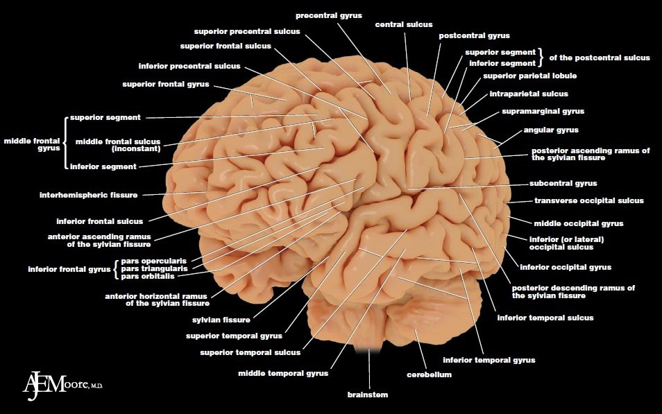

> 
>
> Курс "Анатомия нервной системы"
>
> Автор: сообщество Психиатрия & Нейронауки, psyandneuro.ru
> Сверстано для 1 курса ЛФ СибГМУ силами трудящихся
>

> Особенности: заменены "шакальные" иллюстрации и полностью убрана библиография, поскольку документ для внутреннего пользования и в ссылках не нуждается.

# Анатомия нервной системы

> Bonus: Подборка бесплатных интернет-порталов для изучения анатомии нервной системы.
>
> 1) **The Atlas of Functional Neuroanatomy, 2nd edition, by Walter J. Hendelman (M.D., C.M.)**
> Интернет-портал  по анатомии нервной системы первой линии по мнению редакции ПиН. Очень  лёгок в использовании, и просто пестрит полезным материалом, по которому  очень хорошо изучать/повторять строение ЦНС. Помимо самой анатомии  описаны и функциональные системы со всеми структурами, туда входящими. В  общем, это действительно очень качественный и фундаментальный труд,  который доступен каждому, кому уже лень идти в анатомический корпус  своего мед.вуза за препаратами. 
>
> Ссылка: [www.atlasbrain.com/enx/atlas_main.html](https://vk.com/away.php?to=http%3A%2F%2Fwww.atlasbrain.com%2Fenx%2Fatlas_main.html&post=-120580572_1579&cc_key=) 
>
> 2) **Anatomy of the brain, University of British Columbia**
> Потрясающий  ресурс, который содержит кучу полезной информации по анатомии нервной  системы: иллюстрации макро- и микропрепаратов, лекции, видео-материалы,  анатомические структуры на снимках МРТ и многое другое. Опасен тем, что  можно залипнуть на несколько часов, листая бесчисленные ссылки. 
>
> Ссылка: [www.neuroanatomy.ca/index.html](https://vk.com/away.php?to=http%3A%2F%2Fwww.neuroanatomy.ca%2Findex.html&post=-120580572_1579&cc_key=) 
>
> 3) **The Internet Pathology Laboratory for Medical Education, The University of Utah**
> Данный  учебный ресурс удобен тем, что там имеется множество иллюстраций очень  качественных макропрепаратов головного мозга в различных срезах, где  стрелочками указываются на те или иные его анатомические структуры.  Стрелочки исчезают и появляются при наведении курсором на анатомические  названия тех или иных структур , поэтому можно легко устроить себе  экзамен на знание анатомии, а затем себя же и проверить! 
>
> Ссылка:[library.med.utah.edu/WebPath/HISTHTML/NEURANAT/NEURAN](https://vk.com/away.php?to=http%3A%2F%2Flibrary.med.utah.edu%2FWebPath%2FHISTHTML%2FNEURANAT%2FNEURAN&post=-120580572_1579&cc_key=).. 
>

Содержание
* [Развитие нервной системы](#развитие нервной системы)
* [Общие сведения о нервной системе](#общие сведения о нервной системе)
* [Спинной мозг](#спинной мозг)
* [Переферическая нервная система](#переферическая нервная система)
	* [Черепные нервы](#черепные нервы)
	* [Нервные сплетения](#нервные сплетения)
* [Кора головного мозга](#кора головного мозга)
* [Свол головного мозга](#ствол головного мозга)
* [Промежуточный мозг](#промежуточный мозг)
* [Ретикулярная формация](#ретикулярная формация)
* [Экстрапирамидная система](#экстрапирамидная система)
* [Лимбическая система](#лимбическая система)
* [Кровоснабжение головного мозга](#кровоснабжение головного мозга)
* [Желудочки головного мозга](#желудочки головного мозга)

## Развитие нервной системы

Онтогенез делится на пренатальный и постнатальный периоды. Нервная  система начинает закладываться уже со второй недели пренатального  периода. Из внешнего зародышевого листка – эктодермы – формируется  утолщение – первичная полоска. Под ней, между эктодермой и энтодермой  мигрирует тяж клеток и образует нотохорд, который служит временным  скелетом для зародыша. Эктодерма, окружающая нотохорд, утолщается и  формирует нервную пластинку. Далее, клетки нервной пластинки делятся,  образуя нервную бороздку и нервные валики. Со временем валики смыкаются  над бороздкой, образуя нервную трубку – это процесс нейруляции.  Одновременно происходит погружение нервной трубки вовнутрь зародыша и  формирование и нервных гребней по бокам вдоль нее. На головном конце  нервной трубки образуются три первичных мозговых пузыря, из которых  впоследствии формируется головной мозг, на каудальном же конце нервная  трубка соединяется со спинным мозгом. Нервный гребень в последствии дает  начало образованию периферической нервной системе. Ткани, образующие  нервную бороздку, и, в последствии, нервную трубку, состоят из  нейробластов и спонгиобластов, из первых образуются нейроны, из вторых —  клетки глии. 

 

*Нейруляция*

*Нейрула*

На четвертой неделе беременности передний и задний  первичные пузыри перешнуровываются, образуя в целом уже пять пузырей.  Из заднего образуется продолговатый мозг, из четвертого — варолиев мост и  мозжечок, из третьего – средний мозг, из второго — зрительные бугры,  гипоталамическая область, паллидум (бледный шар), из переднего –  полушария головного мозга и неостриатум (полосатое тело).

*4 неделя, закрытие нейропор*

*4 неделя, нейропоры закрыты*

По  завершении нейруляции часть клеток нервного гребня мигрируют в брюшную  полость, формируя вегетативные узлы и мозговое вещество надпочечников.  Другие клетки образуют ганглиозную пластинку, делящуюся на ганглиозные  валики. Они дают начало спинальным ганглиям, периферическим  ганглионарным нейронам симпатической нервной системы, шванновским  клеткам, а также клеткам, образующим внутренние листки оболочек мозга.  Клетки ганглиозных валиков дифференцируются сначала в биполярные, а  затем в псевдоуниполярные чувствительные нервные клетки, центральный  отросток которых уходит в ЦНС, а периферический — к рецепторам других  тканей и органов, образуя афферентную часть периферической соматической  нервной системы. 

С пятого месяца пренатального развития  начинается миелинизация нейронов, которая завершается в 5-7 лет. Также в  это время появляются первые синапсы. 

### Эмбриогенез головного мозга. 

Вскоре после формирования трех первичных пузырей начинают развиваться глаза. 

В  передней (ростральной) части мозговой трубки образуются два первичных  мозговых пузыря - архэнцефалон и дейтерэнцефалон. В начале четвертой  недели у зародыша дейтерэнцефалон делится на средний (mesencephalon) и  ромбовидный (rhombencephalon) пузыри, а архэнцефалон превращается на  этой (трехпузырной) стадии в передний мозговой пузырь (prosencephalon). В  нижней части переднего мозга отрастают обонятельные лопасти, дающие  начало обонятельному эпителию, луковицам и трактам. Из дорзолатеральных  стенок образуется сетчатка, зрительные нервы и тракты. 

На шестой неделе эмбрионального развития передний и ромбовидный пузыри делятся каждый на два.

*1. olfactory 2. optic 3. oculomotor 4. trochlear 5. trigeminal sensory 6. trigeminal motor 7. abducens 8. facial 9. vestibulocochlear 10. glossopharyngeal 11. vagus 12. cranial accessory 13. spinal accessory 14. hypoglossal 15. cervical I, II, III and IV*

Передний  пузырь — конечный мозг — разделяется продольной щелью на два полушария,  так же разделяется и полость, образуя желудочки. Из-за неравномерного  разрастания мозгового вещества образуются извилины. Каждое полушарие  делится на четыре доли, желудочки делятся также на 4 части: центральный  отдел и три рога желудочка. Серое вещество, распложенное на периферии,  образует кору полушарий, а в основании полушарий – подкорковые ядра. 
Задняя  часть переднего пузыря является теперь промежуточным мозгом. Боковые  стенки его преобразуются в зрительные бугры – таламус. В вентральной области (гипоталамус) образуется выпячивание – воронка, из ее нижнего  конца происходит нейрогипофиз. 

Третий мозговой пузырь  превращается в средний мозг. Его полость превращается в Сильвиев  водопровод, который соединяет III и IV желудочки. Из дорзальной стенки  развивается четверохолмие, из вентральной — ножки среднего мозга. 

Ромбовидный  мозг делится на задний и добавочный. Из заднего формируется мозжечок, а  из добавочного – продолговатый мозг. Полость превращается в IV  желудочек, который сообщается с Сильвиевым водопроводом и с центральным  каналом спинного мозга. 

Из клеток, расположенных в боковых  частях мозговой трубки, образуется спинной мозг. Развивается он быстро и  у трехмесячного зародыша почти сформирован. Полость мозговой трубки  превращается в канал спинного мозга. Проходящая по боковым стенкам  спинного мозга и стволового отдела головного мозга парная пограничная  борозда (sulcus limitons) делит мозговую трубку на основную  (вентральную) и крыловидную (дорзальную) пластинки. Из основной  пластинки формируются моторные структуры (передние рога спинного мозга,  двигательные ядра черепно-мозговых нервов). Над пограничной бороздой из  крыловидной пластинки развиваются сенсорные структуры (задние рога  спинного мозга, сенсорные ядра ствола мозга), в пределах самой  пограничной борозды — центры вегетативной нервной системы. 

Весь передний мозг развивается из крыловидной пластинки, поэтому в нем есть только сенсорные структуры. 

После  рождения ребенка начинается постнатальный онтогенез нервной системы.  Головной мозг новорожденного весит 300—400 г. После рождения  прекращается образование новых нейронов. К восьмому месяцу после  рождения вес мозга удваивается, а к 4—5 годам утраивается. Масса мозга  растет в основном за счет увеличения количества отростков и их  миелинизации. После 50 лет мозг уплощается, вес его падает и в старости  может уменьшиться на 100 г.

## Общие сведения о нервной системе

### Нейрон

Анатомической и функциональной единицей нервной системы является нейрон.  В организме человека насчитывается более 100 миллиардов нейронов.  Нейроны имеют отростки, с помощью которых соединяются между собой и с  иннервируемыми образованиями (мышечными волокнами, кровеносными  сосудами, железами). Отростки нервной клетки неравнозначны в  функциональном отношении:

* Дендриты – множество ветвящихся  коротких отростков отходящих от тела клетки (проводят раздражение к телу  нейрона),
  Тела нервных клеток с дендритными деревьями образуют нервные  центры – серое вещество.
* Аксон – отходящий от тела клетки один  длинный отросток (покрыт миелиновой оболочкой)- проводит раздражение от  тела нейрона, благодаря разветвлению окончания аксона возбуждение  передается нескольким нервным клеткам. 

Аксоны различных нервных клеток образуют проводящие пути – белое вещество. 

На  основании числа и расположения дендритов и аксона нейроны делятся на  безаксонные, униполярные нейроны, псевдоуниполярные нейроны, биполярные  нейроны и мультиполярные (много дендритных стволов, обычно эфферентные) нейроны.

* Безаксонные нейроны - небольшие клетки,  сгруппированы вблизи спинного мозга в межпозвоночных ганглиях, не  имеющие анатомических признаков разделения отростков на дендриты и  аксоны. Все отростки у клетки очень похожи. Функциональное назначение  безаксонных нейронов слабо изучено. 
* Униполярные нейроны - нейроны с одним отростком, присутствуют, например в сенсорном ядре тройничного нерва в среднем мозге.
* Биполярные нейроны - нейроны, имеющие один аксон и один дендрит,  расположенные в специализированных сенсорных органах - сетчатке глаза,  обонятельном эпителии и луковице, слуховом и вестибулярном ганглиях.
* Мультиполярные нейроны - нейроны с одним аксоном и несколькими  дендритами. Данный вид нервных клеток преобладает в центральной нервной  системе.
* Псевдоуниполярные нейроны - являются уникальными в  своём роде. От тела отходит один отросток, который сразу же Т-образно  делится. Весь этот единый тракт покрыт миелиновой оболочкой и структурно  представляет собой аксон, хотя по одной из ветвей возбуждение идёт не  от, а к телу нейрона. Структурно дендритами являются разветвления на  конце этого (периферического) отростка. Триггерной зоной является начало  этого разветвления (т. е. находится вне тела клетки). Такие нейроны  встречаются в спинальных ганглиях.

*Морфологическая классификация нейронов (схема):
A - униполярный нейрон (амакринная клетка сетчатки глаза); Б - биполярный нейрон (вставочный нейрон сетчатки глаза); В - псевдоуниполярный нейрон (афферентная клетка спинномозгового узла); Г1-Г3 - мультиполярные нейроны: Г1 - мотонейрон спинного мозга; Г2 - пирамидный нейрон коры полушарий большого мозга, Г3 - клетка Пуркинье коры полушарий мозжечка.
1 - перикарион, 1.1 - ядро; 2 - аксон; 3 - дендрит(ы); 4 - периферический отросток; 5 - центральный отросток.*

Основная функция нейронов -  это переработка информации: получение, проведение и передача другим  клеткам. Получение информации происходит через синапсы с рецепторами  сенсорных органов или другими нейронами, или непосредственно из внешней  среды с помощью специализированных дендритов. Проведение информации  происходит по аксонам, передача - через синапсы.

Помимо нейронов  нервная ткань содержит клетки еще одного типа - клетки глии, глиальные  клетки, или глия (от греч. "глия" - клей). Они выполняют опорную и  защитную функции , а также участвуют в нейронофагии. По численности их в  10 раз больше, чем нейронов (10 в 13-ой и 10 в 12-ой степени,  соответственно) и они занимают половину объема центральной нервной  системы (ЦНС). 

Глия выполняет не только опорные функции, но и  обеспечивает многообразные метаболические процессы в нервной ткани, а  также способствует восстановлению нервной ткани после травм и инфекций.  Выделяют макроглию и микроглию. Макроглия подразделяется на эпендимную  глию, астроцитарную глию (астроглию) и олигодендроглию. 

### Синапс

Нейроны  контактируют между собой с помощью особого аппарата – синапса. Синапс -  специализированная зона контакта между отростками нервных клеток и  другими возбудимыми и невозбудимыми клетками, обеспечивающая передачу  информационного сигнала. Морфологически синапс образован контактирующими  мембранами двух клеток. Мембрана, принадлежащая отросткам нервных  клеток, называется пресинаптической, мембрана клетки, к которой  передается сигнал, - постсинаптической. В соответствии с принадлежностью  постсинаптической мембраны синапса подразделяют на нейросекреторные,  нейромышечные и межнейрональные. Термин «синапс» был введён в 1897 г.  английским физиологом Чарльзом Шеррингтоном.

**Структура синапса:**

Типичный  синапс - аксо-дендритический химический. Такой синапс состоит из двух  частей: пресинаптической, образованной булавовидным расширением  окончанием аксона передающей клетки и постсинаптической, представленной  контактирующим участком цитолеммы воспринимающей клетки (в данном случае  - участком дендрита). Синапс представляет собой пространство,  разделяющее мембраны контактирующих клеток, к которым подходят нервные  окончания. 

Передача импульсов осуществляется химическим путём с  помощью медиаторов или электрическим путём посредством прохождения  ионов из одной клетки в другую. Между обеими частями имеется  синаптическая щель, края которой укреплены межклеточными контактами.  Часть аксолеммы булавовидного расширения, прилежащая к синаптической  щели называется пресинаптической мембраной. Участок цитолеммы  воспринимающей клетки, ограничивающий синаптическую щель с  противоположной стороны, называется постсинаптической мембраной, в  химических синапсах она рельефна и содержит многочисленные рецепторы. В  синаптическом расширении имеются мелкие везикулы, так называемые  синаптические пузырьки, содержащие либо медиатор (вещество-посредник в  передаче возбуждения), либо фермент, разрушающий этот медиатор. На  постсинаптической и пресинаптической мембранах присутствуют рецепторы к  тому или иному медиатору.

Существуют также и смешанные синапсы,  где пресинаптический потенциал действия создает ток, который  деполяризует постсинаптическую мембрану типичного химического синапса,  где пре- и постсинаптические мембраны не плотно прилегают друг к другу.  Таким образом, в этих синапсах химическая передача служит необходимым  усиливающим механизмом. Наиболее распространён первый тип.

Химические синапсы можно классифицировать по их местоположению и принадлежности соответствующим структурам: 

Периферические:
* нервно-мышечные 
* нейросекреторные (аксо-вазальные) 
* рецепторно-нейрональные 

Центральные:

* аксо-дендритические - с дендритами, в т. ч. 
* аксо-шипиковые - с дендритными шипиками, выростами на дендритах; 
* аксо-соматические - с телами нейронов; 
* аксо-аксональные - между аксонами; 
* дендро-дендритические - между дендритами; 

В зависимости от медиатора синапсы разделяются на 

*  аминергические, содержащие биогенные амины (например, серотонин,  дофамин;) o в том числе адренергические, содержащие адреналин или  норадреналин;
*  холинергические, содержащие ацетилхолин; 
* пуринергические, содержащие пурины; 
*  пептидергические, содержащие пептиды. При этом в синапсе не всегда  вырабатывается только один медиатор. Обычно основной медиатор  выбрасывается вместе с другим, играющим роль модулятора.

## Спинной мозг

Спинной мозг, medulla spinalis (греч. myelos), лежит в позвоночном канале и у взрослых представляет собой длинный (45 см у мужчин и 41-42 см у женщин), несколько сплюснутый спереди назад цилиндрический тяж, который вверху (краниально) непосредственно переходит в продолговатый мозг, а внизу (каудально) оканчивается коническим заострением, conus medullaris, на уровне II поясничного позвонка. Знание этого факта имеет практическое значение (чтобы не повредить спинной мозг при поясничном проколе с целью взятия спинномозговой жидкости или с целью спинномозговой анестезии, надо вводить иглу шприца между остистыми отростками III и IV поясничных позвонков). От conus medullaris отходит книзу так называемая концевая нить, filum terminale, представляющая атрофированную нижнюю часть спинного мозга, которая внизу состоит из продолжения оболочек спинного мозга и прикрепляется ко II копчиковому позвонку.

Спинной мозг на своем протяжении имеет два утолщения, соответствующих корешкам нервов верхней и нижней конечностей: верхнее из них называется шейным утолщением, intumescentia cervicalis, а нижнее - пояснично-крестцовым, intumescentia lumbosacralis. Из этих утолщений более обширно пояснично-крестцовое, но более дифференцировано шейное, что связано с более сложной иннервацией руки как органа труда.

Образовавшимися вследствие утолщения боковых стенок спинномозговой трубки и проходящими по средней линии передней и задней продольными бороздами: глубокой fissura mediana anterior, и поверхностной, sulcus medianus posterior, спинной мозг делится на две симметричные половины - правую и левую; каждая из них в свою очередь имеет слабо выраженную продольную борозду, идущую по линии входа задних корешков (sulcus posterolateralis) и по линии выхода передних корешков (sulcus anterolateralis). Эти борозды делят каждую половину белого вещества спинного мозга на три продольных канатика: передний - funiculus anterior, боковой - funiculus lateralis и задний - funiculus posterior. Задний канатик в шейном и верхнегрудном отделах делится еще промежуточной бороздкой, sulcus intermedius posterior, на два пучка: fasciculus gracilis и fasciculus cuneatus. Оба эти пучка под теми же названиями переходят вверху на заднюю сторону продолговатого мозга. 

На той и другой стороне из спинного мозга выходят двумя продольными рядами корешки спинномозговых нервов. Передний корешок, radix ventralis s. anterior, выходящий через sulcus anterolateralis, состоит из нейритов двигательных (центробежных, или эфферентных) нейронов, клеточные тела которых лежат в спинном мозге, тогда как задний корешок, radix dorsalis s. posterior, входящий в sulcus posterolateralis, содержит отростки чувствительных (центростремительных, или афферентных) нейронов, тела которых лежат в спинномозговых узлах. 

На некотором расстоянии от спинного мозга двигательный корешок прилегает к чувствительному и они вместе образуют ствол спинномозгового нерва, truncus n. spinalis, который невропатологи выделяют под именем канатика, funiculus. При воспалении канатика (фуникулит) возникают сегментарные расстройства одновременно двигательной и чувствительной сфер; при заболевании корешка (радикулит) наблюдаются сегментарные нарушения одной сферы - или чувствительной, или двигательной, а при воспалении ветвей нерва (неврит) расстройства соответствуют зоне распространения данного нерва. Ствол нерва обычно очень короткий, так как по выходе из межпозвоночного отверстия нерв распадается на свои основные ветви. 

В межпозвоночных отверстиях вблизи места соединения обоих корешков задний корешок имеет утолщение - спинномозговой узел, ganglion spinale, содержащий ложноуниполярные нервные клетки (афферентные нейроны) с одним отростком, который делится затем на две ветви: одна из них, центральная, идет в составе заднего корешка в спинной мозг, другая, периферическая, продолжается в спинномозговой нерв. 

Таким образом, в спинномозговых узлах отсутствуют синапсы, так как здесь лежат клеточные тела только афферентных нейронов. Этим названные узлы отличаются от вегетативных узлов периферической нервной системы, так как в последних вступают в контакты вставочные и эфферентные нейроны. Спинномозговые узлы крестцовых корешков лежат внутри крестцового канала, а узел копчикового корешка - внутри мешка твердой оболочки спинного мозга. Вследствие того что спинной мозг короче позвоночного канала, место выхода нервных корешков не соответствует уровню межпозвоночных отверстий. Чтобы попасть в последние, корешки направляются не только в стороны от мозга, но еще и вниз, при этом тем отвеснее, чем ниже они отходят от спинного мозга. В поясничной части последнего нервные корешки спускаются к соответствующим межпозвоночным отверстиям параллельно filum terminate, облекая ее и conus medullaris густым пучком, который носит название конского хвоста, cauda equina. 

### Внутреннее строение спинного мозга. 

Спинной мозг состоит из серого вещества, содержащего нервные клетки, и белого вещества, слагающегося из миелиновых нервных волокон

* Серое вещество, substantia grisea, заложено внутри спинного мозга и окружено со всех сторон белым веществом. Серое вещество образует две вертикальные колонны, помещенные в правой и левой половинах спинного мозга. В середине его заложен узкий центральный канал, canalis centralis, спинного мозга, проходящий во всю длину последнего и содержащий спинномозговую жидкость.
  * Центральный канал является остатком полости первичной нервной трубки. Поэтому вверху он сообщается с IV желудочком головного мозга, а в области conus medullaris заканчивается расширением - концевым желудочком, ventriculus terminalis. Серое вещество, окружающее центральный канал, носит название промежуточного, substantia intermedia centralis. В каждой колонне серого вещества два столба: передний, columna anterior, и задний, columna posterior. На поперечных разрезах спинного мозга эти столбы имеют вид рогов: переднего, расширенного, cornu anterius, и заднего, заостренного, cornu posterius. Поэтому общий вид серого вещества на фоне белого напоминает букву «Н».
  * Серое вещество состоит из нервных клеток, группирующихся в ядра, расположение которых в основном соответствует сегментарному строению спинного мозга и его первичной трехчленной рефлекторной дуге. Первый, чувствительный, нейрон этой дуги лежит в спинномозговых узлах, периферический отросток которого начинается рецепторами в органах и тканях, а центральный в составе задних чувствительных корешков проникает через sulcus posterolateralis в спинной мозг. Вокруг верхушки заднего рога образуется пограничная зона белого вещества, представляющая собой совокупность центральных отростков клеток спинномозговых узлов, заканчивающихся в спинном мозге.
  * Клетки задних рогов образуют отдельные группы или ядра, воспринимающие из сомы различные виды чувствительности, - соматически-чувствительные ядра. Среди них выделяются: грудное ядро, nucleus thoracicus (columna thoracica), наиболее выраженное в грудных сегментах мозга; находящееся на верхушке рога студенистое вещество, substantia gelatinosa, а также так называемые собственные ядра, nuclei proprii. Заложенные в заднем роге клетки образуют вторые, вставочные, нейроны. В сером веществе задних рогов разбросаны также рассеянные клетки, так называемые пучковые клетки, аксоны которых проходят в белом веществе обособленными пучками волокон. Эти волокна несут нервные импульсы от определенных ядер спинного мозга в его другие сегменты или служат для связи с третьими нейронами рефлекторной дуги, заложенными в передних рогах того же сегмента. Отростки этих клеток, идущие от задних рогов к передним, располагаются вблизи серого вещества, по его периферии, образуя узкую кайму белого вещества, окружающего серое со всех сторон. Это собственные пучки спинного мозга, fasciculi proprii. Вследствие этого раздражение, идущее из определенной области тела, может передаваться не только на соответствующий ей сегмент спинного мозга, но захватывать и другие. В результате простой рефлекс может вовлекать в ответную реакцию целую группу мышц, обеспечивая сложное координированное движение, остающееся, однако, безусловнорефлекторным.
  * Передние рога содержат третьи, двигательные, нейроны, аксоны которых, выходя из спинного мозга, составляют передние, двигательные, корешки. Эти клетки образуют ядра эфферентных соматических нервов, иннервирующих скелетную мускулатуру, - соматически-двигательные ядра. Последние имеют вид коротких колонок и лежат в виде двух групп - медиальной и латеральной. Нейроны медиальной группы иннервируют мышцы, развившиеся из дорсальной части миотомов (аутохтонная мускулатура спины), а латеральной - мышцы, происходящие из вентральной части миотомов (вентролатеральные мышцы туловища и мышцы конечностей); чем дистальнее иннервируемые мышцы, тем латеральнее лежат иннервирующие их клетки. Наибольшее число ядер содержится в передних рогах шейного утолщения спинного мозга, откуда иннервируются верхние конечности, что определяется участием последних в трудовой деятельности человека. У последнего в связи с усложнением движений руки как органа труда этих ядер значительно больше, чем у животных, включая антропоидов (Рис. 4).
    
  * Таким образом, задние и передние рога серого вещества имеют отношение к иннервации органов животной жизни, особенно аппарата движения, в связи с усовершенствованием которого в процессе эволюции и развивался спинной мозг. Передний и задний рога в каждой половине спинного мозга связаны между собой промежуточной зоной серого вещества, которая в грудном и поясничном отделах спинного мозга, на протяжении от I грудного до II-III поясничных сегментов особенно выражена и выступает в виде бокового рога, cornu laterale. Вследствие этого в названных отделах серое вещество на поперечном разрезе приобретает вид бабочки. В боковых рогах заложены клетки, иннервирующие вегетативные органы и группирующиеся в ядро, которое носит название columna intermediolateralis. Нейриты клеток этого ядра выходят из спинного мозга в составе передних корешков. 

* Белое вещество, substantia alba, спинного мозга состоит из нервных отростков, которые составляют три системы нервных волокон:
* Короткие пучки ассоциативных волокон, соединяющих участки спинного мозга на различных уровнях (афферентные и вставочные нейроны).
* Длинные центростремительные (чувствительные, афферентные).
* Длинные центробежные (двигательные, эфферентные).
  * Первая система (коротких волокон) относится к собственному аппарату спинного мозга, а остальные две (длинных волокон) составляют проводниковый аппарат двусторонних связей с головным мозгом. Собственный аппарат включает серое вещество спинного мозга с задними и передними корешками и собственными пучками белого вещества (fasciculi proprii), окаймляющими серое в виде узкой полосы. По развитию собственный аппарат является образованием филогенетически более старым и потому сохраняет примитивные черты строения - сегментарность, отчего его называют также сегментарным аппаратом спинного мозга в отличие от остального несегментированного аппарата двусторонних связей с головным мозгом. 

Таким образом, **нервный сегмент** - это поперечный отрезок спинного мозга и связанных с ним правого и левого спинномозговых нервов, развившихся из одного невротома (невромера). Он состоит из горизонтального слоя белого и серого вещества (задние, передние и боковые рога), содержащего нейроны, отростки которых проходят в одном парном (правом и левом) спинномозговом нерве и его корешках. 

В спинном мозге различают 31 сегмент, которые топографически делятся на 8 шейных, 12 грудных, 5 поясничных, 5 крестцовых и 1 копчиковый. В пределах нервного сегмента замыкается короткая рефлекторная дуга. Так как собственный сегментарный аппарат спинного мозга возник тогда, когда еще не было головного, то функция его - это осуществление тех реакций в ответ на внешнее и внутреннее раздражения, которые в процессе эволюции возникли раньше, т. е. врожденных реакций. Аппарат двусторонних связей с головным мозгом филогенетически более молодой, так как возник лишь тогда, когда появился головной мозг. По мере развития последнего разрастались кнаружи и проводящие пути, связывающие спинной мозг с головным. Этим объясняется тот факт, что белое вещество спинного мозга как бы окружило со всех сторон серое вещество. Благодаря проводниковому аппарату собственный аппарат спинного мозга связан с аппаратом головного мозга, который объединяет работу всей нервной системы. Нервные волокна группируются в пучки, а из пучков составляются видимые невооруженным глазом канатики: задний, боковой и передний. В заднем канатике, прилежащем к заднему (чувствительному) рогу, лежат пучки восходящих нервных волокон; в переднем канатике, прилежащем к переднему (двигательному) рогу, лежат пучки нисходящих нервных волокон; наконец, в боковом канатике находятся и те и другие. Кроме канатиков, белое вещество находится в белой спайке, comissura alba, образующейся вследствие перекреста волокон спереди от substantia intermedia centralis; сзади белая спайка отсутствует.

**Задние канатики** содержат волокна задних корешков спинномозговых нервов, слагающиеся в две системы:

* Медиально расположенный тонкий пучок, fasciculus gracilis.

* Латерально расположенный клиновидный пучок, fasciculus cuneatus. 

  Пучки тонкий и клиновидный проводят от соответствующих частей тела к коре головного мозга сознательную проприоцептивную (мышечно-суставное чувство) и кожную (чувство стереогноза - узнавание предметов на ощупь) чувствительность, имеющую отношение к определению положения тела в пространстве, а также тактильную чувствительность. 

**Боковые канатики** содержат следующие пучки:

* Восходящие.
  * К заднему мозгу:
    * tractus spinocerebellaris posterior, задний спинно-мозжечковый путь, располагается в задней части бокового канатика по его периферии;
    * tractus spinocerebellaris anterior, передний спинно-мозжечковый путь, лежит вентральнее предыдущего.
    
      Оба спинно-мозжечковых тракта проводят бессознательные проприоцептивные импульсы (бессознательная координация движений).
  * К среднему мозгу: 
    
    * tractus spinotectalis, спинно-покрыщечный путь, прилегает к медиальной стороне и передней части tractus spinocerebellaris anterior. 
  * К промежуточному мозгу: 
    * tractus spinothalamics lateralis прилегает с медиальной стороны к tractus spinocerebellaris anterior, тотчас позади tractus spinotectalis. Он проводит в дорсальной части тракта температурные раздражения, а в вентральной - болевые;
    * tractus spinothalamicus anteriror s. ventralis аналогичен предыдущему, но располагается кпереди от соименного латерального и является путем проведения импульсов осязания, прикосновения (тактильная чувствительность). По последним данным, этот тракт располагается в переднем канатике

* Нисходящие.

  * От коры большого мозга:
    * латеральный корково-спинномозговой (пирамидный) путь, tractus corticospinalis (pyramidalis) lateralis. Этот тракт является сознательным эфферентным двигательным путем.
  * От среднего мозга:
    * tractus rubrospinalis. Он является бессознательным эфферентным двигательным путем.
  * От заднего мозга:
    * tractus olivospinalis, лежит вентральнее tractus spinocerebellaris anterior, вблизи переднего канатика. Передние канатики содержат нисходящие пути.
  * От коры головного мозга:
    * передний корково-спинномозговой (пирамидный) путь, tractus corticospinalis (pyramidalis) anterior, составляет с латеральным пирамидным пучком общую пирамидную систему.
  * От среднего мозга:
    * ractus tectospinalis, лежит медиальнее пирамидного пучка, ограничивая fissura mediana anterior. Благодаря ему осуществляются рефлекторные защитные движения при зрительных и слуховых раздражениях - зрительно-слуховой рефлекторный тракт

Ряд пучков идет к **передним рогам** спинного мозга **от различных ядер продолговатого мозга**, имеющих отношение к равновесию и координации движений, а именно:

* от ядер вестибулярного нерва - tractus vestibulospinalis - лежит на границе переднего и бокового канатиков;
* от formatio reticularis - tractus reticulospinalis anterio

## Переферическая нервная система

### Черепные нервы

* I пара — обонятельные нервы (nn. olfactorii). Они начинаются от слизистой оболочки обонятельной области полости носа, проходят через решетчатую пластинку в полость черепа и подходят к обонятельной луковице, где оканчивается 1-й нейрон обонятельного пути и берет начало центральный обонятельный путь.

* II пара — зрительный нерв (n. opticus), который содержит около 1 млн. тонких нервных волокон, являющихся аксонами мультиполярных нейронов сетчатки глаза (3-й нейрон зрительного пути). Нерв имеет наружное и внутреннее влагалища, служащие продолжением оболочек головного мозга. Через зрительный канал нерв проникает в полость черепа.
Кпереди от турецкого седла оба нерва образуют зрительный перекрест (chiasma opticum), где волокна из медиальных (назальных) половин сетчаток переходят на противоположную сторону. После перекреста образуется зрительный тракт (tractus opticus), который огибает ножку мозга и отдает свои волокна подкорковым зрительным центрам.

* Ill пара — глазодвигательный нерв (n. oculomotorius) Он берет начало от двигательных ядер, расположенных в покрышке среднего мозга на уровне верхних холмиков. Нерв выходит в межножковой ямке из медиальной поверхности ножки мозга, входит в боковую стенку пещеристого синуса и через верхнюю глазничную щель попадает в глазницу. Здесь он делится на верхнюю и нижнюю ветви. Верхняя ветвь входит в мышцу, поднимающую верхнее веко, и в верхнюю прямую мышцу глазного яблока, а нижняя ветвь иннервирует нижнюю и медиальную прямые и нижнюю косую мышцы. Глазодвигательный нерв содержит парасимпатические волокна, которые начинаются в его добавочном ядре и по соединительной ветви проходят в ресничный ганглий. От клеток этого ганглия получают иннервацию сфинктер зрачка и ресничная мышца глаза.

* IV пара — блоковый нерв (n. trochlearis), самый тонкий из черепных нерв. Он начинается от ядра, лежащего в покрышке среднего мозга на уровне нижних холмиков, выходит на задней поверхности мозгового ствола, огибает ножку мозга, идет в стенке пещеристого синуса и через верхнюю глазничную щель проникает в глазницу, иннервирует верхнюю косую мышцу глазного яблока.

* V пара — тройничный нерв (n. trigeminus), который является главным чувствительным нервом головы. Область иннервации кожи головы тройничным нервом ограничена теменно-ушно-подбородочной линией. Тройничный нерв иннервирует также глазное яблоко и конъюнктиву, твердую мозговую оболочку, слизистую оболочку полости носа и рта, большей части языка, зубы и десны. Его двигательные волокна идут к жевательным мышцам и мышцам дна ротовой полости.
Тройничный нерв выходит из мозга на границе между мостом и средней мозжечковой ножкой. Он имеет более толстый чувствительный и более тонкий двигательный корешки. Волокна чувствительного корешка являются отростками нейронов тройничного ганглия (ganglion trigeminale), который лежит в углублении височной пирамиды вблизи ее верхушки в особой полости, образованной расщеплением твердой мозговой оболочки. Эти волокна оканчиваются в мостовом ядре тройничного нерва, расположенном в верхнем отделе ромбовидной ямки, и в ядре спинномозгового пути, которое из моста продолжается в продолговатый мозг и далее в шейные сегменты спинного мозга. Волокна, приносящие проприоцептивные раздражения из жевательных мышц, являются отростками клеток ядра среднемозгового пути тройничного нерва, лежащего в покрышке среднего мозга. Волокна двигательного корешка начинаются от двигательного ядра тройничного нерва, расположенного в мосту.
	* От тройничного ганглия отходят три главные ветви нерва — глазной, верхнечелюстной и нижнечелюстной нервы. Глазной нерв (n. ophthalmicus) чисто чувствительный. Он делится, в свою очередь, на три ветви — слезный, лобный и носоресничный нервы, которые проходят через верхнюю глазничную щель. Слезный нерв (n. lacrimalis) иннервирует кожу латерального угла глаза и конъюнктиву, отдает секреторные веточки к слезной железе. Лобный нерв (n. frontalis) разветвляется в коже лба, верхнего века и снабжает слизистую оболочку лобной пазухи. Носоресничный нерв (n. nasociliaris) отдает длинные ресничные нервы глазному яблоку. От него в полость носа идут передний и задний решетчатые нервы, иннервирующие слизистую оболочку полости носа, решетчатой и клиновидной пазух, а также кожу спинки носа. Его конечная ветвь — подблоковый нерв разветвляется в коже медиального угла глаза и иннервирует слезный мешок.
	* Верхнечелюстной нерв (n. maxillaris) также является чувствительным, он проходит через круглое отверстие в крыловидно-небную ямку, откуда продолжается в глазницу и, пройдя подглазничный канал, выходит под названием подглазничного нерва (n. infraorbitalis) на переднюю поверхность лица; иннервирует кожу щеки, нижнего века, верхней губы, крыла и преддверия носа. От верхнечелюстного и подглазничного нервов отходят верхние альвеолярные нервы (nn. alveolares sup.) к зубам верхней челюсти и деснам.
	* Скуловой нерв (n. zygomaticus) иннервирует кожу латеральной части лица. Крыловидно-небные нервы идут от верхнечелюстного нерва к крыловидно-небному ганглию. Входящие в их состав чувствительные волокна проходят от крыловидно-небного ганглия по задним носовым нервам к слизистой оболочке полости носа, по небным нервам к слизистой оболочке неба, по глоточной ветви к слизистой оболочке носоглотки. Нервы, отходящие от крыловидно-небного ганглия, содержат симпатические и парасимпатические волокна. В числе последних имеются волокна, иннервирующие слезную железу; они идут по ветви, соединяющей скуловой и слезный нервы.
	* Нижнечелюстной нерв (n. mandibularis) является смешанным. В его состав входят волокна двигательного корешка тройничного нерва. Нижнечелюстной нерв проходит через овальное отверстие и отдаст ветви ко всем жевательным мышцам. К чувствительным ветвям его относятся: щечный нерв (n. buccalis), который снабжает слизистую оболочку щеки и щечную поверхность десен нижних премоляров и 1-го моляра; ушно-височный нерв (n. auriculotemporalis), иннервирующий кожу височной области и часть ушной раковины; язычный нерв (n. lingualisi), снабжающий слизистую оболочку кончика и спинки языка.
	* Смешанный состав имеет нижний альвеолярный нерв (n. alveolaris inf.), который проходит в канале нижней челюсти, отдавая ветви зубам и деснам; его конечной ветвью является подбородочный нерв (n. mentalis), разветвляющийся в коже подбородка, коже и слизистой оболочке нижней губы. До вхождения нижнего альвеолярного нерва в канал нижней челюсти от него ответвляется челюстно-подъязычный нерв, несущий двигательные волокна к мышцам диафрагмы рта. Ветви нижнечелюстного нерва связаны с вегетативными ганглиями, ушно-височный нерв — с ушным ганглием, из которого получает парасимпатическую иннервацию околоушная железа, а язычный нерв — с поднижнечелюстным ганглием, дающим иннервацию поднижнечелюстной и подъязычной железам.

* VI пара — отводящий нерв (n. abducens). Он имеет двигательное ядро в верхнем отделе ромбовидной ямки, выходит из мозга между краем моста и пирамидой продолговатого мозга, проходит через пещеристый синус к верхней глазничной щели, иннервирует наружную прямую мышцу глаза.

* VII пара — лицевой нерв (n. facialis). Он образован главным образом двигательными волокнами, берущими начало от ядра, которое расположено в верхнем отделе ромбовидной ямки. В состав лицевого нерва входит промежуточный нерв (n. intermedius), который содержит чувствительные вкусовые и парасимпатические волокна. Первые являются отростками нейронов ганглия коленца и оканчиваются в ядре одиночного пути вместе со вкусовыми волокнами языкоглоточного и блуждающего нервов. Вторые берут начало в слезном и верхнем слюноотделительном ядрах, лежащих рядом с двигательным ядром лицевого нерва.
Лицевой нерв выходит из мозга в мостомозжечковом углу и вступает во внутренний слуховой проход, откуда переходит в лицевой канал височной кости. Здесь располагаются барабанная струна (chorda tympani), ганглий коленца и начинается большой каменистый нерв, по которому парасимпатические волокна проходят к крыловидно-небному ганглию. Барабанная струна проходит через барабанную полость и присоединяется к язычному нерву, содержит вкусовые волокна от двух передних третей языка и парасимпатические волокна, достигающие поднижнечелюстного ганглия. Лицевой нерв выходит из височной кости через шилососцевидное отверстие и входит в околоушную железу, образуя в ней сплетение. От этого сплетения ветви лицевого нерва веерообразно расходятся по лицу, иннервируя все мимические мышцы, а также заднее брюшко двубрюшной мышцы и шилоподъязычную мышцу. Шейная ветвь лицевого нерва разветвляется в подкожной мышце шеи. Ветви лицевого нерва образуют соединения, ветвями тройничного, языкоглоточного, блуждающего нервов и шейного сплетения.

* VIII пара преддверно-улитковый нерв (n. vestibulocochlearis), который проводит раздражения от рецепторов внутреннего уха к собственным ядрам, расположенным в латеральной части ромбовидной ямки. Нерв состоит из преддверного и улиткового корешков. Преддверный корешок образован отростками нейронов преддверного ганглия (ganglion vestibulare), расположенного во внутреннем слуховом проходе. Улитковый корешок состоит из отростков клеток спирального ганглия (ganglion spirale), находящегося в улитке. Преддверно-улитковый нерв выходит из внутреннего слухового прохода и вступает в головной мозг в области мостомозжечкового угла.

* IX пара — языкоглоточный нерв (n. glossopharyngeus). Он проводит двигательные волокна к сжимателям глотки и шилоглоточной мышце, чувствительные волокна от слизистой оболочки глотки, миндалин, барабанной полости и слуховой трубы, вкусовые волокна от желобовидных сосочков языка и преганглионарные парасимпатические волокна к ушному ганглию для околоушной железы. Ядра нерва располагаются в нижнем отделе ромбовидной ямки, в треугольнике блуждающего нерва. Здесь лежат двигательное двойное ядро, общее с блуждающим нервом, и ядро одиночного пути, общее с лицевым и блуждающим нервами. Парасимпатические волокна берут начало в нижнем слюноотделительном ядре. Языкоглоточный нерв выходит из продолговатого мозга позади оливы и покидает полость черепа через яремное отверстие.
Он образует верхний и нижний чувствительные ганглии. По выходе из черепа языкоглоточный нерв проходит между шилоглоточной и шилоязычными мышцами к основанию языка. От его нижнего ганглия отходит барабанный нерв (n. tympanicus), образующий сплетение в барабанной полости. Барабанный нерв содержит парасимпатические волокна, которые продолжаются по малому каменистому нерву до ушного ганглия. Далее языкоглоточный нерв отдает глоточные, миндаликовые и язычные ветви. Последние иннервируют слизистую оболочку корня языка. Каротидная ветвь языкоглоточного нерва проводит афферентные волокна от каротидного синуса и гломуса. IX пара и ее ветви образуют соединения с ушно-височным, лицевым, блуждающим нервами, внутренним сонным сплетением.

* Х пара — блуждающий нерв (n. vagus), имеющий самую обширную область иннервации. Он является главным парасимпатическим нервом внутренних органов, а также проводит большую часть афферентных волокон из органов, в которых разветвляется. В области головы и шеи блуждающий нерв отдает ветвь твердой мозговой оболочке, обеспечивает чувствительную и двигательную иннервацию неба и глотки (вместе с тройничным и языкоглоточным нервами), полностью иннервирует гортань, участвует во вкусовой иннервации корня языка. Блуждающему нерву принадлежит двойное ядро, ядро одиночного пути и дорсальное (парасимпатическое) ядро в продолговатом мозге. Нерв выходит несколькими корешками позади оливы вместе с языкоглоточным нервом и проходит через яремное отверстие, где находятся его верхний и нижний ганглии.
На шее блуждающий нерв идет в составе сосудисто-нервного пучка. Ушная ветвь этого нерва иннервирует кожу наружного слухового прохода и примыкающий участок ушной раковины. От шейной части блуждающего нерва отходят глоточные ветви, верхняя и нижняя шейные сердечные ветви и верхний гортанный нерв. В грудной полости от блуждающего нерва берет начало возвратный гортанный нерв (n. laryngeus recurrens), который поднимается на шею и продолжается в нижний гортанный нерв, иннервирующий вместе с верхним гортанным нервом слизистую оболочку и мышцы гортани.

* XI пара — добавочный нерв (n. accessorius), который начинается от двигательного ядра, расположенного в нижней части продолговатого мозга и первом-четвертом шейных сегментах спинного мозга. Соответственно он имеет черепные и спинномозговые корешки, которые объединяются в ствол нерва. Последний проходит через яремное отверстие и делится на внутреннюю и наружную ветви. Внутренняя ветвь присоединяется к блуждающему нерву, она содержит волокна, участвующие в двигательной иннервации глотки и гортани. Наружная ветвь снабжает грудино-ключично-сосцевидную и трапециевидную мышцы; она часто соединяется с шейным сплетением.

* XII пара — подъязычный нерв (n. hypoglossus), являющийся двигательным нервом языка. Его ядро лежит в нижнемедиальном участке ромбовидной ямки. Корешки подъязычного нерва выходят из продолговатого мозга между пирамидой и оливой. Из полости черепа нерв проходит через подъязычный канал затылочной кости, располагается на шее позади заднего брюшка двубрюшной и шилоподъязычной мышц, пересекает снаружи наружную сонную артерию и входит в мускулатуру языка, где разделяется на свои конечные ветви. Подъязычный нерв отдает соединительную ветвь к шейному сплетению, которая принимает участие в формировании шейной петли (ansa cervicalis).

### Нервные сплетения

## Кора головного мозга

### Структурная организация коры большого мозга.
Кора большого мозга представляет собой многослойную нейронную ткань общей площадью примерно 2200 см2. На основании формы и расположения клеток по толщине коры в типичном случае выделяют 6 слоев (с поверхности вглубь): молекулярный, наружный зернистый, наружный пирамидный, внутренний зернистый, внутренний пирамидный, слой веретеновидных клеток; некоторые из них можно разделить на два или более вторичных слоев.

В коре полушарий большого мозга подобное шестислойное строение является характерным для неокортекса (изокортекса). Более древний тип коры аллокортекс - в основном трехслойный. Он расположен в глубине височных долей и с поверхности мозга не виден. В состав аллокортекса входит старая кора - архикортекс (зубчатая фасция, аммонов рог и основание гиппокампа), древняя кора - палеокортекс (обонятельный бугорок, диагональная область, прозрачная перегородка, периамигдалярная область и перипириформная область) и производные коры - ограда, миндалины и прилежащее ядро.

### Функциональная организация коры большого мозга.

Современные представления о локализации высших психических функций в коре большого мозга сводятся к теории о системной динамической локализации. Это означает, что психическая функция соотносится мозгом как определенная многокомпонентная и многозвеньевая система, различные звенья которой связаны с работой различных мозговых структур. Основоположник данного представления крупнейший нейропсихолог А. Р. Лурия писал, что «высшие психические функции как сложные функциональные системы не могут быть локализованы в узких зонах мозговой коры или в изолированных клеточных груп- пах, а должны охватывать сложные системы совместно работающих зон, каждая из которых вносит свой вклад в осуществление сложных психических процессов и которые могут располагаться в совершенно различных, иногда далеко отстоящих друг от друга участках мозга».

Два полушария человека неодинаковы по функции. Полушарие, где расположены центры речи, называется доминантным, у правшей - это левое полушарие. Другое полушарие называется субдоминантным (у правшей - правое). Такое разделение называется латерализацией функций и детерминируется генетически. Поэтому переученный левша пишет правой рукой, но до конца жизни остается левшой по типу мышления.

Корковый отдел анализатора состоит из трех отделов.
* Первичные поля - специфические ядерные зоны анализатора (например, 17 поле по Бродману - при его поражении возникает гомонимная гемианопсия).
* Вторичные поля - периферические ассоциативные поля (например, 18-19 поля - при их поражении могут быть зрительные галлюцинации, зрительные агнозии, метаморфопсии, затылочные приступы).
* Третичные поля - сложные ассоциативные поля, зоны перекрытия нескольких анализаторов (например, 39-40 поля - при их поражении возникают апраксия, акалькулия, при поражении 37 поля - астереогноз).

### Зоны и поля коры большого мозга

В коре большого мозга различают функциональные зоны, каждая из которых включает несколько полей Бродмана (всего 53 поля).

* 1-я зона - двигательная - представлена центральной извилиной и лобной зоной впереди нее (4, 6, 8, 9 поля Бродмана). При ее раздражении возникают различные двигательные реакции; при ее разрушении - нарушения двигательных функций: адинамия, парез, паралич (соответственно ослабление, резкое снижение, исчезновение движений). В двигательной зоне участки, ответственные за иннервацию различных групп мышц, представлены неодинаково. Зона, участвующая в иннервации мышц нижней конечности, представлена в верхнем отделе 1-й зоны; мышц верхней конечности и головы - в нижнем отделе 1-й зоны. Наибольшую площадь занимает проекция мимической мускулатуры, мышц языка и мелких мышц кисти руки.
* 2-я зона - чувствительная - участки коры головного мозга кзади от центральной борозды (1, 2, 3, 5, 7 поля Бродмана). При раздражении этой зоны возникают парестезии, при ее разрушении - выпадение поверхностной и части глубокой чувствительности. В верхних отделах постцентральной извилины представлены корковые центры чувствительности для нижней конечности противоположной стороны, в средних отделах - для верхней, а в нижних - для лица и головы.
1-я и 2-я зоны тесно связаны друг с другом в функциональном отношении. В двигательной зоне много афферентных нейронов, получающих импульсы от проприорецепторов, - это мотосенсорные зоны. В чувствительной зоне много двигательных элементов - это сенсомоторные зоны, которые отвечают за возникновение болевых ощущений.
* 3-я зона - зрительная - затылочная область коры головного мозга (17, 18, 19 поля Бродмана). При разрушении 17 поля возникает выпадение зрительных ощущений (корковая слепота). Различные участки сетчатки неодинаково проецируются в 17 поле Бродмана и имеют различное расположение. При точечном разрушении 17 поля нарушается полнота зрительного восприятия окружающей среды, так как выпадает участок поля зрения. При поражении 18 поля Бродмана страдают функции, связанные с распознаванием зрительного образа, нарушается восприятие письма. При поражении 19 поля Бродмана возникают различные зрительные галлюцинации, страдает зрительная память и другие зрительные функции.
* 4-я зона - слуховая - височная область коры головного мозга (22, 41, 42 поля Бродмана). При поражении 42 поля нарушается функция распознавания звуков. При разрушении 22 поля возникают слуховые галлюцинации, нарушение слуховых ориентировочных реакций, музыкальная глухота. При разрушении 41 поля - корковая глухота.
* 5-я зона - обонятельная - располагается в грушевидной извилине (11 поле Бродмана).
* 6-я зона - вкусовая - 43 поле Бродмана.
* 7-я зона - речедвигательная (по Джексону - центр речи) у правшей располагается в левом полушарии. Эта зона делится на 3 отдела:
	* речедвигательный центр Брока (центр речевого праксиса) расположен в задненижней части лобных извилин. Он отвечает за праксис речи, т. е. умение говорить. Важно понять разницу между центром Брока и двигательным центром речедвигательных мышц (языка, глотки, лица), который расположен в передней центральной извилине кзади от зоны Брока. При поражении двигательного центра указанных мышц развивается их центральный парез или паралич. При этом человек способен говорить, смысловая сторона речи не страдает, но речь его нечетка, голос маломодулирован, т. е. нарушено качество звукопроизношения. При поражении зоны Брока мышцы речедвигательного аппарата интактны, но человек не способен говорить, как ребенок первых месяцев жизни. Это состояние называется моторной афазией;
	* сенсорный центр Вернике расположен в височной зоне. Он связан с восприятием устной речи. При его поражении возникает сенсорная афазия - человек не понимает устную речь (как чужую, так и свою). Из-за непонимания собственной речевой продукции речь больного приобретает характер «словесного салата», т. е. набора не связанных между собой слов и звуков.
При совместном поражении центров Брока и Вернике (например, при инсульте, поскольку оба они расположены в одном сосудистом бассейне) развивается тотальная (сенсорная и моторная) афазия;
	* центр восприятия письменной речи располагается в зрительной зоне коры головного мозга - 18 поле Бродмана. При его поражении развивается аграфия - невозможность писать.

Аналогичные, но недифференцированные зоны есть и в субдоминантном правом полушарии, при этом степень их развития различна у каждого индивидуума. Если у левши повреждено правое полушарие, функция речи страдает в меньшей степени.

Кору большого мозга на макроскопическом уровне можно разделить на **сенсорные, двигательные и ассоциативные зоны**. Сенсорные (проекционные) зоны, к которым относят первичную соматосенсорную кору, первичные зоны различных анализаторов (слухового, зрительного, вкусового, вестибулярного), имеют связь с определенными участками, органами и системами человеческого тела, периферическими отделами анализаторов. Такую же соматотопическую организацию имеет и двигательная кора. Проекции частей тела и органов представлены в этих зонах по принципу функциональной значимости.

**Ассоциативная кора**, к которой относят теменно-височно-затылочную, префрональную и лимбическую ассоциативные зоны, важна для осуществления следующих интегративных процессов: высших сенсорных функций и речи, двигательного праксиса, памяти и эмоционального (аффективного) поведения. Ассоциативные отделы коры полушарий большого мозга у человека не только больше по занимаемой площади, чем проекционные (сенсорные и двигательные), но и характеризуются более тонким архитектоническим и нейронным строением.

## Ствол головного мозга

Ствол мозга включает три отдела головного мозга: продолговатый мозг, мост и средний мозг - это те отделы, в которых находятся ядра и отходящие от них черепные нервы (с III по XII пару), иннервирующих мускулатуру и кожу головы, части мышц шеи, внутренние органы, часть органов чувств. Через ствол мозга осуществляется связь головного мозга со спинным посредством восходящих и нисходящих проводящих путей. По эволюционному развитию это наиболее древняя часть головного мозга, поэтому большинство образований мозгового ствола по взаимному распределению серого и белого вещества сходны со спинным мозгом.
### Продолговатый мозг
**Продолговатый мозг** представляет собой непосредственное продолжение спинного мозга, поэтому в его строении наиболее проявляется сходством с последним. Он имеет форму усеченного конуса (старое название - луковица) и длину около 3 см. Продолговатый мозг находится полости черепа на скате, к которому прилежит своей вентральной поверхностью, а дорсальной поверхностью он обращен к мозжечку. Верхний расширенный конец продолговатого мозга граничит с нижним краем моста, а нижний соответствует месту выхода корешков I пары шейных спинномозговых нервов.

На вентральной поверхности продолговатого мозга имеется передняя срединная щель, на дорсальной поверхности - задняя срединная борозда, а по бокам с каждой стороны находятся передняя и задняя латеральные борозды. По бокам от передней срединной щели располагаются утолщения белого вещества - пирамиды. Нервные волокна пирамид на границе со спинным мозгом частично переходят на противоположную сторону и образуют перекрест пирамид. Кзади от каждой пирамиды имеется утолщение овальной формы - олива. Между пирамидой и оливой в передней боковой борозде выходят из продолговатого мозга корешки XII пары черепных нервов (подъязычного нерва), а дорсальнее оливы в задней боковой борозде - корешки IX, X и XI пар черепных нервов (языкоглоточного, блуждающего и добавочного соответственно). Между задней срединной и латеральной бороздами с каждой стороны продолговатого мозга расположены по два утолщения - тонкий и клиновидный бугорки, внутри которых находятся одноименные ядра. Верхняя часть задней поверхности продолговатого мозга имеет форму треугольника и является нижней половиной ромбовидной ямки (дно IV желудочка). С боков нижний отдел ромбовидной ямки ограничивают две нижние мозжечковые ножки. Внутри нижней трети продолговатого мозга находится центральный канал, который открывается в IV желудочек мозга.

#### Внутреннее строение продолговатого мозга
Для внутреннего строения продолговатого мозга характерно особое распределение серого и белого вещества в крыше, покрышке и основании.

1. Крыша
	* Нижний мозговой парус – расположен между нижними ножками мозжечка, представляет собой нейроэпителиальную пластинку, в которой расположено сосудистое сплетение IV желудочка. Имеет три отверстия: снизу в середине - Мажанди; сверху латерально - 2 отверстия Люшке. Через них происходит сообщение полости четвертого желудочка с субарахноидальным пространством головного мозга.
2. Покрышка образует дно IV желудочка
	* Ядра черепномозговых нервов: 
		1. сенсорные (чувствительные) - блуждающего (X), языкоглоточного (IX), тройничного (V);
		2. двигательные - подъязычного (XII), добавочного (XI), блуждающего (X), языкоглоточного (IX);
		3. вегетативные - парасимпатические блуждающего (X) и языкоглоточного (IX).
	* Ядерный комплекс оливы относится к экстрапирамидной системе и является подкорковым центром вестибулярных функций.
	* Ядро тонкого пучка (Голля) - образовано телами ассоциативных нейронов.
	* Ядро клиновидного пучка (Бурдаха) - образовано телами ассоциативных нейронов.
	* Ядра ретикулярной формации являются вставочными нейронами ствола и формируют дыхательный и сосудодвигательный центры.
	* Вегетативные центры: пищеварительный, чихания, рвоты, кашля.
3. Основание - представлено пирамидами

### Варолиев мост
Варолиев мост (мост мозга, мост). Белый толстый валик длиной 25-27 см. Расположен между продолговатым мозгом и ножками мозга. На границе между мостом и продолговатым мозгом находятся места выходов отводящего (VI пара), лицевого (VII пара), и преддверно-улиткового (VIII пара) нерва. Различают: переднюю часть моста, которая прилегает к скату черепа, и заднюю, которая обращена к мозжечку. Между вентральной и дорсальной частями моста (между покрышкой и основанием) располагается полоска шириной 2-3 мм - трапециевидное тело. Оно имеет собственные ядра, кроме этого в ней проходят волокна вентрального и дорсального слуховых ядер. На передней части моста проходит базилярная борозда, в которой располагается базилярная артерия. По бокам мост переходит в правую и левую средние ножки мозжечка. В них проходят нервные волокна из моста в мозжечок. Задняя часть моста образует верхнюю половину ромбовидной ямки. Мост новорожденного лежит на 5 мм выше спинки турецкого седла. К 2-3 годам он опускается на скат черепа. Волокна моста миелинизируются к 8 годам.

#### Внутреннее строение моста

1. Крыша образована верхним мозговым парусом, натянутым между верхними ножками мозжечка.
2. Покрышка является продолжением продолговатого мозга
	* Ядра черепных нервов: тройничного (V), отводящего (VI) и лицевого (VII).
Отростки вторых нейронов чувствительного ядра тройничного нерва образуют тройничную (тригеминальную) петлю.
	* Ядра преддверно-улиткового нерва (VIII). Волокна нейронов этих ядер образуют латеральную петлю, волокна которой идут к среднему и промежуточному мозгу.
	* Верхнее оливное ядро (парное).
	* Ядра ретикулярной формации.
	* Собственные ядра моста. Являются промежуточным звеном связи коры с мозжечком. Волокна, идущие от этих ядер, перекрещиваются и следуют в составе средних ножек мозжечка, в результате чего каждое полушарие коры влияет на работу контрлатеральной половины мозжечка.

### Средний мозг
Средний мозг является верхней частью мозгового ствола. Он представляет собой наименьшую часть головного мозга и состоит из верхней дорсальной и нижней вентральной части. Дорсальная часть представлена крышей среднего мозга - пластинкой четверохолмия. Вентральная часть образована ножками мозга. Полостью среднего мозга является сильвиев водопровод – узкий канал длиной 1,5-2 см, выстланный эпендимой - соединяет IV желудочек с III.

**Функции среднего мозга**
Средний мозг является первичным зрительным и слуховым центром, осуществляет быстрые рефлекторные реакции (оборонительные и ориентировочные). Кроме того, красные ядра и черная субстанция являются ядрами, которые контролируют тонус мускулатуры и движения.

#### Внутреннее строение среднего мозга.

На поперечном разрезе среднего мозга выделяют три отдела:
1. Крыша - пластинка четверохолмия
	* первичный подкорковый центр зрения (верхние бугорки) - выполняют функцию рефлекторных центров, которые определяют положение головы и глаз в ответ на зрительные и слуховые раздражения;
	* основной подкорковый центр слуха (нижние бугорки) - состоит из трех ядер: два из которых передают информацию в медиальное коленчатое тело, и одно обеспечивает акустическо-двигательную реакцию.
2. Покрышка - верхний отдел ножек мозга
	* Красное ядро - располагается между черной субстанцией и центральным серым веществом - состоит из клеток, содержащих железо, относится к экстрапирамидной системе, к нему идут волокна от коры, таламуса и мозжечка, от него идет красноядерно-спинномозговой (Монаков) путь к клеткам передних рогов спинного мозга;
	* Центральное серое вещество, расположенное вокруг водопровода, в котором находятся ниже перечисленные ядра;
	* Ядра глазодвигательного нерва (III пара): двигательное соматическое, вегетативное парасимпатическое (Якубовича), центральное непарное (Перлиа);
	* Ядро блокового нерва (IV пара) - двигательное;
	* Ядра ретикулярной формации: промежуточное ядро (Кахаля) - участвует в осуществлении медленных вращательных и вертикальных движений глазных яблок, ядро задней спайки мозга (Даркшевича) - функции те же;
	* Ядро среднемозгового пути тройничного нерва (V пара);
3. Основание ножек мозга - лишено ядер и образовано нисходящими из коры больших полушарий пирамидными эфферентными проводящими путями.

## Промежуточный мозг

Промежуточный мозг (diencephalon) находится между большими полушариями мозга. Основную массу его составляют таламусы (thalami, зрительные бугры). Кроме того, к нему относятся структуры, расположенные позади таламусов, над и под ними, составляющие соответственно метаталамус (metathalamus, забугорье), эпиталамус (epithalamus, надбугорье) и гипоталамус (hypothalamus, подбугорье).

### Эпиталамус
В состав эпиталамуса (надбугорья) входит шишковидное тело (эпифиз). С гипоталамусом (подбугорьем) связан гипофиз. К промежуточному мозгу относятся также зрительные нервы, зрительный перекрест (хиазма) и зрительные тракты - структуры, входящие в состав зрительного анализатора. Полостью промежуточного мозга является III желудочек мозга - остаток полости первичного переднего мозгового пузыря, из которого в процессе онтогенеза формируется этот отдел мозга.

### Таламус
Таламусы (thalami), или зрительные бугры, расположены по бокам III желудочка и составляют до 80% массы промежуточного мозга. Они имеют яйцевидную форму, приблизительный объем 3,3 куб. см и состоят из клеточных скоплений (ядер) и прослоек белого вещества. В каждом таламусе различают четыре поверхности: внутреннюю, наружную, верхнюю и нижнюю.

Внутренняя поверхность таламуса образует боковую стенку III желудочка. От расположенного ниже подбугорья она отделена неглубокой гипоталамической бороздой (sulcus hypothalamicus), идущей от межжелудочкового отверстия к входу в водопровод мозга. Внутреннюю и верхнюю поверхности разграничивает мозговая полоска (stria medullaris thalami). Верхняя поверхность таламуса, как и внутренняя, свободна. Она прикрыта сводом и мозолистым телом, с которыми не имеет сращений. В передней части верхней поверхности таламуса расположен его передний бугорок, который иногда называют возвышением переднего ядра. Задний конец таламуса утолщен - это так называемая подушка таламуса (pulvinar). Наружный край верхней поверхности таламуса подходит к хвостатому ядру, от которого ее отделяет пограничная полоска (stria terminalis).
По верхней поверхности таламуса в косом направлении проходит сосудистая борозда, которую занимает сосудистое сплетение бокового желудочка. Эта борозда делит верхнюю поверхность таламуса на наружную и внутреннюю части. Наружная часть верхней поверхности таламуса покрыта так называемой прикрепленной пластинкой, составляющей дно центрального отдела бокового желудочка мозга.
Наружная поверхность таламуса прилежит к внутренней капсуле, отделяющей ее от чечевичного ядра и головки хвостатого ядра. За подушкой таламуса расположены коленчатые тела, относящиеся к метаталамусу. Остальная часть нижней стороны таламуса сращена с образованиями гипоталамической области.
Таламусы находятся на пути восходящих трактов, идущих от спинного мозга и ствола мозга к коре больших полушарий. Они имеют многочисленные связи с подкорковыми узлами, проходящими главным образом через петлю чечевичного ядра (ansa lenticularis).

В состав таламуса входят клеточные скопления (ядра), отграниченные друг от друга прослойками белого вещества. К каждому ядру подходят собственные афферентные и эфферентные связи. Соседние ядра формируют группы. Выделяют: 
1. передние ядра (nucll. anteriores) - имеют реципрокные связи с сосцевидным телом и сводом, известные как сосцевидно-таламический пучок (пучок Вик д'Азира) с поясной извилиной, относящиеся к лимбической системе;
2. задние ядра, или ядра подушки бугра (nucll. posteriores) - связаны с ассоциативными полями теменной и затылочной областей; играют важную роль в интеграции различных видов поступающей сюда сенсорной информации;
3. дорсальное боковое ядро (nucl. dorsolateralis) - получает афферентные импульсы от бледного шара и проецирует их в каудальные отделы поясной извилины; 
4. вентролатеральные ядра (nucll. ventrolaterales) - самые крупные специфические ядра, являются коллектором большинства соматосенсорных путей: медиальная петля, спиноталамические пути, тройнично-таламические и вкусовые пути, по которым проходят импульсы глубокой и поверхностной чувствительности и др.; отсюда нервные импульсы направляются в корковую проекционную соматосенсорную зону коры (поля 1, 2, 3а и 3б, по Бродману); 
5. медиальные ядра (nucll. mediales) - ассоциативные, получают афферентные импульсы от вентральных и интраламинарных таламических ядер, гипоталамуса, ядер среднего мозга и бледного шара; эфферентные пути отсюда направляются в ассоциативные области префронтальной коры, расположенные впереди моторной зоны; 
6. внутрипластинчатые ядра (интраламинарные ядра, nucll. intralaminares) - составляют основную часть неспецифической проекционной системы таламуса; афферентные импульсы они получают частично по восходящим волокнам ретикулярной формации ствола нерва, частично по волокнам, начинающимся от ядер таламуса. Исходящие от этих ядер проводящие пути направляются в хвостатое ядро, скорлупу, бледный шар, относящиеся к экстрапирамидной системе, и, вероятно, в другие ядерные комплексы таламуса, которые затем направляют их во вторичные ассоциативные зоны коры мозга. Важной частью интраламинарного комплекса является центральное ядро таламуса, представляющее таламический отдел восходящей ретикулярной акти- вирующей системы.

Таламусы являются своеобразным коллектором чувствительных путей, местом, в котором концентрируются все пути, проводящие чувствительные импульсы, идущие от противоположной половины тела. Кроме того, в переднее его ядро по сосцевидно-таламическому пучку поступают обонятельные импульсы; вкусовые волокна (аксоны вторых нейронов, расположенных в одиночном ядре) заканчиваются в одном из ядер вентролатеральной группы.

Таламические ядра, получающие импульсы от строго определенных участков тела и передающие эти импульсы в соответствующие ограниченные зоны коры (первичные проекционные зоны), называются проекционными, специфическими или переключающими ядрами. К ним относятся вентролатеральные ядра. Переключающие ядра для зрительных и слуховых импульсов заложены соответственно в латеральных и медиальных коленчатых телах, прилежащих к задней поверхности зрительных бугров и составляющих основную массу забу- горья.

Наличие в проекционных ядрах таламуса, прежде всего в вентролатеральных ядрах, определенного соматотопического представительства делает возможным при ограниченном по объему патологическом очаге в таламусе развитие расстройства чувствительности и сопряженных с этим двигательных нарушений в какой-либо ограниченной части противоположной половины тела.

### Метаталамус
Метаталамус (metathalamus, забугорье) составляют медиальные и латеральные коленчатые тела, расположенные под задней частью подушки таламуса, выше и латеральнее верхних холмиков четверохолмия.

* Медиальное коленчатое тело (corpus geniculatum medialis) содержит клеточное ядро, в котором заканчивается латеральная (слуховая) петля. Нервными волокнами, составляющими нижнюю ручку четверохолмия (brachium colliculi inferioris), оно связано с нижними холмиками четверохолмия и вместе с ними образует подкорковый слуховой центр. Аксоны клеток, заложенные в подкорковом слуховом центре, главным образом в медиальном коленчатом теле, направляются к корковому концу слухового анализатора, расположенному в верхней височной извилине, точнее в коре находящихся на ней мелких извилин Гешля (поля 41, 42, 43, по Бродману), при этом слуховые импульсы передаются к проекционному слуховому полю коры в тонотопическом порядке. Поражение медиального коленчатого тела ведет к снижению слуха, более выраженному на противоположной стороне. Поражение обоих медиальных коленчатых тел может обусловить глухоту на оба уха.
* Латеральное коленчатое тело (corpus geniculatum laterale), как и верхние бугры четверохолмия, с которыми оно связано верхними ручками четверохолмия (brachii colliculi superiores), состоит из чередующихся слоев серого и белого вещества. Латеральные коленчатые тела составляют подкорковый зрительный центр. Главным образом в них заканчиваются зрительные тракты. Аксоны клеток латеральных коленчатых тел проходят компактно в составе заднего отдела заднего бедра внутренней капсулы, а затем формируют зрительную лучистость (radiatio optica), по которой зрительные импульсы достигают в строгом ретинотопическом порядке коркового конца зрительного анализатора - в основном область шпорной борозды на медиальной поверхности затылочной доли (поле 17, по Бродману).

### Эпиталамус
Эпиталамус (epithalamus, надбугорье) можно рассматривать как непосредственное продолжение крыши среднего мозга. К эпиталамусу принято относить заднюю эпиталамическую спайку (commissura epithalamica posterior), два поводка (habenulae) и их спайку (commissura habenularum), а также шишковидное тело (corpus pineale, эпифиз).

* Эпиталамическая спайка располагается над верхней частью водопровода мозга и представляет собой комиссуральный пучок нервных волокон, который берет начало от ядер Даркшевича и Кахаля. Впереди от этой спайки расположено непарное шишковидное тело, имеющее вариабельные размеры (при этом длина его не превышает 10 мм) и форму конуса, обращенного вершиной назад. Основание шишковидного тела образовано нижней и верхней мозго- выми пластинками, которые окаймляют выворот шишковидного тела (recessus pinealis) - выступающую верхнезаднюю часть третьего желудочка мозга. Нижняя мозговая пластинка продолжается назад и переходит в эпиталамическую спайку и пластинку четверохолмия. Передняя часть верхней мозговой пластинки переходит в спайку поводков, от конца которой отходят направляющиеся вперед поводки, называемые иногда ножками шишковидного тела. Каждый из поводков тянется к зрительному бугру и на границе верхней и внутренней его поверхности заканчивается треугольным расширением, находящимся над расположенным уже в веществе таламуса небольшим ядром уздечки. От ядра уздечки вдоль задненаружной поверхности таламуса тянется белая полоска - stria medullaris, состоящая из волокон, соединяющих шишковидное тело со структурами обонятельного анализатора. В связи с этим существует мнение о том, что эпиталамус имеет отношение к обонянию.
В последнее время установлено, что отделы эпиталамуса, главным образом шишковидное тело, продуцируют физиологически активные вещества - серотонин, мелатонин, адреногломерулотропин и антигипоталамический фактор.
* Шишковидное тело представляет собой железу внутренней секреции. Оно имеет дольчатое строение, паренхима его состоит из пинеоцитов, эпителиальных и глиальных клеток. Шишковидное тело содержит большое количество кровеносных сосудов, кровоснабжение его обеспечивается ветвями задних мозговых артерий. Подтверждает эндокринную функцию эпифиза и его высокая способность к поглощению радиоактивных изотопов 32P и 131I. Он поглощает радиоактивного фосфора больше, чем любой другой орган, а по количеству поглощаемого радиоактивного йода уступает только щитовидной железе. До периода полового созревания клетки шишковидного тела выделяют вещества, тормозящие действие гонадотропного гормона гипофиза, и в связи с этим задерживают развитие половой сферы. Это подтверждают клинические наблюдения преждевременного полового созревания при заболеваниях (главным образом при опухолях) шишковидного тела. Существует мнение, что шишковидное тело находится в состоянии антагонистической корреляции со щитовидной железой и надпочечниками и влияет на обменные процессы, в частности на витаминный баланс и функцию вегетативной нервной системы.
Некоторое практическое значение имеет наблюдаемое после полового созревания отложение в шишковидном теле солей кальция. В связи с этим на краниограммах взрослых людей видна тень обызвествленного шишковидного тела, которое при объемных патологических процессах (опухоль, абсцесс и т.п.) в полости супратенториального пространства может смещаться в сторону, противоположную патологическому процессу.

### Гипоталамус
Гипоталамус (hypothalamus) составляет нижнюю, филогенетически наиболее древнюю часть промежуточного мозга. Условная граница между таламусами и гипоталамусом проходит на уровне гипоталамических борозд, находящихся на боковых стенках третьего желудочка мозга.

Гипоталамус условно делится на две части: переднюю и заднюю. К задней части гипоталамической зоны относят расположенные позади серого бугра сосцевидные тела (corpora mammillaria) с прилежащими к ним участками мозговой ткани. К передней части относится зрительный перекрест (chiasma opticum) и зрительные тракты (tracti optici), серый бугор (tuber cinereum), воронка (infundibulum) и гипофиз (hypophysis). Гипофиз, соединенный с серым бугром через воронку и гипофизарную ножку, располагается в центре основания черепа в костном ложе - гипофизарной ямке турецкого седла основной кости. Диаметр гипофиза составляет не более 15 мм, масса его от 0,5 до 1 г.

Гипоталамическая область состоит из многочисленных клеточных скоплений - ядер и пучков нервных волокон. Основные ядра гипоталамуса можно разделить на 4 группы.
1. В переднюю группу входят медиальные и латеральные предоптическое, супраоптическое, паравентрикулярные и переднее гипоталамическое ядра.
2. Промежуточную группу составляют дугообразное ядро, серобугорные ядра, вентромедиальное и дорсомедиальное гипоталамические ядра, дорсальное гипоталамическое ядро, заднее паравентрикулярное ядро, ядро воронки.
3. Задняя группа ядер включает заднее гипоталамическое ядро, а также медиальные и латеральные ядра сосцевидного тела.
4. К дорсальной группе относятся ядра чечевицеобразной петли.

Сагиттальный срез гипоталамуса.

1 - паравентрикулярное ядро; 2 -  сосцевидно-таламический пучок; 3 - дорсомедиальное гипоталамическое  ядро; 4 - вентромедиальное гипоталамическое ядро, 5 - мост мозга; 6 -  супраоптический гипофизарный путь; 7 - нейрогипофиз; 8 - аденогипофиз; 9  - гипофиз; 10 - зрительный перекрест; 11 - супраоптическое ядро; 12 -  преоптическое ядро.

## Ретикулярная формация

Ретикулярная формация - совокупность различных нейронов, расположенных на протяжении ствола мозга, оказывающих активирующее или тормозящее влияние на различные структуры центральной нервной системы, тем самым контролируя их рефлекторную деятельность.

Ретикулярная формация ствола мозга оказывает активирующее влияние на клетки коры головного мозга и тормозное действие на мотонейроны спинного мозга. Посылая в спинной мозг к его двигательным нейронам тормозящие и возбуждающие импульсы ретикулярная формация участвует в регуляции тонуса скелетных мышц. 

Ретикулярная формация поддерживает тонус вегетативных центров, интегрирует симпатические и парасимпатические влияния, передает модулирующее влияние от гипоталамуса и мозжечка к внутренним органам.

### Функции ретикулярной формации

1.  Соматодвигательный контроль (активация скелетной мускулатуры), может быть прямым через tr. reticulospinalis и непрямым через мозжечок, оливы, бугорки четверохолмия, красное ядро, черное вещество, полосатое тело, ядра таламуса и даже соматомоторные зоны коры.
2. Соматочувствительный контроль, т.е. снижение уровней соматосенсорной информации — «медленная боль», модификация восприятия различных видов сенсорной чувствительности (слуха, зрения, вестибуляции, обоняния). 
3. Висцеромоторный контроль состояния сердечно-сосудистой, дыхательной систем, активности гладкой мускулатуры различных внутренних органов. 
4. Нейроэндокринная трансдукция через влияние на нейромедиаторы, центры гипоталамуса и далее гипофиз. 
5. Биоритмы через связи с гипоталамусом и шишковидной железой. 
   Различные функциональные состояния организма (сон, пробуждение, состояние сознания, поведение) осуществляются посредством многочисленных связей ядер ретикулярной формации со всеми частями ЦНС. 
6. Координация работы разных центров ствола мозга, обеспечивающих сложные висцеральные рефлекторные ответы (чихание, кашель, рвота, зевота, жевание, сосание, глотание и др.).

### Строение ретикулярной формации:

Ретикулярная формация образована совокупностью многочисленных нейронов, лежащих отдельно или сгруппированных в ядра (см. рис. 1 и 2). Ее структуры локализуются в центральных участках ствола, начиная с верхних сегментов шейного отдела спинного мозга до верхнего уровня ствола мозга, где они постепенно сливаются с ядерными группами таламуса. Ретикулярная формация занимает пространства между ядрами черепных нервов, другими ядрами и трактами, проходящими через ствол мозга. 

 *Важнейшие структурные образования среднего мозга (поперечный срез)*

*Расположение некоторых ядер в стволе мозга и гипоталамусе: 1 — паравентрикулярное; 2 — дорсомедиальное: 3 — преоптическое; 4 — супраоптическое; 5 — заднее*

Нейроны ретикулярной формации характеризуются большим разнообразием форм и размеров, но их общим признаком является то, что они образуют длинными дендритами и широко ветвящимися аксонами многочисленные синаптические контакты как между собой, так и с нейронами других ядер мозга. Эти ветвления формируют своеобразную сеть (ретикулум), откуда произошло название — ретикулярная формация. У нейронов, формирующих ядра ретикулярной формации, имеются длинные аксоны, образующие проводящие пути к спинному мозгу, ядрам ствола мозга, мозжечка, таламуса и других областей головного мозга.

К нейронам ретикулярной формации поступают многочисленные афферентные сигналы из различных структур ЦНС. Можно выделить несколько групп нейронов, к которым поступают эти сигналы. Это группа нейронов латерального ядра ретикулярной формации, расположенного в продолговатом мозге. Нейроны ядра получают афферентные сигналы от вставочных нейронов спинного мозга и входят в состав одного из непрямых спиномозжечковых путей. Кроме того, они получают сигналы от вестибулярных ядер и могут интегрировать информацию о состоянии активности вставочных нейронов, связанных с мотонейронами спинного мозга, и о положении тела и головы в пространстве. 

Следующая группа — это нейроны ретикулотегментального ядра, расположенные на границе дорсального края моста. Они получают афферентные синаптические входы от нейронов претектальных ядер и верхних холмиков четверохолмия и посылают свои аксоны в структуры мозжечка, участвующие в контроле движений глаз. 
Нейроны ретикулярной формации получают разнообразные сигналы через пути, связывающие их с корой головного мозга (кортикоретикулоспинальные пути), черной субстанцией, гипоталамусом и лимбической системой.

Кроме описанных афферентных путей в ретикулярную формацию поступают сигналы по аксонным коллатералям проводящих путей сенсорных систем. При этом на один и тот же нейрон могут конвергировать сигналы от разных рецепторов (тактильных, зрительных, слуховых, вестибулярных, болевых, температурных, проприорецепторов, рецепторов внутренних органов). 

Из приведенного перечня основных афферентных связей ретикулярной формации с другими областями ЦНС видно, что состояние ее тонической нейронной активности определяется притоком практически всех типов сенсорных сигналов от чувствительных нейронов, а также сигналов от большинства структур ЦНС.

*Связи ретикулярной формации и нейромедиаторной системы ГМ*

## Экстрапирамидная система

### Понятие об экстрапирамидной системе

Когда наличие пирамидной системы уже стало общепризнанным, исследователи обратили внимание на то, что в обеспечении двигательных функций принимают участие и многие другие клеточные структуры, расположенные на разных уровнях ЦНС, которые стали именовать экстрапирамидными.

Данный термин был введен в 1908 г. английским невропатологом С. Вильсоном, который в процессе изучения заболевания, известного теперь как гепато-лентикулярная дегенерация, или болезнь Вильсона-Коновалова, отметил, что на состояние двигательных функций влияют и подкорковые узлы, не входящие в понятие о пирамидной системе. С тех пор все структуры головного мозга, которые, как выяснялось позже, влияют на состояние поперечнополосатых мышц и, следовательно, участвующие в обеспечении движений, стали именовать экстрапирамидными. 

Однако на сегодня известно, что с точки зрения учения о филогенезе и онтогенезе нервной системы, экстрапирамидные структуры формируются раньше пирамидных. Экстрапирамидные структуры в двигательной системе могут рассматриваться как базисные, тогда как признаваемые классическими моносинаптические пирамидные волокна (аксоны клеток Беца) составляют в кортико-спинальных проводящих путях человека всего лишь 2-2,5%. Их можно рассматривать как своеобразную надстройку над экстрапирамидными путями, возникающую у приматов с необходимостью выполнения тонких и точных двигательных актов. У человека такая потребность достигла наиболее высокого уровня в связи с совершенствованием произвольных движений рук, главным образом кисти и пальцев, а также тонких движений, осуществляемых за счет мимических мышц и речедвигательного аппарата, или, по выражению В.М. Бехтерева, «особенных» движений.

В 1973 г. ведущий американский физиолог П. Милнер (Milner P.) высказался по этому поводу так: «Само подразделение моторной системы на пирамидную и экстрапирамидную является источником путаницы и ошибок. Возможно, оно явилось следствием исторического заблуждения, возникшего из начального представления о том, что пирамидная система является единственной двигательной системой. Поэтому те части мозга, участие которых в двигательных функциях было выявлено позднее, были объединены под названием экстрапирамидной системы. Трудно провести четкую функциональную грань между этими системами. Не обособлены они и анатомически, за исключением короткой части пути через продолговатый мозг». 

Высказанное П. Милнером мнение вполне логично, однако пока по традиции большинство нейрофизиологов и клиницистов признают целесообразность выделения пирамидной и экстрапирамидной системы. К экстрапирамидной системе обычно относят многочисленные клеточные образования, расположенные в больших полушариях мозга, в промежуточном мозге и в стволе мозга, а также афферентные и эфферентные связи между этими образованиями.

### Структура и основные функции экстрапирамидной системы

**Чечевицеобразное ядро** - самое крупное из расположенных в глубине большого полушария мозга ядерное образование, состоит из трех члеников, сформированных из серого вещества. Два из них (медиальные), более светлые, составляют так называемый **бледный шар** (globus pallidus). Бледный шар состоит из крупных клеток, расположенных в петлях, которые образованы миелиновыми волокнами, находящимися здесь в большом количестве и обусловливающими его «бледность». Латерально расположенный членик чечевицеобразного ядра называется **скорлупой** (putamen). Скорлупа и находящееся поблизости хвостатое ядро состоят из большого количества мелких клеток с короткими ветвящимися отростками и больших мультиполярных нейронов между ними, имеющих длинные аксоны. 

Сходство фило- и онтогенеза, гистологического строения и биохимического состава, а также определенная общность функций служат основанием для объединения скорлупы и хвостатого ядра в **полосатое тело** (corpus striatum seu neostriatum), или **стриарную систему**. Исчерченность полосатого тела обусловлена наличием чередования в нем участков серого и белого вещества. Стриарной системе противопоставляется **паллидарная система**, которая известна и как paleostriatum, так как является более древней в филогенетическом отношении и раньше формируется в процессе онтогенеза

**Стриарная и паллидарная системы** имеют различное происхождение, разную структуру и в какой-то степени противоположные функции. Скорлупа и хвостатое ядро происходят из паравентрикулярных структур, расположенных вблизи бокового желудочка, тогда как бледный шар, располагаясь вблизи III желудочка, имеет общее происхождение с субталамическим ядром. В паллидарной и стриарной системах предполагается наличие элементов соматотопического представительства. 

**Хвостатое ядро** повторяет очертания бокового желудочка и имеет форму эллипса, при этом хвост его почти достигает миндалевидного ядра. Скорлупа находится снаружи бледного шара и отделена от него слоем миелинизированных волокон - боковой медуллярной пластинкой бледного шара. Латеральная сторона скорлупы отграничена от ограды наружной капсулой (capsula externa). В ее состав входят ассоциативные волокна, связывающие слуховую область коры височной доли с моторной и премоторной корой.

Структуры стриопаллидарной системы имеют связи между собой, а также афферентные и эфферентные связи с другими отделами экстрапирамидной системы, в частности с черной субстанцией, красным ядром, ретикулярной формацией, мозжечком, а также с корой больших полушарий и периферическими мотонейронами ствола и спинного мозга. Через переднюю спайку мозга (комиссуру Мейнерта) осуществляется взаимодействие подкорковых узлов правого и левого полушарий. Тесная связь стриопаллидарной системы с ядрами гипоталамического отдела мозга определяет ее роль в механизмах эмоциональных реакций.

**Полосатое тело** получает импульсы от многих отделов мозговой коры, при этом особенно значительны ее **ипсилатеральные связи** с двигательными зонами (заднелобные отделы, предцентральная извилина, парацентральная долька). Нервные волокна, обеспечивающие эти связи, расположены в определенном порядке. Поступающая по ним импульсация оказывает в основном тормозное действие на клетки полосатого тела. Другая система афферентных волокон обеспечивает передачу импульсов в полосатое тело из центромедианного ядра таламуса. Эти импульсы оказывают на собственные клетки полосатого тела, скорее всего, активирующее действие. 

Афферентные пути из хвостатого ядра и из скорлупы, составляющие полосатое тело, направляются к латеральному и медиальному сегментам бледного шара, разделенным тонкой медуллярной пластинкой. Кроме того, полосатое тело имеет прямые и обратные связи с черной субстанцией, которая обеспечивается соответственно аксонами стрионигральных и нигростриарных нейронов. Нигростриарные нейроны являются допаминергическими, тормозящими функцию стриарных холинергических нейронов и уменьшающими таким образом их тормозное влияние на структуры паллидума. ГАМКергические стрионигральные нейроны тормозят активность клеток черной субстанции. Они оказывают тормозное действие как на дофаминергические нигростриарные нейроны, так и на нигроспинальные нейроны, аксоны которых направляются к гамма-мотонейронам спинного мозга, регулируя таким образом тонус поперечнополосатых мышц. Часть нервных волокон, идущих от полосатого тела, обеспечивает его влияние на многие ядерные образования, относящиеся к экстрапирамидной и к лимбико-ретикулярной системам.

От деятельности экстрапирамидных структур зависит способность человека принимать оптимальную для предстоящего действия позу, поддерживать необходимое реципрокное соотношение тонуса мышц-агонистов и антагонистов, двигательную активность, а также плавность и соразмерность двигательных актов во времени и пространстве. Экстрапирамидная система обеспечивает преодоление инерции покоя и инерции движений, координацию произвольных и непроизвольных (автоматизированных) и, в частности, локомоторных движений, спонтанную мимику, влияет на состояние вегетативного баланса.

## Лимбическая система

Лимбическая система — совокупность нервных структур и их связей, расположенных в медиобазальной части больших полушарий, участвующих в управлении вегетативными функциями и эмоциональным, а также оказывающих влияние на смену фаз сна и бодрствования.

Лимбическая система состоит из филогенетически старых отделов переднего мозга. В названии (limbus — край) отражена особенность ее расположения в виде кольца между новой корой и конечной частью ствола мозга. К лимбической системе относят ряд функционально объединенных структур среднего, промежуточного и конечного мозга. Это поясная, парагиппокампальная и зубчатая извилины, гиппокамп, обонятельная луковица, обонятельный тракт и прилежащие участки коры. Кроме того, к лимбической системе относят миндалину, переднее и септальное таламические ядра, гипоталамус и мамиллярные тела.

Лимбическая система имеет множественные афферентные и эфферентные связи с другими структурами мозга. Ее структуры взаимодействуют друг с другом. Функции лимбической системы реализуются на основе протекающих в ней интегративных процессов. В то же время отдельным структурам лимбической системы присущи более или менее очерченные функции.

### Основные функции лимбической системы

- Эмоционально-мотивационное поведение (при страхе, агрессии, голоде, жажде), которое может сопровождаться эмоционально окрашенными двигательными реакциями 
- Участие в организации сложных форм поведения, таких как инстинкты (пищевые, половые, оборонительные) 
- Участие в ориентировочных рефлексах: реакция настороженности, внимания 
- Участие в формировании памяти и динамике обучения (выработка индивидуального поведенческого опыта) 
- Регуляция биологических ритмов, в частности смен фаз сна и бодрствования 
- Участие в поддержании гомеостаза путем регуляции вегетативных функций

### Большой круг Пейпеса

- гиппокамп; 
- свод; 
- мамиллярные тела; 
- мамиллярно-таламический пучок Викд'Азира; 
- таламус; 
- поясная извилина.

*Основные составляющие лимбической системы*

*Важнейшие связи между структурами лимбической системы и ствола мозга: а — круг Пайпеца, б — круг через миндалину; МТ — мамиллярные тела*

### Поясная извилина

Нейроны поясной извилины получают афферентные сигналы из ассоциативных областей лобной, теменной и височной коры. Аксоны ее эфферентных нейронов следуют к нейронам ассоциативной коры лобной доли, гипиокампа, септальных ядер, миндалины, которые связаны с гипоталамусом. 

Одной из функций поясной извилины является ее участие в формировании поведенческих реакций. Так, при стимуляции ее передней части у животных возникает агрессивное поведение, а после двухстороннего удаления животные становятся тихими, покорными, асоциальными — теряют интерес к другим особям группы, не пытаясь устанавливать с ними контакт. 

Поясная извилина может оказывать регуляторные влияния на функции внутренних органов и поперечно-полосатой мускулатуры. Ее электрическая стимуляция сопровождается уменьшением частоты дыхания, сокращений сердца, снижением давления крови, усилением моторики и секреции желудочно-кишечного тракта, расширением зрачка, снижением тонуса мышц.

*При рассечении снижается болевое чувство.*

### Миндалина

Миндалина расположена в височной доле мозга, и ее нейроны формируют несколько подгрупп ядер, нейроны которых взаимодействуют друг с другом и другими структурами мозга. Среди этих ядерных групп кортикомедиальная и базолатеральная подгруппы ядер. 
Нейроны кортикомедиальных ядер миндалины получают афферентные сигналы от нейронов обонятельной луковицы, гипоталамуса, ядер таламуса, септальных ядер, вкусовых ядер промежуточного мозга и путей болевой чувствительности моста, по которым к нейронам миндалины поступают сигналы от больших рецептивных полей кожи и внутренних органов. С учетом этих связей предполагают, что кортикомедиальная группа ядер миндалин вовлечена в контроль осуществления вегетативных функций организма. 

Нейроны базолатеральных ядер миндалины получают сенсорные сигналы от нейронов таламуса, афферентные сигналы о смысловом (осознаваемом) содержании сигналов от префронтальной коры лобной доли, височной доли мозга и поясной извилины. 

Нейроны базолатеральных ядер связаны с таламусом, префронтальной частью коры больших полушарий мозга и вентральной частью полосатого тела базальных ганглиев, поэтому предполагается, что ядра базолатеральной группы миндалин принимают участие в осуществлении функций лобной и височной долей мозга. 

Нейроны миндалины посылают эфферентные сигналы по аксонам преимущественно к тем же структурам мозга, от которых они получили афферентные связи. Среди них гипоталамус, медиодорсальное ядро таламуса, префронтальная кора, зрительные области височной коры, гиппокамп, вентральная часть полосатого тела. 

О характере функций, выполняемых миндалиной, судят но последствиям ее разрушения или по эффектам ее раздражения у высших животных. Так, двухстороннее разрушение миндалин у обезьян вызывает потерю агрессивности, снижение эмоций и защитных реакций. Обезьяны с удаленными миндалинами держатся в одиночестве, не стремятся вступать в контакт с другими животными. При заболеваниях миндалин наблюдается разобщение между эмоциями и эмоциональными реакциями. Больные могут испытывать и выражать большую обеспокоенность по какому-либо поводу, но в это время частота сокращений сердца, давление крови и другие вегетативные реакции у них не изменены. Предполагается, что удаление миндалин, сопровождаемое разрывом ее связей с корой, ведет к нарушению в коре процессов нормальной интеграции смысловой и эмоциональной составляющих эфферентных сигналов.

###  Гиппокампальные структуры

Гиппокамп вместе с зубчатой извилиной (subiculun) и обонятельной корой образует единую функциональную гиппокампальную структуру лимбической системы, расположенную в медиальной части височной доли мозга. Между составляющими этой структуры имеются многочисленные двухсторонние связи. 

Основные афферентные сигналы зубчатая извилина получает от обонятельной коры и посылает их в гиппокамп. В свою очередь обонятельная кора как главные ворота получения афферентных сигналов получает их от различных ассоциативных областей коры больших полушарий, гиппокампальной и поясной извилин. К гиппокампу поступают уже обработанные зрительные сигналы из внестриарных областей коры, слуховые — из височной доли, соматосенсорные — из постцентральной извилины и информация — из полисенсорных ассоциативных областей коры. 

К гиппокампальным структурам поступают сигналы и из других областей мозга — ядер ствола, ядра шва, голубоватого пятна. Эти сигналы выполняют преимущественно модуляторную функцию по отношению к активности нейронов гиппокампа, приспосабливая ее к степени внимания и мотиваций, оказывающих решающее значение на процессы запоминания и обучения. 

Эфферентные связи гиппокампа организованы так, что они следуют в основном в те области мозга, с которыми гиппокамп связан афферентными связями. Таким образом, эфферентные сигналы гиппокампа следуют главным образом к ассоциативным областям височной и лобной долей мозга. Для выполнения своих функций гиппокампальные структуры нуждаются в постоянном обмене информацией с корой и другими структурами мозга. 
Одним из последствий двухстороннего заболевания медиальной части височной доли является развитие амнезии — потери памяти с последующим снижением интеллекта. При этом наиболее грубые нарушения памяти наблюдаются при повреждении всех гиппокампальных структур и менее выраженные — при повреждении только гиппокампа. Из этих наблюдений сделан вывод о том, что гиппокампальные структуры являются частью структур мозга, включая медиальный галамус, холинергические нейронные группы основания лобных долей, миндалины, играющих ключевое значение в механизмах памяти и обучения. 

Особую роль в реализации гиппокампом механизмов памяти играет уникальное свойство его нейронов сохранять в течение длительного времени состояние возбуждения и синаптической передачи сигналов после их активации какими-либо воздействиями (это свойство называется посттетанической потенциацией). Посттетаническая потенциация, обеспечивающая длительное циркулирование информационных сигналов по замкнутым нейронным кругам лимбической системы, является одним из ключевых процессов в механизмах формирования долговременной памяти. 

Гиппокампальные структуры играют важную роль в усвоении новой информации и сохранении ее в памяти. Информация о более ранних событиях сохраняется в памяти после повреждения этой структуры. При этом гиппокампальные структуры играют роль в механизмах декларативной или конкретной памяти на события и факты. К механизмам недекларативной памяти (память на навыки и лица) в большей степени причастны базальные ганглии, мозжечок, моторные области коры, височная кора.

---

**Таким образом, структуры лимбической системы принимают участие в осуществлении таких сложных функций мозга как поведение, эмоции, обучение, память.** Функции мозга организованы так, что чем сложнее функция, тем разветвленное нейронные сети, участвующие в ее организации. Из этого очевидно, что лимбическая система является лишь частью структур центральной нервной системы, имеющих значение в механизмах сложных функций мозга, и вносит свой вклад в их осуществление.

Так, в формировании эмоций как состояний, отражающих паше субъективное отношение к текущим или прошлым событиям, можно выделить психический (переживание), соматический (жестикуляция, мимика) и вегетативный (вегетативные реакции) компоненты. Степень проявления этих компонентов эмоций зависит от большей или меньшей вовлеченности в эмоциональные реакции структур мозга, при участии которых они реализуются. Это во многом определяется тем, какая группа ядер и структур лимбической системы активируется в наибольшей степени. Лимбическая система выступает в организации эмоций как своеобразный дирижер, усиливающий или ослабляющий выраженность того или иного компонента эмоциональной реакции. 

Вовлечение в ответные реакции структур лимбической системы, связанных с корой больших полушарий, усиливает в них психический компонент эмоции, а вовлечение структур, связанных с гипоталамусом и самого гипоталамуса как части лимбической системы, усиливает вегетативный компонент эмоциональной реакции. В то же время функция лимбической системы в организации эмоций находится у человека под влиянием коры лобной доли мозга, которая оказывает корригирующее влияние на функции лимбической системы. Она сдерживает проявление излишних эмоциональных реакций, связанных с удовлетворением простейших биологических потребностей и, по-видимому, способствует появлению эмоций, связанных с реализацией социальных взаимоотношений и творчества.

## Кровоснабжение головного мозга

## Желудочки головного мозга

Боковые, латеральные желудочки мозга (правый и левый) лежат внутри обоих полушарий большого мозга. В каждом из боковых желудочков
различают части: передний, задний и нижний рога, центральная часть.
Каждая из них соответствует одной из долей полушария большого мозга: передний рог залегает в лобной доле, задний - в затылочной, нижний – в височной, центральная часть - в теменной.

Третий желудочек мозга располагается в срединной сагиттальной плоскости и сообщается с боковыми желудочками посредством впереди лежащих межжелудочковых отверстий, с четвертым желудочком - посредством водопровода мозга. Боковые стенки третьего желудочка образованы медиальными поверхностями зрительных бугров. Четвертый желудочек внизу сообщается с полостью спинного мозга его спинномозговым каналом. В задних отделах четвертого желудочка находятся два отверстия, через которые полость желудочка сообщается с субарахноидальным пространством, - боковые отверстия четвертого желудочка (отверстия Люшка). В самой каудальной части четвертого желудочка есть участок, где его крыша сильно истончается и в ней образуется отверстие, через которое может выходить часть спинномозговой жидкости (срединное отверстие четвертого желудочка, или отверстие Мажанди).

В желудочках мозга находится сосудистое сплетение, выполняющее функцию секреции цереброспинальной жидкости. Большая его часть равномерно распределена между четвертым и латеральными желудочками.
Около 10% сосудистого сплетения расположено в третьем желудочке. Во взрослом мозге на долю сосудистого сплетения приходится, как правило, не более 0,25% массы всего мозга (у человека 2 - 3 г).

Объем ликвора 110-120 мл.

---
