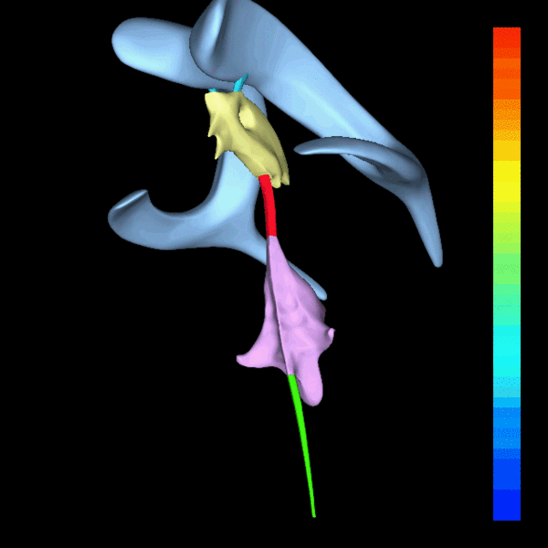

[Вернуться](./Анатомия нервной системы.md)

# Желудочки головного мозга

Боковые, латеральные желудочки мозга (правый и левый) лежат внутри обоих полушарий большого мозга. В каждом из боковых желудочков
различают части: передний, задний и нижний рога, центральная часть.
Каждая из них соответствует одной из долей полушария большого мозга: передний рог залегает в лобной доле, задний - в затылочной, нижний – в височной, центральная часть - в теменной.

Третий желудочек мозга располагается в срединной сагиттальной плоскости и сообщается с боковыми желудочками посредством впереди лежащих межжелудочковых отверстий, с четвертым желудочком - посредством водопровода мозга. Боковые стенки третьего желудочка образованы медиальными поверхностями зрительных бугров. Четвертый желудочек внизу сообщается с полостью спинного мозга его спинномозговым каналом. В задних отделах четвертого желудочка находятся два отверстия, через которые полость желудочка сообщается с субарахноидальным пространством, - боковые отверстия четвертого желудочка (отверстия Люшка). В самой каудальной части четвертого желудочка есть участок, где его крыша сильно истончается и в ней образуется отверстие, через которое может выходить часть спинномозговой жидкости (срединное отверстие четвертого желудочка, или отверстие Мажанди).

В желудочках мозга находится сосудистое сплетение, выполняющее функцию секреции цереброспинальной жидкости. Большая его часть равномерно распределена между четвертым и латеральными желудочками.
Около 10% сосудистого сплетения расположено в третьем желудочке. Во взрослом мозге на долю сосудистого сплетения приходится, как правило, не более 0,25% массы всего мозга (у человека 2 - 3 г).

Объем ликвора 110-120 мл.

