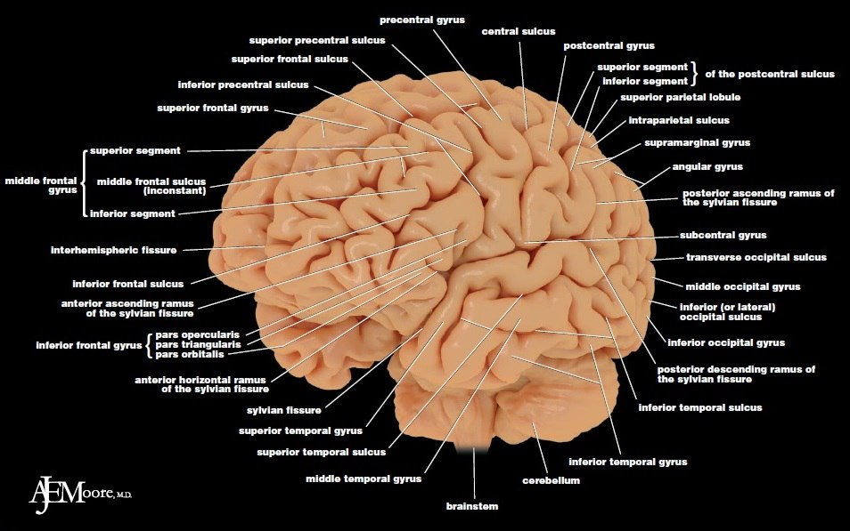
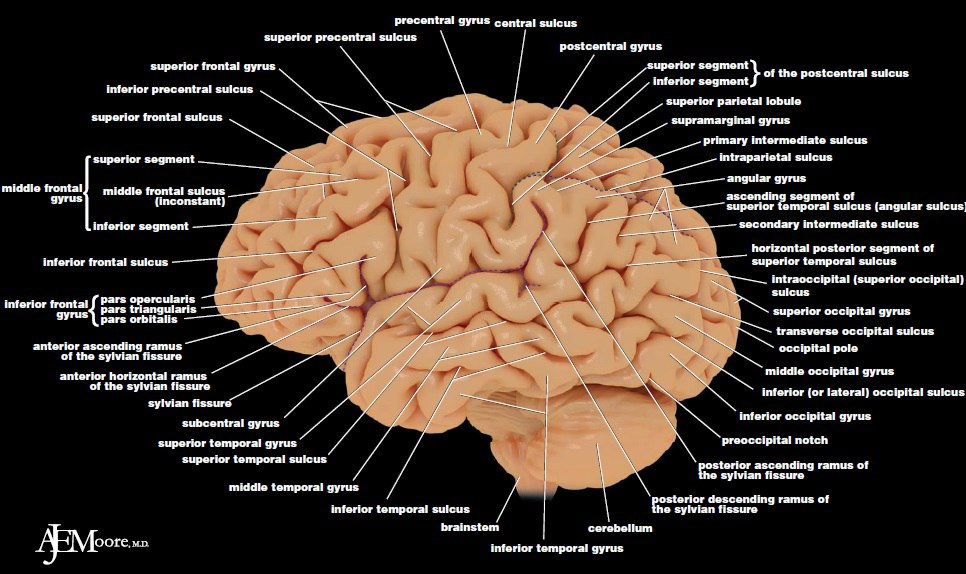
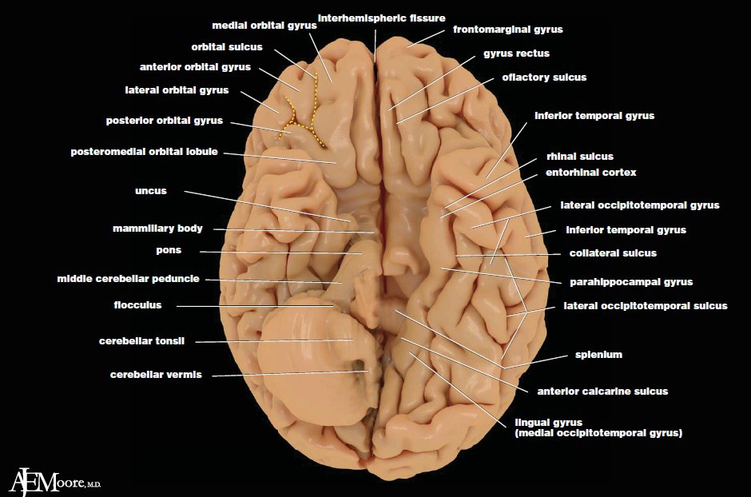
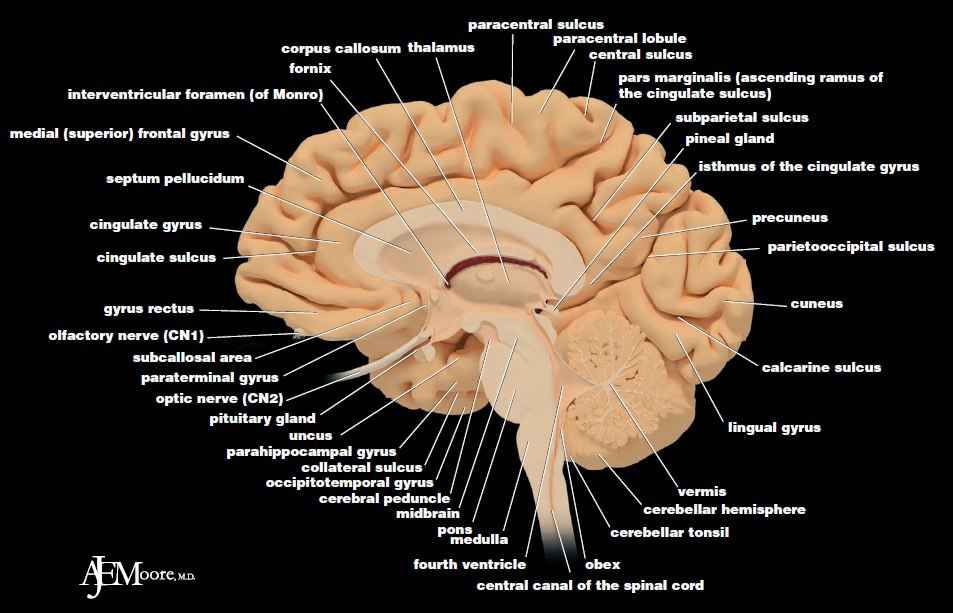
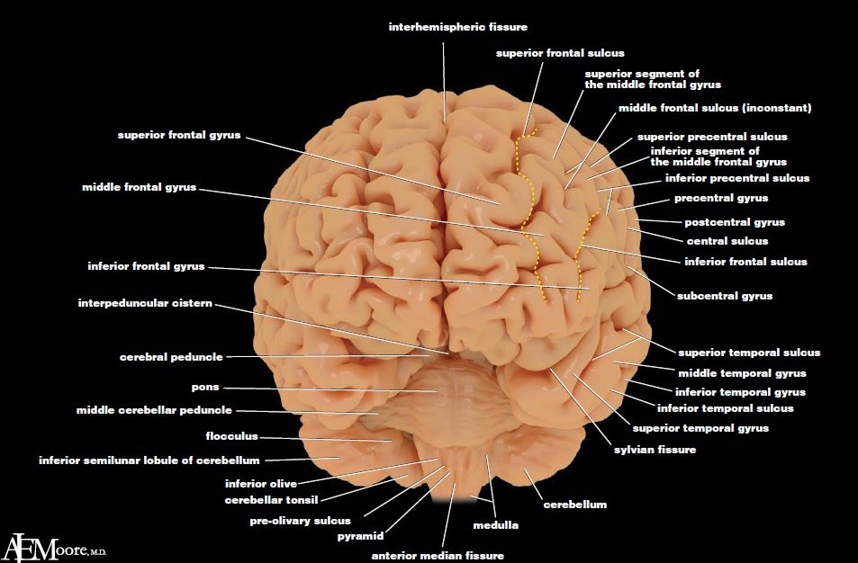

[Вернуться](./Анатомия нервной системы.md)

# Кора головного мозга

## Структурная организация коры большого мозга.
Кора большого мозга представляет собой многослойную нейронную ткань общей площадью примерно 2200 см2. На основании формы и расположения клеток по толщине коры в типичном случае выделяют 6 слоев (с поверхности вглубь): молекулярный, наружный зернистый, наружный пирамидный, внутренний зернистый, внутренний пирамидный, слой веретеновидных клеток; некоторые из них можно разделить на два или более вторичных слоев.

В коре полушарий большого мозга подобное шестислойное строение является характерным для неокортекса (изокортекса). Более древний тип коры аллокортекс - в основном трехслойный. Он расположен в глубине височных долей и с поверхности мозга не виден. В состав аллокортекса входит старая кора - архикортекс (зубчатая фасция, аммонов рог и основание гиппокампа), древняя кора - палеокортекс (обонятельный бугорок, диагональная область, прозрачная перегородка, периамигдалярная область и перипириформная область) и производные коры - ограда, миндалины и прилежащее ядро.

## Функциональная организация коры большого мозга.

Современные представления о локализации высших психических функций в коре большого мозга сводятся к теории о системной динамической локализации. Это означает, что психическая функция соотносится мозгом как определенная многокомпонентная и многозвеньевая система, различные звенья которой связаны с работой различных мозговых структур. Основоположник данного представления крупнейший нейропсихолог А. Р. Лурия писал, что «высшие психические функции как сложные функциональные системы не могут быть локализованы в узких зонах мозговой коры или в изолированных клеточных груп- пах, а должны охватывать сложные системы совместно работающих зон, каждая из которых вносит свой вклад в осуществление сложных психических процессов и которые могут располагаться в совершенно различных, иногда далеко отстоящих друг от друга участках мозга».

Два полушария человека неодинаковы по функции. Полушарие, где расположены центры речи, называется доминантным, у правшей - это левое полушарие. Другое полушарие называется субдоминантным (у правшей - правое). Такое разделение называется латерализацией функций и детерминируется генетически. Поэтому переученный левша пишет правой рукой, но до конца жизни остается левшой по типу мышления.

Корковый отдел анализатора состоит из трех отделов.
* Первичные поля - специфические ядерные зоны анализатора (например, 17 поле по Бродману - при его поражении возникает гомонимная гемианопсия).
* Вторичные поля - периферические ассоциативные поля (например, 18-19 поля - при их поражении могут быть зрительные галлюцинации, зрительные агнозии, метаморфопсии, затылочные приступы).
* Третичные поля - сложные ассоциативные поля, зоны перекрытия нескольких анализаторов (например, 39-40 поля - при их поражении возникают апраксия, акалькулия, при поражении 37 поля - астереогноз).

## Зоны и поля коры большого мозга

В коре большого мозга различают функциональные зоны, каждая из которых включает несколько полей Бродмана (всего 53 поля).

* 1-я зона - двигательная - представлена центральной извилиной и лобной зоной впереди нее (4, 6, 8, 9 поля Бродмана). При ее раздражении возникают различные двигательные реакции; при ее разрушении - нарушения двигательных функций: адинамия, парез, паралич (соответственно ослабление, резкое снижение, исчезновение движений). В двигательной зоне участки, ответственные за иннервацию различных групп мышц, представлены неодинаково. Зона, участвующая в иннервации мышц нижней конечности, представлена в верхнем отделе 1-й зоны; мышц верхней конечности и головы - в нижнем отделе 1-й зоны. Наибольшую площадь занимает проекция мимической мускулатуры, мышц языка и мелких мышц кисти руки.
* 2-я зона - чувствительная - участки коры головного мозга кзади от центральной борозды (1, 2, 3, 5, 7 поля Бродмана). При раздражении этой зоны возникают парестезии, при ее разрушении - выпадение поверхностной и части глубокой чувствительности. В верхних отделах постцентральной извилины представлены корковые центры чувствительности для нижней конечности противоположной стороны, в средних отделах - для верхней, а в нижних - для лица и головы.
1-я и 2-я зоны тесно связаны друг с другом в функциональном отношении. В двигательной зоне много афферентных нейронов, получающих импульсы от проприорецепторов, - это мотосенсорные зоны. В чувствительной зоне много двигательных элементов - это сенсомоторные зоны, которые отвечают за возникновение болевых ощущений.
* 3-я зона - зрительная - затылочная область коры головного мозга (17, 18, 19 поля Бродмана). При разрушении 17 поля возникает выпадение зрительных ощущений (корковая слепота). Различные участки сетчатки неодинаково проецируются в 17 поле Бродмана и имеют различное расположение. При точечном разрушении 17 поля нарушается полнота зрительного восприятия окружающей среды, так как выпадает участок поля зрения. При поражении 18 поля Бродмана страдают функции, связанные с распознаванием зрительного образа, нарушается восприятие письма. При поражении 19 поля Бродмана возникают различные зрительные галлюцинации, страдает зрительная память и другие зрительные функции.
* 4-я зона - слуховая - височная область коры головного мозга (22, 41, 42 поля Бродмана). При поражении 42 поля нарушается функция распознавания звуков. При разрушении 22 поля возникают слуховые галлюцинации, нарушение слуховых ориентировочных реакций, музыкальная глухота. При разрушении 41 поля - корковая глухота.
* 5-я зона - обонятельная - располагается в грушевидной извилине (11 поле Бродмана).
* 6-я зона - вкусовая - 43 поле Бродмана.
* 7-я зона - речедвигательная (по Джексону - центр речи) у правшей располагается в левом полушарии. Эта зона делится на 3 отдела:
	* речедвигательный центр Брока (центр речевого праксиса) расположен в задненижней части лобных извилин. Он отвечает за праксис речи, т. е. умение говорить. Важно понять разницу между центром Брока и двигательным центром речедвигательных мышц (языка, глотки, лица), который расположен в передней центральной извилине кзади от зоны Брока. При поражении двигательного центра указанных мышц развивается их центральный парез или паралич. При этом человек способен говорить, смысловая сторона речи не страдает, но речь его нечетка, голос маломодулирован, т. е. нарушено качество звукопроизношения. При поражении зоны Брока мышцы речедвигательного аппарата интактны, но человек не способен говорить, как ребенок первых месяцев жизни. Это состояние называется моторной афазией;
	* сенсорный центр Вернике расположен в височной зоне. Он связан с восприятием устной речи. При его поражении возникает сенсорная афазия - человек не понимает устную речь (как чужую, так и свою). Из-за непонимания собственной речевой продукции речь больного приобретает характер «словесного салата», т. е. набора не связанных между собой слов и звуков.
При совместном поражении центров Брока и Вернике (например, при инсульте, поскольку оба они расположены в одном сосудистом бассейне) развивается тотальная (сенсорная и моторная) афазия;
	* центр восприятия письменной речи располагается в зрительной зоне коры головного мозга - 18 поле Бродмана. При его поражении развивается аграфия - невозможность писать.

Аналогичные, но недифференцированные зоны есть и в субдоминантном правом полушарии, при этом степень их развития различна у каждого индивидуума. Если у левши повреждено правое полушарие, функция речи страдает в меньшей степени.

Кору большого мозга на макроскопическом уровне можно разделить на **сенсорные, двигательные и ассоциативные зоны**. Сенсорные (проекционные) зоны, к которым относят первичную соматосенсорную кору, первичные зоны различных анализаторов (слухового, зрительного, вкусового, вестибулярного), имеют связь с определенными участками, органами и системами человеческого тела, периферическими отделами анализаторов. Такую же соматотопическую организацию имеет и двигательная кора. Проекции частей тела и органов представлены в этих зонах по принципу функциональной значимости.

**Ассоциативная кора**, к которой относят теменно-височно-затылочную, префрональную и лимбическую ассоциативные зоны, важна для осуществления следующих интегративных процессов: высших сенсорных функций и речи, двигательного праксиса, памяти и эмоционального (аффективного) поведения. Ассоциативные отделы коры полушарий большого мозга у человека не только больше по занимаемой площади, чем проекционные (сенсорные и двигательные), но и характеризуются более тонким архитектоническим и нейронным строением.

