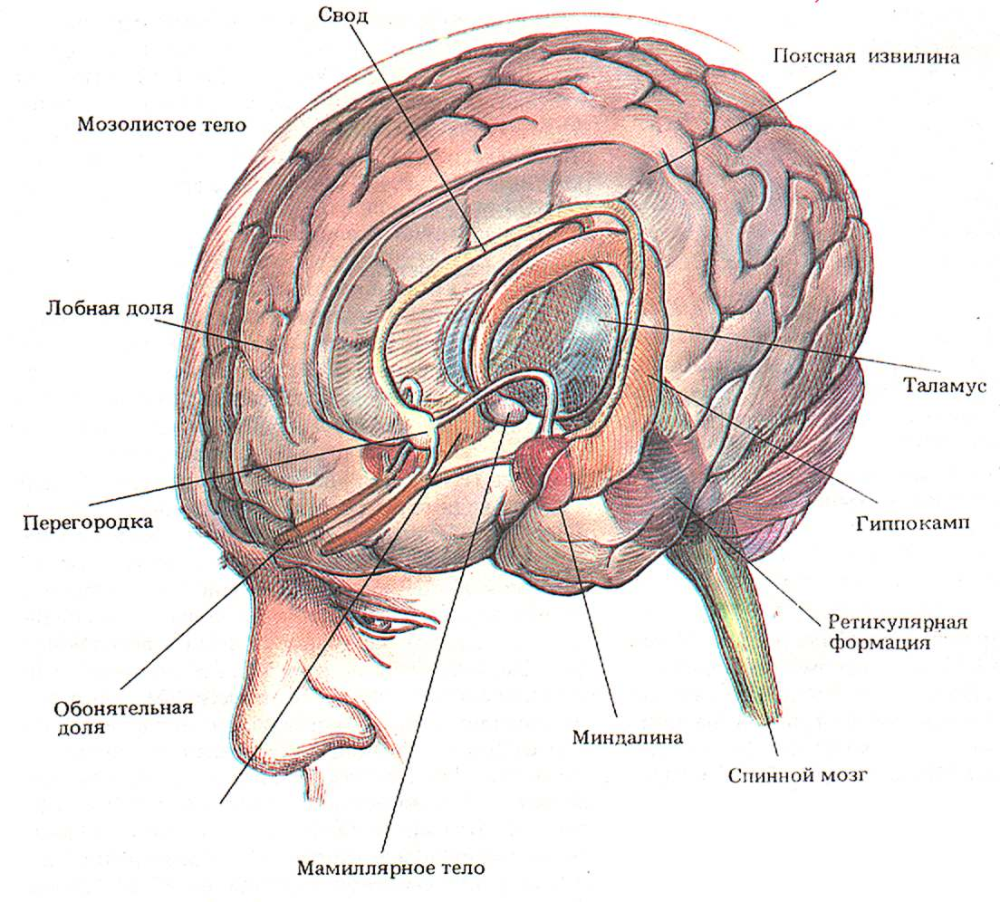
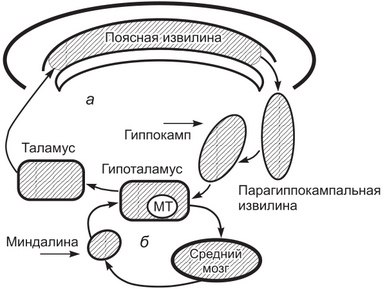

[Вернуться](./Анатомия нервной системы.md)

# Лимбическая система

Лимбическая система — совокупность нервных структур и их связей, расположенных в медиобазальной части больших полушарий, участвующих в управлении вегетативными функциями и эмоциональным, а также оказывающих влияние на смену фаз сна и бодрствования.

Лимбическая система состоит из филогенетически старых отделов переднего мозга. В названии (limbus — край) отражена особенность ее расположения в виде кольца между новой корой и конечной частью ствола мозга. К лимбической системе относят ряд функционально объединенных структур среднего, промежуточного и конечного мозга. Это поясная, парагиппокампальная и зубчатая извилины, гиппокамп, обонятельная луковица, обонятельный тракт и прилежащие участки коры. Кроме того, к лимбической системе относят миндалину, переднее и септальное таламические ядра, гипоталамус и мамиллярные тела.

Лимбическая система имеет множественные афферентные и эфферентные связи с другими структурами мозга. Ее структуры взаимодействуют друг с другом. Функции лимбической системы реализуются на основе протекающих в ней интегративных процессов. В то же время отдельным структурам лимбической системы присущи более или менее очерченные функции.

## Основные функции лимбической системы

- Эмоционально-мотивационное поведение (при страхе, агрессии, голоде, жажде), которое может сопровождаться эмоционально окрашенными двигательными реакциями 
- Участие в организации сложных форм поведения, таких как инстинкты (пищевые, половые, оборонительные) 
- Участие в ориентировочных рефлексах: реакция настороженности, внимания 
- Участие в формировании памяти и динамике обучения (выработка индивидуального поведенческого опыта) 
- Регуляция биологических ритмов, в частности смен фаз сна и бодрствования 
- Участие в поддержании гомеостаза путем регуляции вегетативных функций

## Большой круг Пейпеса

- гиппокамп; 
- свод; 
- мамиллярные тела; 
- мамиллярно-таламический пучок Викд'Азира; 
- таламус; 
- поясная извилина.

*Основные составляющие лимбической системы*

*Важнейшие связи между структурами лимбической системы и ствола мозга: а — круг Пайпеца, б — круг через миндалину; МТ — мамиллярные тела*

## Поясная извилина

Нейроны поясной извилины получают афферентные сигналы из ассоциативных областей лобной, теменной и височной коры. Аксоны ее эфферентных нейронов следуют к нейронам ассоциативной коры лобной доли, гипиокампа, септальных ядер, миндалины, которые связаны с гипоталамусом. 

Одной из функций поясной извилины является ее участие в формировании поведенческих реакций. Так, при стимуляции ее передней части у животных возникает агрессивное поведение, а после двухстороннего удаления животные становятся тихими, покорными, асоциальными — теряют интерес к другим особям группы, не пытаясь устанавливать с ними контакт. 

Поясная извилина может оказывать регуляторные влияния на функции внутренних органов и поперечно-полосатой мускулатуры. Ее электрическая стимуляция сопровождается уменьшением частоты дыхания, сокращений сердца, снижением давления крови, усилением моторики и секреции желудочно-кишечного тракта, расширением зрачка, снижением тонуса мышц.

*При рассечении снижается болевое чувство.*

## Миндалина

Миндалина расположена в височной доле мозга, и ее нейроны формируют несколько подгрупп ядер, нейроны которых взаимодействуют друг с другом и другими структурами мозга. Среди этих ядерных групп кортикомедиальная и базолатеральная подгруппы ядер. 
Нейроны кортикомедиальных ядер миндалины получают афферентные сигналы от нейронов обонятельной луковицы, гипоталамуса, ядер таламуса, септальных ядер, вкусовых ядер промежуточного мозга и путей болевой чувствительности моста, по которым к нейронам миндалины поступают сигналы от больших рецептивных полей кожи и внутренних органов. С учетом этих связей предполагают, что кортикомедиальная группа ядер миндалин вовлечена в контроль осуществления вегетативных функций организма. 

Нейроны базолатеральных ядер миндалины получают сенсорные сигналы от нейронов таламуса, афферентные сигналы о смысловом (осознаваемом) содержании сигналов от префронтальной коры лобной доли, височной доли мозга и поясной извилины. 

Нейроны базолатеральных ядер связаны с таламусом, префронтальной частью коры больших полушарий мозга и вентральной частью полосатого тела базальных ганглиев, поэтому предполагается, что ядра базолатеральной группы миндалин принимают участие в осуществлении функций лобной и височной долей мозга. 

Нейроны миндалины посылают эфферентные сигналы по аксонам преимущественно к тем же структурам мозга, от которых они получили афферентные связи. Среди них гипоталамус, медиодорсальное ядро таламуса, префронтальная кора, зрительные области височной коры, гиппокамп, вентральная часть полосатого тела. 

О характере функций, выполняемых миндалиной, судят но последствиям ее разрушения или по эффектам ее раздражения у высших животных. Так, двухстороннее разрушение миндалин у обезьян вызывает потерю агрессивности, снижение эмоций и защитных реакций. Обезьяны с удаленными миндалинами держатся в одиночестве, не стремятся вступать в контакт с другими животными. При заболеваниях миндалин наблюдается разобщение между эмоциями и эмоциональными реакциями. Больные могут испытывать и выражать большую обеспокоенность по какому-либо поводу, но в это время частота сокращений сердца, давление крови и другие вегетативные реакции у них не изменены. Предполагается, что удаление миндалин, сопровождаемое разрывом ее связей с корой, ведет к нарушению в коре процессов нормальной интеграции смысловой и эмоциональной составляющих эфферентных сигналов.

##  Гиппокампальные структуры

Гиппокамп вместе с зубчатой извилиной (subiculun) и обонятельной корой образует единую функциональную гиппокампальную структуру лимбической системы, расположенную в медиальной части височной доли мозга. Между составляющими этой структуры имеются многочисленные двухсторонние связи. 

Основные афферентные сигналы зубчатая извилина получает от обонятельной коры и посылает их в гиппокамп. В свою очередь обонятельная кора как главные ворота получения афферентных сигналов получает их от различных ассоциативных областей коры больших полушарий, гиппокампальной и поясной извилин. К гиппокампу поступают уже обработанные зрительные сигналы из внестриарных областей коры, слуховые — из височной доли, соматосенсорные — из постцентральной извилины и информация — из полисенсорных ассоциативных областей коры. 

К гиппокампальным структурам поступают сигналы и из других областей мозга — ядер ствола, ядра шва, голубоватого пятна. Эти сигналы выполняют преимущественно модуляторную функцию по отношению к активности нейронов гиппокампа, приспосабливая ее к степени внимания и мотиваций, оказывающих решающее значение на процессы запоминания и обучения. 

Эфферентные связи гиппокампа организованы так, что они следуют в основном в те области мозга, с которыми гиппокамп связан афферентными связями. Таким образом, эфферентные сигналы гиппокампа следуют главным образом к ассоциативным областям височной и лобной долей мозга. Для выполнения своих функций гиппокампальные структуры нуждаются в постоянном обмене информацией с корой и другими структурами мозга. 
Одним из последствий двухстороннего заболевания медиальной части височной доли является развитие амнезии — потери памяти с последующим снижением интеллекта. При этом наиболее грубые нарушения памяти наблюдаются при повреждении всех гиппокампальных структур и менее выраженные — при повреждении только гиппокампа. Из этих наблюдений сделан вывод о том, что гиппокампальные структуры являются частью структур мозга, включая медиальный галамус, холинергические нейронные группы основания лобных долей, миндалины, играющих ключевое значение в механизмах памяти и обучения. 

Особую роль в реализации гиппокампом механизмов памяти играет уникальное свойство его нейронов сохранять в течение длительного времени состояние возбуждения и синаптической передачи сигналов после их активации какими-либо воздействиями (это свойство называется посттетанической потенциацией). Посттетаническая потенциация, обеспечивающая длительное циркулирование информационных сигналов по замкнутым нейронным кругам лимбической системы, является одним из ключевых процессов в механизмах формирования долговременной памяти. 

Гиппокампальные структуры играют важную роль в усвоении новой информации и сохранении ее в памяти. Информация о более ранних событиях сохраняется в памяти после повреждения этой структуры. При этом гиппокампальные структуры играют роль в механизмах декларативной или конкретной памяти на события и факты. К механизмам недекларативной памяти (память на навыки и лица) в большей степени причастны базальные ганглии, мозжечок, моторные области коры, височная кора.

---

**Таким образом, структуры лимбической системы принимают участие в осуществлении таких сложных функций мозга как поведение, эмоции, обучение, память.** Функции мозга организованы так, что чем сложнее функция, тем разветвленное нейронные сети, участвующие в ее организации. Из этого очевидно, что лимбическая система является лишь частью структур центральной нервной системы, имеющих значение в механизмах сложных функций мозга, и вносит свой вклад в их осуществление.

Так, в формировании эмоций как состояний, отражающих паше субъективное отношение к текущим или прошлым событиям, можно выделить психический (переживание), соматический (жестикуляция, мимика) и вегетативный (вегетативные реакции) компоненты. Степень проявления этих компонентов эмоций зависит от большей или меньшей вовлеченности в эмоциональные реакции структур мозга, при участии которых они реализуются. Это во многом определяется тем, какая группа ядер и структур лимбической системы активируется в наибольшей степени. Лимбическая система выступает в организации эмоций как своеобразный дирижер, усиливающий или ослабляющий выраженность того или иного компонента эмоциональной реакции. 

Вовлечение в ответные реакции структур лимбической системы, связанных с корой больших полушарий, усиливает в них психический компонент эмоции, а вовлечение структур, связанных с гипоталамусом и самого гипоталамуса как части лимбической системы, усиливает вегетативный компонент эмоциональной реакции. В то же время функция лимбической системы в организации эмоций находится у человека под влиянием коры лобной доли мозга, которая оказывает корригирующее влияние на функции лимбической системы. Она сдерживает проявление излишних эмоциональных реакций, связанных с удовлетворением простейших биологических потребностей и, по-видимому, способствует появлению эмоций, связанных с реализацией социальных взаимоотношений и творчества.

