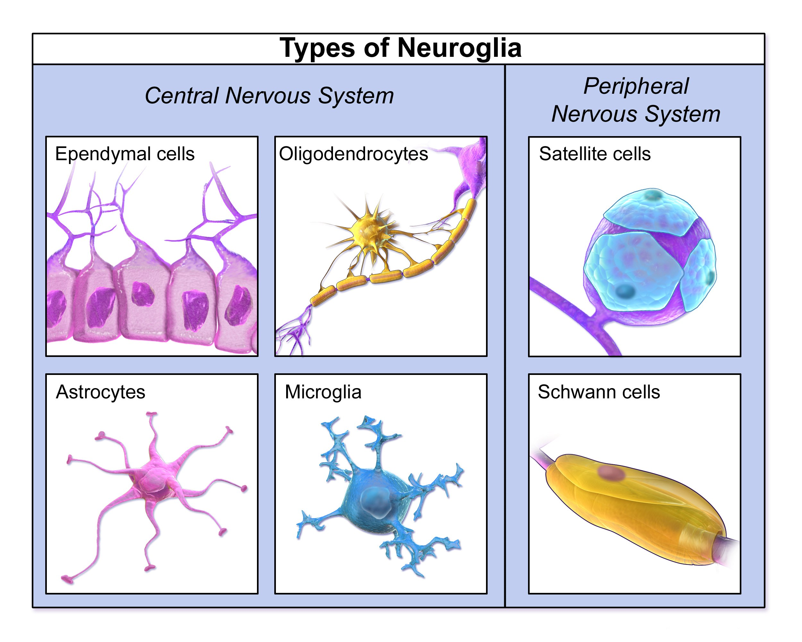
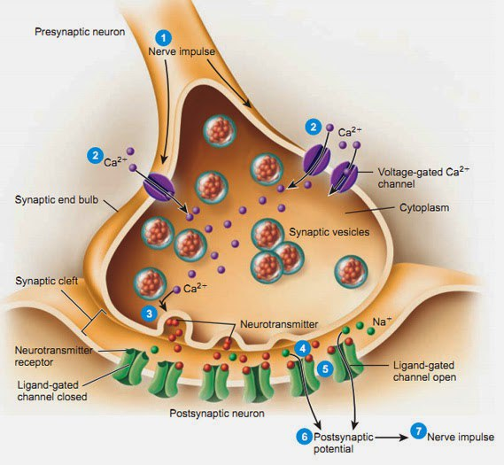

[Вернуться](./Анатомия нервной системы.md)

# Общие сведения о нервной системе

## Нейрон

Анатомической и функциональной единицей нервной системы является нейрон.  В организме человека насчитывается более 100 миллиардов нейронов.  Нейроны имеют отростки, с помощью которых соединяются между собой и с  иннервируемыми образованиями (мышечными волокнами, кровеносными  сосудами, железами). Отростки нервной клетки неравнозначны в  функциональном отношении:

* Дендриты – множество ветвящихся  коротких отростков отходящих от тела клетки (проводят раздражение к телу  нейрона),
  Тела нервных клеток с дендритными деревьями образуют нервные  центры – серое вещество.
* Аксон – отходящий от тела клетки один  длинный отросток (покрыт миелиновой оболочкой)- проводит раздражение от  тела нейрона, благодаря разветвлению окончания аксона возбуждение  передается нескольким нервным клеткам. 

Аксоны различных нервных клеток образуют проводящие пути – белое вещество. 

На  основании числа и расположения дендритов и аксона нейроны делятся на  безаксонные, униполярные нейроны, псевдоуниполярные нейроны, биполярные  нейроны и мультиполярные (много дендритных стволов, обычно эфферентные) нейроны.

* Безаксонные нейроны - небольшие клетки,  сгруппированы вблизи спинного мозга в межпозвоночных ганглиях, не  имеющие анатомических признаков разделения отростков на дендриты и  аксоны. Все отростки у клетки очень похожи. Функциональное назначение  безаксонных нейронов слабо изучено. 
* Униполярные нейроны - нейроны с одним отростком, присутствуют, например в сенсорном ядре тройничного нерва в среднем мозге.
* Биполярные нейроны - нейроны, имеющие один аксон и один дендрит,  расположенные в специализированных сенсорных органах - сетчатке глаза,  обонятельном эпителии и луковице, слуховом и вестибулярном ганглиях.
* Мультиполярные нейроны - нейроны с одним аксоном и несколькими  дендритами. Данный вид нервных клеток преобладает в центральной нервной  системе.
* Псевдоуниполярные нейроны - являются уникальными в  своём роде. От тела отходит один отросток, который сразу же Т-образно  делится. Весь этот единый тракт покрыт миелиновой оболочкой и структурно  представляет собой аксон, хотя по одной из ветвей возбуждение идёт не  от, а к телу нейрона. Структурно дендритами являются разветвления на  конце этого (периферического) отростка. Триггерной зоной является начало  этого разветвления (т. е. находится вне тела клетки). Такие нейроны  встречаются в спинальных ганглиях.

*Морфологическая классификация нейронов (схема):
A - униполярный нейрон (амакринная клетка сетчатки глаза); Б - биполярный нейрон (вставочный нейрон сетчатки глаза); В - псевдоуниполярный нейрон (афферентная клетка спинномозгового узла); Г1-Г3 - мультиполярные нейроны: Г1 - мотонейрон спинного мозга; Г2 - пирамидный нейрон коры полушарий большого мозга, Г3 - клетка Пуркинье коры полушарий мозжечка.
1 - перикарион, 1.1 - ядро; 2 - аксон; 3 - дендрит(ы); 4 - периферический отросток; 5 - центральный отросток.*

Основная функция нейронов -  это переработка информации: получение, проведение и передача другим  клеткам. Получение информации происходит через синапсы с рецепторами  сенсорных органов или другими нейронами, или непосредственно из внешней  среды с помощью специализированных дендритов. Проведение информации  происходит по аксонам, передача - через синапсы.

Помимо нейронов  нервная ткань содержит клетки еще одного типа - клетки глии, глиальные  клетки, или глия (от греч. "глия" - клей). Они выполняют опорную и  защитную функции , а также участвуют в нейронофагии. По численности их в  10 раз больше, чем нейронов (10 в 13-ой и 10 в 12-ой степени,  соответственно) и они занимают половину объема центральной нервной  системы (ЦНС). 

Глия выполняет не только опорные функции, но и  обеспечивает многообразные метаболические процессы в нервной ткани, а  также способствует восстановлению нервной ткани после травм и инфекций.  Выделяют макроглию и микроглию. Макроглия подразделяется на эпендимную  глию, астроцитарную глию (астроглию) и олигодендроглию. 

## Синапс

Нейроны  контактируют между собой с помощью особого аппарата – синапса. Синапс -  специализированная зона контакта между отростками нервных клеток и  другими возбудимыми и невозбудимыми клетками, обеспечивающая передачу  информационного сигнала. Морфологически синапс образован контактирующими  мембранами двух клеток. Мембрана, принадлежащая отросткам нервных  клеток, называется пресинаптической, мембрана клетки, к которой  передается сигнал, - постсинаптической. В соответствии с принадлежностью  постсинаптической мембраны синапса подразделяют на нейросекреторные,  нейромышечные и межнейрональные. Термин «синапс» был введён в 1897 г.  английским физиологом Чарльзом Шеррингтоном.

**Структура синапса:**

Типичный  синапс - аксо-дендритический химический. Такой синапс состоит из двух  частей: пресинаптической, образованной булавовидным расширением  окончанием аксона передающей клетки и постсинаптической, представленной  контактирующим участком цитолеммы воспринимающей клетки (в данном случае  - участком дендрита). Синапс представляет собой пространство,  разделяющее мембраны контактирующих клеток, к которым подходят нервные  окончания. 

Передача импульсов осуществляется химическим путём с  помощью медиаторов или электрическим путём посредством прохождения  ионов из одной клетки в другую. Между обеими частями имеется  синаптическая щель, края которой укреплены межклеточными контактами.  Часть аксолеммы булавовидного расширения, прилежащая к синаптической  щели называется пресинаптической мембраной. Участок цитолеммы  воспринимающей клетки, ограничивающий синаптическую щель с  противоположной стороны, называется постсинаптической мембраной, в  химических синапсах она рельефна и содержит многочисленные рецепторы. В  синаптическом расширении имеются мелкие везикулы, так называемые  синаптические пузырьки, содержащие либо медиатор (вещество-посредник в  передаче возбуждения), либо фермент, разрушающий этот медиатор. На  постсинаптической и пресинаптической мембранах присутствуют рецепторы к  тому или иному медиатору.

Существуют также и смешанные синапсы,  где пресинаптический потенциал действия создает ток, который  деполяризует постсинаптическую мембрану типичного химического синапса,  где пре- и постсинаптические мембраны не плотно прилегают друг к другу.  Таким образом, в этих синапсах химическая передача служит необходимым  усиливающим механизмом. Наиболее распространён первый тип.

Химические синапсы можно классифицировать по их местоположению и принадлежности соответствующим структурам: 

Периферические:
* нервно-мышечные 
* нейросекреторные (аксо-вазальные) 
* рецепторно-нейрональные 

Центральные:

* аксо-дендритические - с дендритами, в т. ч. 
* аксо-шипиковые - с дендритными шипиками, выростами на дендритах; 
* аксо-соматические - с телами нейронов; 
* аксо-аксональные - между аксонами; 
* дендро-дендритические - между дендритами; 

В зависимости от медиатора синапсы разделяются на 

*  аминергические, содержащие биогенные амины (например, серотонин,  дофамин;) o в том числе адренергические, содержащие адреналин или  норадреналин;
*  холинергические, содержащие ацетилхолин; 
* пуринергические, содержащие пурины; 
*  пептидергические, содержащие пептиды. При этом в синапсе не всегда  вырабатывается только один медиатор. Обычно основной медиатор  выбрасывается вместе с другим, играющим роль модулятора.

