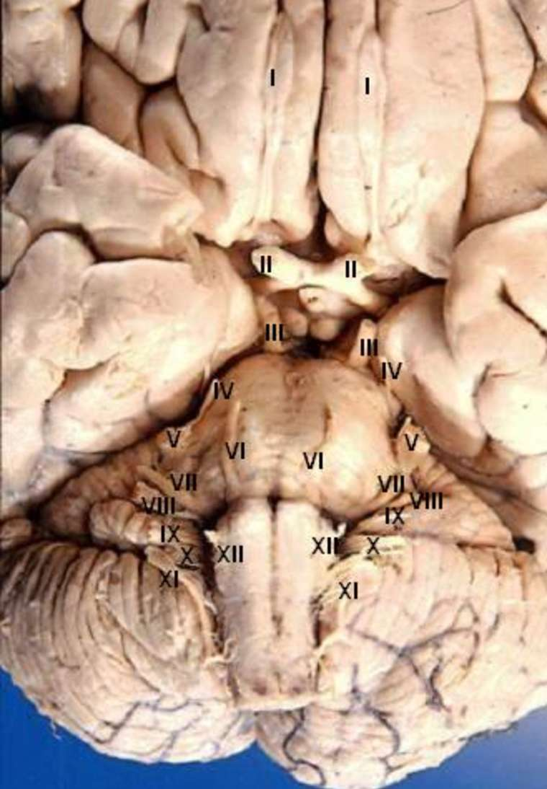
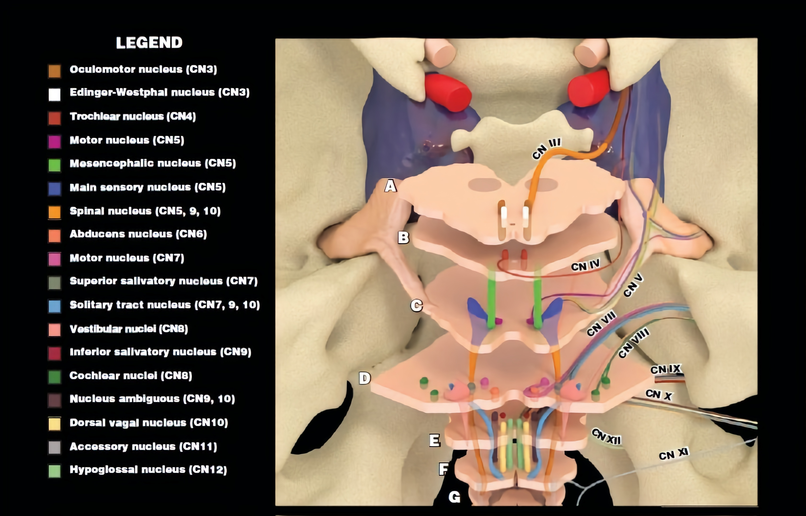
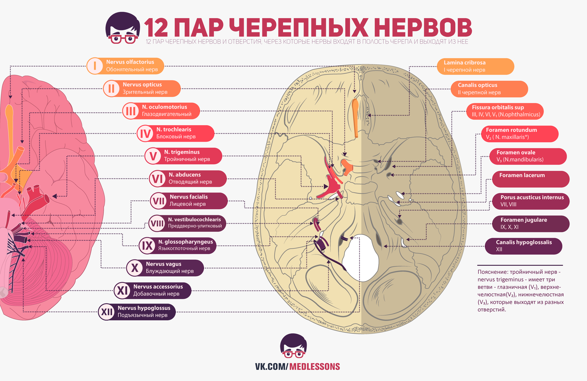

[Вернуться](./Анатомия нервной системы.md)

# Переферическая нервная система

## Черепные нервы

* I пара — обонятельные нервы (nn. olfactorii). Они начинаются от слизистой оболочки обонятельной области полости носа, проходят через решетчатую пластинку в полость черепа и подходят к обонятельной луковице, где оканчивается 1-й нейрон обонятельного пути и берет начало центральный обонятельный путь.

* II пара — зрительный нерв (n. opticus), который содержит около 1 млн. тонких нервных волокон, являющихся аксонами мультиполярных нейронов сетчатки глаза (3-й нейрон зрительного пути). Нерв имеет наружное и внутреннее влагалища, служащие продолжением оболочек головного мозга. Через зрительный канал нерв проникает в полость черепа.
Кпереди от турецкого седла оба нерва образуют зрительный перекрест (chiasma opticum), где волокна из медиальных (назальных) половин сетчаток переходят на противоположную сторону. После перекреста образуется зрительный тракт (tractus opticus), который огибает ножку мозга и отдает свои волокна подкорковым зрительным центрам.

* Ill пара — глазодвигательный нерв (n. oculomotorius) Он берет начало от двигательных ядер, расположенных в покрышке среднего мозга на уровне верхних холмиков. Нерв выходит в межножковой ямке из медиальной поверхности ножки мозга, входит в боковую стенку пещеристого синуса и через верхнюю глазничную щель попадает в глазницу. Здесь он делится на верхнюю и нижнюю ветви. Верхняя ветвь входит в мышцу, поднимающую верхнее веко, и в верхнюю прямую мышцу глазного яблока, а нижняя ветвь иннервирует нижнюю и медиальную прямые и нижнюю косую мышцы. Глазодвигательный нерв содержит парасимпатические волокна, которые начинаются в его добавочном ядре и по соединительной ветви проходят в ресничный ганглий. От клеток этого ганглия получают иннервацию сфинктер зрачка и ресничная мышца глаза.

* IV пара — блоковый нерв (n. trochlearis), самый тонкий из черепных нерв. Он начинается от ядра, лежащего в покрышке среднего мозга на уровне нижних холмиков, выходит на задней поверхности мозгового ствола, огибает ножку мозга, идет в стенке пещеристого синуса и через верхнюю глазничную щель проникает в глазницу, иннервирует верхнюю косую мышцу глазного яблока.

* V пара — тройничный нерв (n. trigeminus), который является главным чувствительным нервом головы. Область иннервации кожи головы тройничным нервом ограничена теменно-ушно-подбородочной линией. Тройничный нерв иннервирует также глазное яблоко и конъюнктиву, твердую мозговую оболочку, слизистую оболочку полости носа и рта, большей части языка, зубы и десны. Его двигательные волокна идут к жевательным мышцам и мышцам дна ротовой полости.
Тройничный нерв выходит из мозга на границе между мостом и средней мозжечковой ножкой. Он имеет более толстый чувствительный и более тонкий двигательный корешки. Волокна чувствительного корешка являются отростками нейронов тройничного ганглия (ganglion trigeminale), который лежит в углублении височной пирамиды вблизи ее верхушки в особой полости, образованной расщеплением твердой мозговой оболочки. Эти волокна оканчиваются в мостовом ядре тройничного нерва, расположенном в верхнем отделе ромбовидной ямки, и в ядре спинномозгового пути, которое из моста продолжается в продолговатый мозг и далее в шейные сегменты спинного мозга. Волокна, приносящие проприоцептивные раздражения из жевательных мышц, являются отростками клеток ядра среднемозгового пути тройничного нерва, лежащего в покрышке среднего мозга. Волокна двигательного корешка начинаются от двигательного ядра тройничного нерва, расположенного в мосту.
	* От тройничного ганглия отходят три главные ветви нерва — глазной, верхнечелюстной и нижнечелюстной нервы. Глазной нерв (n. ophthalmicus) чисто чувствительный. Он делится, в свою очередь, на три ветви — слезный, лобный и носоресничный нервы, которые проходят через верхнюю глазничную щель. Слезный нерв (n. lacrimalis) иннервирует кожу латерального угла глаза и конъюнктиву, отдает секреторные веточки к слезной железе. Лобный нерв (n. frontalis) разветвляется в коже лба, верхнего века и снабжает слизистую оболочку лобной пазухи. Носоресничный нерв (n. nasociliaris) отдает длинные ресничные нервы глазному яблоку. От него в полость носа идут передний и задний решетчатые нервы, иннервирующие слизистую оболочку полости носа, решетчатой и клиновидной пазух, а также кожу спинки носа. Его конечная ветвь — подблоковый нерв разветвляется в коже медиального угла глаза и иннервирует слезный мешок.
	* Верхнечелюстной нерв (n. maxillaris) также является чувствительным, он проходит через круглое отверстие в крыловидно-небную ямку, откуда продолжается в глазницу и, пройдя подглазничный канал, выходит под названием подглазничного нерва (n. infraorbitalis) на переднюю поверхность лица; иннервирует кожу щеки, нижнего века, верхней губы, крыла и преддверия носа. От верхнечелюстного и подглазничного нервов отходят верхние альвеолярные нервы (nn. alveolares sup.) к зубам верхней челюсти и деснам.
	* Скуловой нерв (n. zygomaticus) иннервирует кожу латеральной части лица. Крыловидно-небные нервы идут от верхнечелюстного нерва к крыловидно-небному ганглию. Входящие в их состав чувствительные волокна проходят от крыловидно-небного ганглия по задним носовым нервам к слизистой оболочке полости носа, по небным нервам к слизистой оболочке неба, по глоточной ветви к слизистой оболочке носоглотки. Нервы, отходящие от крыловидно-небного ганглия, содержат симпатические и парасимпатические волокна. В числе последних имеются волокна, иннервирующие слезную железу; они идут по ветви, соединяющей скуловой и слезный нервы.
	* Нижнечелюстной нерв (n. mandibularis) является смешанным. В его состав входят волокна двигательного корешка тройничного нерва. Нижнечелюстной нерв проходит через овальное отверстие и отдаст ветви ко всем жевательным мышцам. К чувствительным ветвям его относятся: щечный нерв (n. buccalis), который снабжает слизистую оболочку щеки и щечную поверхность десен нижних премоляров и 1-го моляра; ушно-височный нерв (n. auriculotemporalis), иннервирующий кожу височной области и часть ушной раковины; язычный нерв (n. lingualisi), снабжающий слизистую оболочку кончика и спинки языка.
	* Смешанный состав имеет нижний альвеолярный нерв (n. alveolaris inf.), который проходит в канале нижней челюсти, отдавая ветви зубам и деснам; его конечной ветвью является подбородочный нерв (n. mentalis), разветвляющийся в коже подбородка, коже и слизистой оболочке нижней губы. До вхождения нижнего альвеолярного нерва в канал нижней челюсти от него ответвляется челюстно-подъязычный нерв, несущий двигательные волокна к мышцам диафрагмы рта. Ветви нижнечелюстного нерва связаны с вегетативными ганглиями, ушно-височный нерв — с ушным ганглием, из которого получает парасимпатическую иннервацию околоушная железа, а язычный нерв — с поднижнечелюстным ганглием, дающим иннервацию поднижнечелюстной и подъязычной железам.

* VI пара — отводящий нерв (n. abducens). Он имеет двигательное ядро в верхнем отделе ромбовидной ямки, выходит из мозга между краем моста и пирамидой продолговатого мозга, проходит через пещеристый синус к верхней глазничной щели, иннервирует наружную прямую мышцу глаза.

* VII пара — лицевой нерв (n. facialis). Он образован главным образом двигательными волокнами, берущими начало от ядра, которое расположено в верхнем отделе ромбовидной ямки. В состав лицевого нерва входит промежуточный нерв (n. intermedius), который содержит чувствительные вкусовые и парасимпатические волокна. Первые являются отростками нейронов ганглия коленца и оканчиваются в ядре одиночного пути вместе со вкусовыми волокнами языкоглоточного и блуждающего нервов. Вторые берут начало в слезном и верхнем слюноотделительном ядрах, лежащих рядом с двигательным ядром лицевого нерва.
Лицевой нерв выходит из мозга в мостомозжечковом углу и вступает во внутренний слуховой проход, откуда переходит в лицевой канал височной кости. Здесь располагаются барабанная струна (chorda tympani), ганглий коленца и начинается большой каменистый нерв, по которому парасимпатические волокна проходят к крыловидно-небному ганглию. Барабанная струна проходит через барабанную полость и присоединяется к язычному нерву, содержит вкусовые волокна от двух передних третей языка и парасимпатические волокна, достигающие поднижнечелюстного ганглия. Лицевой нерв выходит из височной кости через шилососцевидное отверстие и входит в околоушную железу, образуя в ней сплетение. От этого сплетения ветви лицевого нерва веерообразно расходятся по лицу, иннервируя все мимические мышцы, а также заднее брюшко двубрюшной мышцы и шилоподъязычную мышцу. Шейная ветвь лицевого нерва разветвляется в подкожной мышце шеи. Ветви лицевого нерва образуют соединения, ветвями тройничного, языкоглоточного, блуждающего нервов и шейного сплетения.

* VIII пара преддверно-улитковый нерв (n. vestibulocochlearis), который проводит раздражения от рецепторов внутреннего уха к собственным ядрам, расположенным в латеральной части ромбовидной ямки. Нерв состоит из преддверного и улиткового корешков. Преддверный корешок образован отростками нейронов преддверного ганглия (ganglion vestibulare), расположенного во внутреннем слуховом проходе. Улитковый корешок состоит из отростков клеток спирального ганглия (ganglion spirale), находящегося в улитке. Преддверно-улитковый нерв выходит из внутреннего слухового прохода и вступает в головной мозг в области мостомозжечкового угла.

* IX пара — языкоглоточный нерв (n. glossopharyngeus). Он проводит двигательные волокна к сжимателям глотки и шилоглоточной мышце, чувствительные волокна от слизистой оболочки глотки, миндалин, барабанной полости и слуховой трубы, вкусовые волокна от желобовидных сосочков языка и преганглионарные парасимпатические волокна к ушному ганглию для околоушной железы. Ядра нерва располагаются в нижнем отделе ромбовидной ямки, в треугольнике блуждающего нерва. Здесь лежат двигательное двойное ядро, общее с блуждающим нервом, и ядро одиночного пути, общее с лицевым и блуждающим нервами. Парасимпатические волокна берут начало в нижнем слюноотделительном ядре. Языкоглоточный нерв выходит из продолговатого мозга позади оливы и покидает полость черепа через яремное отверстие.
Он образует верхний и нижний чувствительные ганглии. По выходе из черепа языкоглоточный нерв проходит между шилоглоточной и шилоязычными мышцами к основанию языка. От его нижнего ганглия отходит барабанный нерв (n. tympanicus), образующий сплетение в барабанной полости. Барабанный нерв содержит парасимпатические волокна, которые продолжаются по малому каменистому нерву до ушного ганглия. Далее языкоглоточный нерв отдает глоточные, миндаликовые и язычные ветви. Последние иннервируют слизистую оболочку корня языка. Каротидная ветвь языкоглоточного нерва проводит афферентные волокна от каротидного синуса и гломуса. IX пара и ее ветви образуют соединения с ушно-височным, лицевым, блуждающим нервами, внутренним сонным сплетением.

* Х пара — блуждающий нерв (n. vagus), имеющий самую обширную область иннервации. Он является главным парасимпатическим нервом внутренних органов, а также проводит большую часть афферентных волокон из органов, в которых разветвляется. В области головы и шеи блуждающий нерв отдает ветвь твердой мозговой оболочке, обеспечивает чувствительную и двигательную иннервацию неба и глотки (вместе с тройничным и языкоглоточным нервами), полностью иннервирует гортань, участвует во вкусовой иннервации корня языка. Блуждающему нерву принадлежит двойное ядро, ядро одиночного пути и дорсальное (парасимпатическое) ядро в продолговатом мозге. Нерв выходит несколькими корешками позади оливы вместе с языкоглоточным нервом и проходит через яремное отверстие, где находятся его верхний и нижний ганглии.
На шее блуждающий нерв идет в составе сосудисто-нервного пучка. Ушная ветвь этого нерва иннервирует кожу наружного слухового прохода и примыкающий участок ушной раковины. От шейной части блуждающего нерва отходят глоточные ветви, верхняя и нижняя шейные сердечные ветви и верхний гортанный нерв. В грудной полости от блуждающего нерва берет начало возвратный гортанный нерв (n. laryngeus recurrens), который поднимается на шею и продолжается в нижний гортанный нерв, иннервирующий вместе с верхним гортанным нервом слизистую оболочку и мышцы гортани.

* XI пара — добавочный нерв (n. accessorius), который начинается от двигательного ядра, расположенного в нижней части продолговатого мозга и первом-четвертом шейных сегментах спинного мозга. Соответственно он имеет черепные и спинномозговые корешки, которые объединяются в ствол нерва. Последний проходит через яремное отверстие и делится на внутреннюю и наружную ветви. Внутренняя ветвь присоединяется к блуждающему нерву, она содержит волокна, участвующие в двигательной иннервации глотки и гортани. Наружная ветвь снабжает грудино-ключично-сосцевидную и трапециевидную мышцы; она часто соединяется с шейным сплетением.

* XII пара — подъязычный нерв (n. hypoglossus), являющийся двигательным нервом языка. Его ядро лежит в нижнемедиальном участке ромбовидной ямки. Корешки подъязычного нерва выходят из продолговатого мозга между пирамидой и оливой. Из полости черепа нерв проходит через подъязычный канал затылочной кости, располагается на шее позади заднего брюшка двубрюшной и шилоподъязычной мышц, пересекает снаружи наружную сонную артерию и входит в мускулатуру языка, где разделяется на свои конечные ветви. Подъязычный нерв отдает соединительную ветвь к шейному сплетению, которая принимает участие в формировании шейной петли (ansa cervicalis).

## Нервные сплетения
*Скоро*
