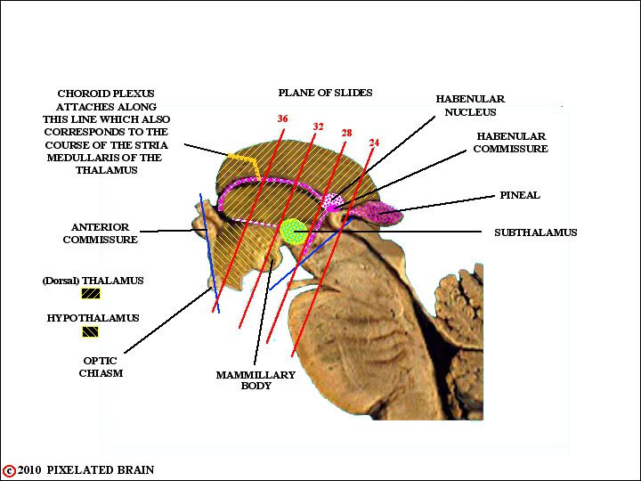
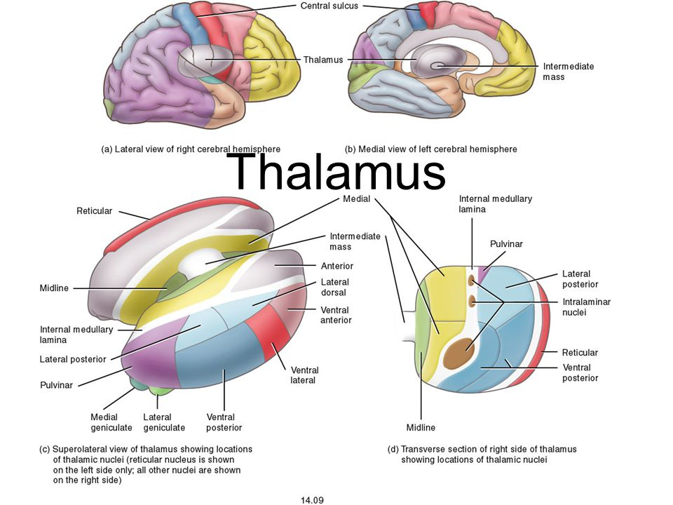
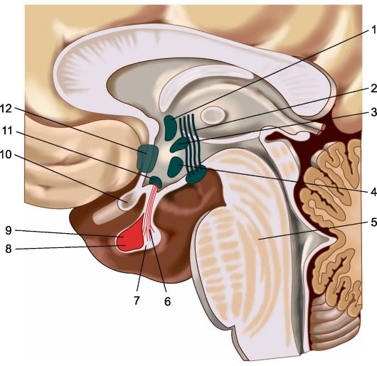

[Вернуться](./Анатомия нервной системы.md)

# Промежуточный мозг

Промежуточный мозг (diencephalon) находится между большими полушариями мозга. Основную массу его составляют таламусы (thalami, зрительные бугры). Кроме того, к нему относятся структуры, расположенные позади таламусов, над и под ними, составляющие соответственно метаталамус (metathalamus, забугорье), эпиталамус (epithalamus, надбугорье) и гипоталамус (hypothalamus, подбугорье).

## Эпиталамус
В состав эпиталамуса (надбугорья) входит шишковидное тело (эпифиз). С гипоталамусом (подбугорьем) связан гипофиз. К промежуточному мозгу относятся также зрительные нервы, зрительный перекрест (хиазма) и зрительные тракты - структуры, входящие в состав зрительного анализатора. Полостью промежуточного мозга является III желудочек мозга - остаток полости первичного переднего мозгового пузыря, из которого в процессе онтогенеза формируется этот отдел мозга.

## Таламус
Таламусы (thalami), или зрительные бугры, расположены по бокам III желудочка и составляют до 80% массы промежуточного мозга. Они имеют яйцевидную форму, приблизительный объем 3,3 куб. см и состоят из клеточных скоплений (ядер) и прослоек белого вещества. В каждом таламусе различают четыре поверхности: внутреннюю, наружную, верхнюю и нижнюю.

Внутренняя поверхность таламуса образует боковую стенку III желудочка. От расположенного ниже подбугорья она отделена неглубокой гипоталамической бороздой (sulcus hypothalamicus), идущей от межжелудочкового отверстия к входу в водопровод мозга. Внутреннюю и верхнюю поверхности разграничивает мозговая полоска (stria medullaris thalami). Верхняя поверхность таламуса, как и внутренняя, свободна. Она прикрыта сводом и мозолистым телом, с которыми не имеет сращений. В передней части верхней поверхности таламуса расположен его передний бугорок, который иногда называют возвышением переднего ядра. Задний конец таламуса утолщен - это так называемая подушка таламуса (pulvinar). Наружный край верхней поверхности таламуса подходит к хвостатому ядру, от которого ее отделяет пограничная полоска (stria terminalis).
По верхней поверхности таламуса в косом направлении проходит сосудистая борозда, которую занимает сосудистое сплетение бокового желудочка. Эта борозда делит верхнюю поверхность таламуса на наружную и внутреннюю части. Наружная часть верхней поверхности таламуса покрыта так называемой прикрепленной пластинкой, составляющей дно центрального отдела бокового желудочка мозга.
Наружная поверхность таламуса прилежит к внутренней капсуле, отделяющей ее от чечевичного ядра и головки хвостатого ядра. За подушкой таламуса расположены коленчатые тела, относящиеся к метаталамусу. Остальная часть нижней стороны таламуса сращена с образованиями гипоталамической области.
Таламусы находятся на пути восходящих трактов, идущих от спинного мозга и ствола мозга к коре больших полушарий. Они имеют многочисленные связи с подкорковыми узлами, проходящими главным образом через петлю чечевичного ядра (ansa lenticularis).

В состав таламуса входят клеточные скопления (ядра), отграниченные друг от друга прослойками белого вещества. К каждому ядру подходят собственные афферентные и эфферентные связи. Соседние ядра формируют группы. Выделяют: 
1. передние ядра (nucll. anteriores) - имеют реципрокные связи с сосцевидным телом и сводом, известные как сосцевидно-таламический пучок (пучок Вик д'Азира) с поясной извилиной, относящиеся к лимбической системе;
2. задние ядра, или ядра подушки бугра (nucll. posteriores) - связаны с ассоциативными полями теменной и затылочной областей; играют важную роль в интеграции различных видов поступающей сюда сенсорной информации;
3. дорсальное боковое ядро (nucl. dorsolateralis) - получает афферентные импульсы от бледного шара и проецирует их в каудальные отделы поясной извилины; 
4. вентролатеральные ядра (nucll. ventrolaterales) - самые крупные специфические ядра, являются коллектором большинства соматосенсорных путей: медиальная петля, спиноталамические пути, тройнично-таламические и вкусовые пути, по которым проходят импульсы глубокой и поверхностной чувствительности и др.; отсюда нервные импульсы направляются в корковую проекционную соматосенсорную зону коры (поля 1, 2, 3а и 3б, по Бродману); 
5. медиальные ядра (nucll. mediales) - ассоциативные, получают афферентные импульсы от вентральных и интраламинарных таламических ядер, гипоталамуса, ядер среднего мозга и бледного шара; эфферентные пути отсюда направляются в ассоциативные области префронтальной коры, расположенные впереди моторной зоны; 
6. внутрипластинчатые ядра (интраламинарные ядра, nucll. intralaminares) - составляют основную часть неспецифической проекционной системы таламуса; афферентные импульсы они получают частично по восходящим волокнам ретикулярной формации ствола нерва, частично по волокнам, начинающимся от ядер таламуса. Исходящие от этих ядер проводящие пути направляются в хвостатое ядро, скорлупу, бледный шар, относящиеся к экстрапирамидной системе, и, вероятно, в другие ядерные комплексы таламуса, которые затем направляют их во вторичные ассоциативные зоны коры мозга. Важной частью интраламинарного комплекса является центральное ядро таламуса, представляющее таламический отдел восходящей ретикулярной акти- вирующей системы.

Таламусы являются своеобразным коллектором чувствительных путей, местом, в котором концентрируются все пути, проводящие чувствительные импульсы, идущие от противоположной половины тела. Кроме того, в переднее его ядро по сосцевидно-таламическому пучку поступают обонятельные импульсы; вкусовые волокна (аксоны вторых нейронов, расположенных в одиночном ядре) заканчиваются в одном из ядер вентролатеральной группы.

Таламические ядра, получающие импульсы от строго определенных участков тела и передающие эти импульсы в соответствующие ограниченные зоны коры (первичные проекционные зоны), называются проекционными, специфическими или переключающими ядрами. К ним относятся вентролатеральные ядра. Переключающие ядра для зрительных и слуховых импульсов заложены соответственно в латеральных и медиальных коленчатых телах, прилежащих к задней поверхности зрительных бугров и составляющих основную массу забу- горья.

Наличие в проекционных ядрах таламуса, прежде всего в вентролатеральных ядрах, определенного соматотопического представительства делает возможным при ограниченном по объему патологическом очаге в таламусе развитие расстройства чувствительности и сопряженных с этим двигательных нарушений в какой-либо ограниченной части противоположной половины тела.

## Метаталамус
Метаталамус (metathalamus, забугорье) составляют медиальные и латеральные коленчатые тела, расположенные под задней частью подушки таламуса, выше и латеральнее верхних холмиков четверохолмия.

* Медиальное коленчатое тело (corpus geniculatum medialis) содержит клеточное ядро, в котором заканчивается латеральная (слуховая) петля. Нервными волокнами, составляющими нижнюю ручку четверохолмия (brachium colliculi inferioris), оно связано с нижними холмиками четверохолмия и вместе с ними образует подкорковый слуховой центр. Аксоны клеток, заложенные в подкорковом слуховом центре, главным образом в медиальном коленчатом теле, направляются к корковому концу слухового анализатора, расположенному в верхней височной извилине, точнее в коре находящихся на ней мелких извилин Гешля (поля 41, 42, 43, по Бродману), при этом слуховые импульсы передаются к проекционному слуховому полю коры в тонотопическом порядке. Поражение медиального коленчатого тела ведет к снижению слуха, более выраженному на противоположной стороне. Поражение обоих медиальных коленчатых тел может обусловить глухоту на оба уха.
* Латеральное коленчатое тело (corpus geniculatum laterale), как и верхние бугры четверохолмия, с которыми оно связано верхними ручками четверохолмия (brachii colliculi superiores), состоит из чередующихся слоев серого и белого вещества. Латеральные коленчатые тела составляют подкорковый зрительный центр. Главным образом в них заканчиваются зрительные тракты. Аксоны клеток латеральных коленчатых тел проходят компактно в составе заднего отдела заднего бедра внутренней капсулы, а затем формируют зрительную лучистость (radiatio optica), по которой зрительные импульсы достигают в строгом ретинотопическом порядке коркового конца зрительного анализатора - в основном область шпорной борозды на медиальной поверхности затылочной доли (поле 17, по Бродману).

## Эпиталамус
Эпиталамус (epithalamus, надбугорье) можно рассматривать как непосредственное продолжение крыши среднего мозга. К эпиталамусу принято относить заднюю эпиталамическую спайку (commissura epithalamica posterior), два поводка (habenulae) и их спайку (commissura habenularum), а также шишковидное тело (corpus pineale, эпифиз).

* Эпиталамическая спайка располагается над верхней частью водопровода мозга и представляет собой комиссуральный пучок нервных волокон, который берет начало от ядер Даркшевича и Кахаля. Впереди от этой спайки расположено непарное шишковидное тело, имеющее вариабельные размеры (при этом длина его не превышает 10 мм) и форму конуса, обращенного вершиной назад. Основание шишковидного тела образовано нижней и верхней мозго- выми пластинками, которые окаймляют выворот шишковидного тела (recessus pinealis) - выступающую верхнезаднюю часть третьего желудочка мозга. Нижняя мозговая пластинка продолжается назад и переходит в эпиталамическую спайку и пластинку четверохолмия. Передняя часть верхней мозговой пластинки переходит в спайку поводков, от конца которой отходят направляющиеся вперед поводки, называемые иногда ножками шишковидного тела. Каждый из поводков тянется к зрительному бугру и на границе верхней и внутренней его поверхности заканчивается треугольным расширением, находящимся над расположенным уже в веществе таламуса небольшим ядром уздечки. От ядра уздечки вдоль задненаружной поверхности таламуса тянется белая полоска - stria medullaris, состоящая из волокон, соединяющих шишковидное тело со структурами обонятельного анализатора. В связи с этим существует мнение о том, что эпиталамус имеет отношение к обонянию.
В последнее время установлено, что отделы эпиталамуса, главным образом шишковидное тело, продуцируют физиологически активные вещества - серотонин, мелатонин, адреногломерулотропин и антигипоталамический фактор.
* Шишковидное тело представляет собой железу внутренней секреции. Оно имеет дольчатое строение, паренхима его состоит из пинеоцитов, эпителиальных и глиальных клеток. Шишковидное тело содержит большое количество кровеносных сосудов, кровоснабжение его обеспечивается ветвями задних мозговых артерий. Подтверждает эндокринную функцию эпифиза и его высокая способность к поглощению радиоактивных изотопов 32P и 131I. Он поглощает радиоактивного фосфора больше, чем любой другой орган, а по количеству поглощаемого радиоактивного йода уступает только щитовидной железе. До периода полового созревания клетки шишковидного тела выделяют вещества, тормозящие действие гонадотропного гормона гипофиза, и в связи с этим задерживают развитие половой сферы. Это подтверждают клинические наблюдения преждевременного полового созревания при заболеваниях (главным образом при опухолях) шишковидного тела. Существует мнение, что шишковидное тело находится в состоянии антагонистической корреляции со щитовидной железой и надпочечниками и влияет на обменные процессы, в частности на витаминный баланс и функцию вегетативной нервной системы.
Некоторое практическое значение имеет наблюдаемое после полового созревания отложение в шишковидном теле солей кальция. В связи с этим на краниограммах взрослых людей видна тень обызвествленного шишковидного тела, которое при объемных патологических процессах (опухоль, абсцесс и т.п.) в полости супратенториального пространства может смещаться в сторону, противоположную патологическому процессу.

## Гипоталамус
Гипоталамус (hypothalamus) составляет нижнюю, филогенетически наиболее древнюю часть промежуточного мозга. Условная граница между таламусами и гипоталамусом проходит на уровне гипоталамических борозд, находящихся на боковых стенках третьего желудочка мозга.

Гипоталамус условно делится на две части: переднюю и заднюю. К задней части гипоталамической зоны относят расположенные позади серого бугра сосцевидные тела (corpora mammillaria) с прилежащими к ним участками мозговой ткани. К передней части относится зрительный перекрест (chiasma opticum) и зрительные тракты (tracti optici), серый бугор (tuber cinereum), воронка (infundibulum) и гипофиз (hypophysis). Гипофиз, соединенный с серым бугром через воронку и гипофизарную ножку, располагается в центре основания черепа в костном ложе - гипофизарной ямке турецкого седла основной кости. Диаметр гипофиза составляет не более 15 мм, масса его от 0,5 до 1 г.

Гипоталамическая область состоит из многочисленных клеточных скоплений - ядер и пучков нервных волокон. Основные ядра гипоталамуса можно разделить на 4 группы.
1. В переднюю группу входят медиальные и латеральные предоптическое, супраоптическое, паравентрикулярные и переднее гипоталамическое ядра.
2. Промежуточную группу составляют дугообразное ядро, серобугорные ядра, вентромедиальное и дорсомедиальное гипоталамические ядра, дорсальное гипоталамическое ядро, заднее паравентрикулярное ядро, ядро воронки.
3. Задняя группа ядер включает заднее гипоталамическое ядро, а также медиальные и латеральные ядра сосцевидного тела.
4. К дорсальной группе относятся ядра чечевицеобразной петли.

Сагиттальный срез гипоталамуса.

1 - паравентрикулярное ядро; 2 -  сосцевидно-таламический пучок; 3 - дорсомедиальное гипоталамическое  ядро; 4 - вентромедиальное гипоталамическое ядро, 5 - мост мозга; 6 -  супраоптический гипофизарный путь; 7 - нейрогипофиз; 8 - аденогипофиз; 9  - гипофиз; 10 - зрительный перекрест; 11 - супраоптическое ядро; 12 -  преоптическое ядро.

