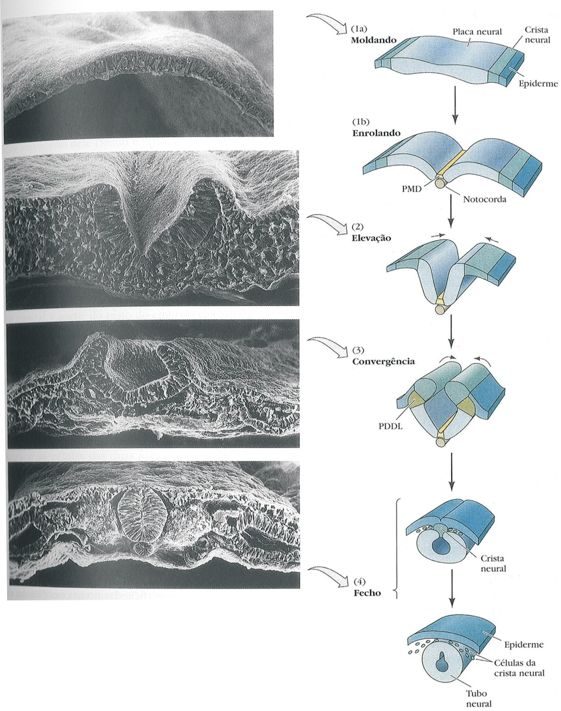
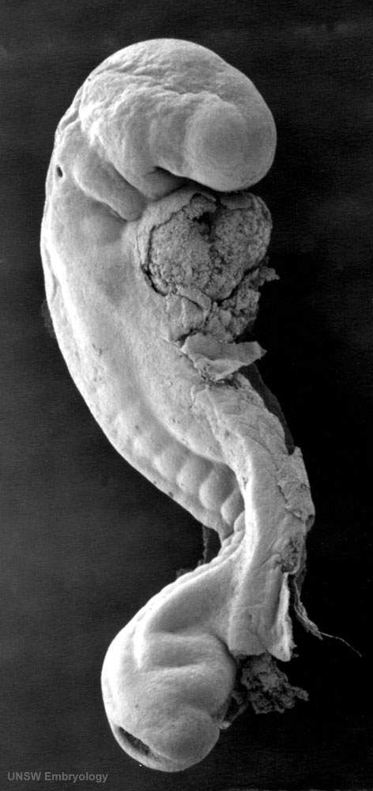
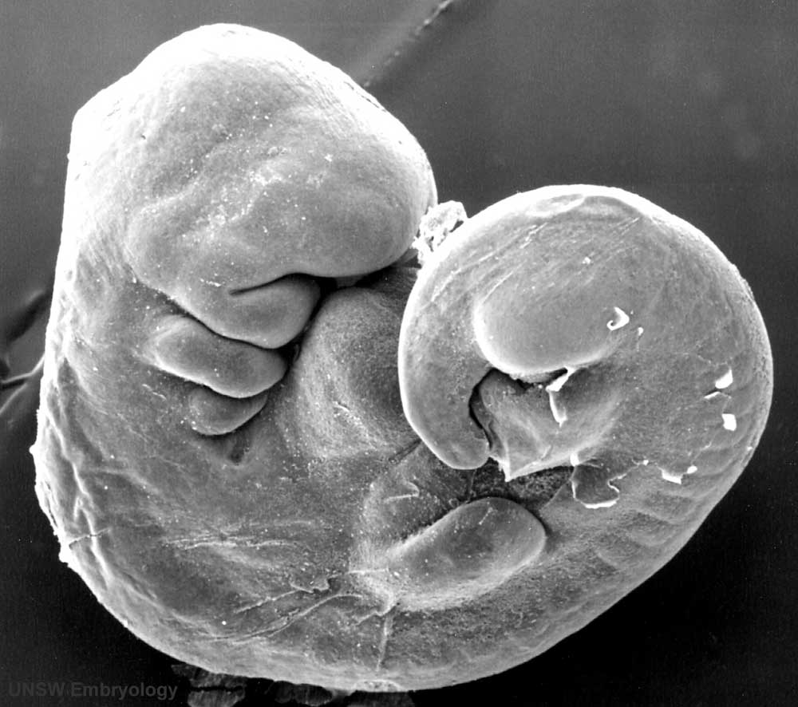
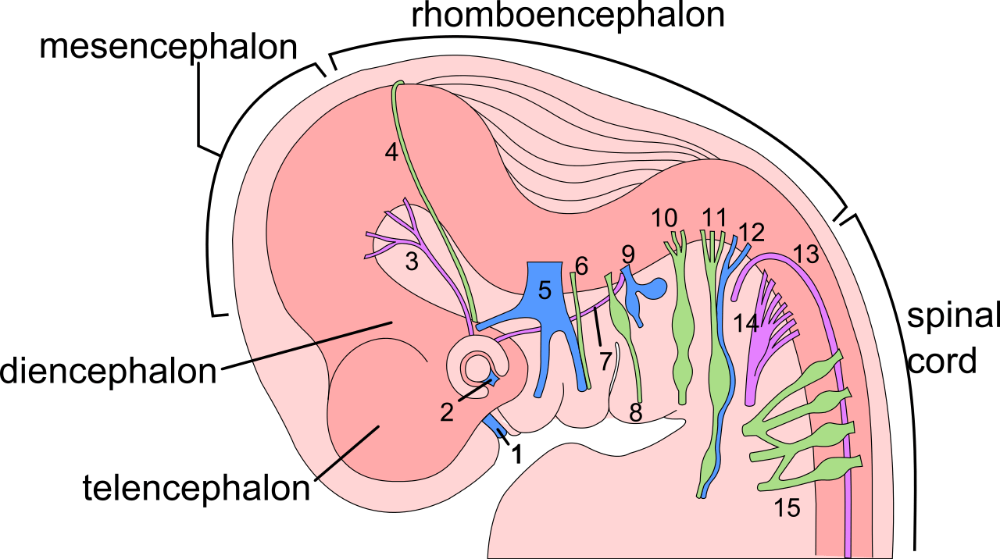

[Вернуться](./Анатомия нервной системы.md)

# Развитие нервной системы

Онтогенез делится на пренатальный и постнатальный периоды. Нервная  система начинает закладываться уже со второй недели пренатального  периода. Из внешнего зародышевого листка – эктодермы – формируется  утолщение – первичная полоска. Под ней, между эктодермой и энтодермой  мигрирует тяж клеток и образует нотохорд, который служит временным  скелетом для зародыша. Эктодерма, окружающая нотохорд, утолщается и  формирует нервную пластинку. Далее, клетки нервной пластинки делятся,  образуя нервную бороздку и нервные валики. Со временем валики смыкаются  над бороздкой, образуя нервную трубку – это процесс нейруляции.  Одновременно происходит погружение нервной трубки вовнутрь зародыша и  формирование и нервных гребней по бокам вдоль нее. На головном конце  нервной трубки образуются три первичных мозговых пузыря, из которых  впоследствии формируется головной мозг, на каудальном же конце нервная  трубка соединяется со спинным мозгом. Нервный гребень в последствии дает  начало образованию периферической нервной системе. Ткани, образующие  нервную бороздку, и, в последствии, нервную трубку, состоят из  нейробластов и спонгиобластов, из первых образуются нейроны, из вторых —  клетки глии. 

 

*Нейруляция*

*Нейрула*

На четвертой неделе беременности передний и задний  первичные пузыри перешнуровываются, образуя в целом уже пять пузырей.  Из заднего образуется продолговатый мозг, из четвертого — варолиев мост и  мозжечок, из третьего – средний мозг, из второго — зрительные бугры,  гипоталамическая область, паллидум (бледный шар), из переднего –  полушария головного мозга и неостриатум (полосатое тело).

*4 неделя, закрытие нейропор*

*4 неделя, нейропоры закрыты*

По  завершении нейруляции часть клеток нервного гребня мигрируют в брюшную  полость, формируя вегетативные узлы и мозговое вещество надпочечников.  Другие клетки образуют ганглиозную пластинку, делящуюся на ганглиозные  валики. Они дают начало спинальным ганглиям, периферическим  ганглионарным нейронам симпатической нервной системы, шванновским  клеткам, а также клеткам, образующим внутренние листки оболочек мозга.  Клетки ганглиозных валиков дифференцируются сначала в биполярные, а  затем в псевдоуниполярные чувствительные нервные клетки, центральный  отросток которых уходит в ЦНС, а периферический — к рецепторам других  тканей и органов, образуя афферентную часть периферической соматической  нервной системы. 

С пятого месяца пренатального развития  начинается миелинизация нейронов, которая завершается в 5-7 лет. Также в  это время появляются первые синапсы. 

## Эмбриогенез головного мозга. 

Вскоре после формирования трех первичных пузырей начинают развиваться глаза. 

В  передней (ростральной) части мозговой трубки образуются два первичных  мозговых пузыря - архэнцефалон и дейтерэнцефалон. В начале четвертой  недели у зародыша дейтерэнцефалон делится на средний (mesencephalon) и  ромбовидный (rhombencephalon) пузыри, а архэнцефалон превращается на  этой (трехпузырной) стадии в передний мозговой пузырь (prosencephalon). В  нижней части переднего мозга отрастают обонятельные лопасти, дающие  начало обонятельному эпителию, луковицам и трактам. Из дорзолатеральных  стенок образуется сетчатка, зрительные нервы и тракты. 

На шестой неделе эмбрионального развития передний и ромбовидный пузыри делятся каждый на два.

*1. olfactory 2. optic 3. oculomotor 4. trochlear 5. trigeminal sensory 6. trigeminal motor 7. abducens 8. facial 9. vestibulocochlear 10. glossopharyngeal 11. vagus 12. cranial accessory 13. spinal accessory 14. hypoglossal 15. cervical I, II, III and IV*

Передний  пузырь — конечный мозг — разделяется продольной щелью на два полушария,  так же разделяется и полость, образуя желудочки. Из-за неравномерного  разрастания мозгового вещества образуются извилины. Каждое полушарие  делится на четыре доли, желудочки делятся также на 4 части: центральный  отдел и три рога желудочка. Серое вещество, распложенное на периферии,  образует кору полушарий, а в основании полушарий – подкорковые ядра. 
Задняя  часть переднего пузыря является теперь промежуточным мозгом. Боковые  стенки его преобразуются в зрительные бугры – таламус. В вентральной области (гипоталамус) образуется выпячивание – воронка, из ее нижнего  конца происходит нейрогипофиз. 

Третий мозговой пузырь  превращается в средний мозг. Его полость превращается в Сильвиев  водопровод, который соединяет III и IV желудочки. Из дорзальной стенки  развивается четверохолмие, из вентральной — ножки среднего мозга. 

Ромбовидный  мозг делится на задний и добавочный. Из заднего формируется мозжечок, а  из добавочного – продолговатый мозг. Полость превращается в IV  желудочек, который сообщается с Сильвиевым водопроводом и с центральным  каналом спинного мозга. 

Из клеток, расположенных в боковых  частях мозговой трубки, образуется спинной мозг. Развивается он быстро и  у трехмесячного зародыша почти сформирован. Полость мозговой трубки  превращается в канал спинного мозга. Проходящая по боковым стенкам  спинного мозга и стволового отдела головного мозга парная пограничная  борозда (sulcus limitons) делит мозговую трубку на основную  (вентральную) и крыловидную (дорзальную) пластинки. Из основной  пластинки формируются моторные структуры (передние рога спинного мозга,  двигательные ядра черепно-мозговых нервов). Над пограничной бороздой из  крыловидной пластинки развиваются сенсорные структуры (задние рога  спинного мозга, сенсорные ядра ствола мозга), в пределах самой  пограничной борозды — центры вегетативной нервной системы. 

Весь передний мозг развивается из крыловидной пластинки, поэтому в нем есть только сенсорные структуры. 

После  рождения ребенка начинается постнатальный онтогенез нервной системы.  Головной мозг новорожденного весит 300—400 г. После рождения  прекращается образование новых нейронов. К восьмому месяцу после  рождения вес мозга удваивается, а к 4—5 годам утраивается. Масса мозга  растет в основном за счет увеличения количества отростков и их  миелинизации. После 50 лет мозг уплощается, вес его падает и в старости  может уменьшиться на 100 г.
