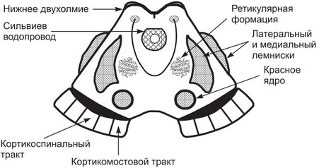
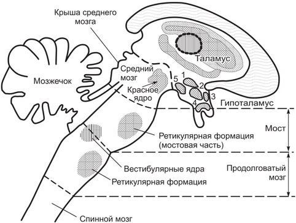

[Вернуться](./Анатомия нервной системы.md)

# Ретикулярная формация

Ретикулярная формация - совокупность различных нейронов, расположенных на протяжении ствола мозга, оказывающих активирующее или тормозящее влияние на различные структуры центральной нервной системы, тем самым контролируя их рефлекторную деятельность.

Ретикулярная формация ствола мозга оказывает активирующее влияние на клетки коры головного мозга и тормозное действие на мотонейроны спинного мозга. Посылая в спинной мозг к его двигательным нейронам тормозящие и возбуждающие импульсы ретикулярная формация участвует в регуляции тонуса скелетных мышц. 

Ретикулярная формация поддерживает тонус вегетативных центров, интегрирует симпатические и парасимпатические влияния, передает модулирующее влияние от гипоталамуса и мозжечка к внутренним органам.

## Функции ретикулярной формации

1.  Соматодвигательный контроль (активация скелетной мускулатуры), может быть прямым через tr. reticulospinalis и непрямым через мозжечок, оливы, бугорки четверохолмия, красное ядро, черное вещество, полосатое тело, ядра таламуса и даже соматомоторные зоны коры.
2. Соматочувствительный контроль, т.е. снижение уровней соматосенсорной информации — «медленная боль», модификация восприятия различных видов сенсорной чувствительности (слуха, зрения, вестибуляции, обоняния). 
3. Висцеромоторный контроль состояния сердечно-сосудистой, дыхательной систем, активности гладкой мускулатуры различных внутренних органов. 
4. Нейроэндокринная трансдукция через влияние на нейромедиаторы, центры гипоталамуса и далее гипофиз. 
5. Биоритмы через связи с гипоталамусом и шишковидной железой. 
   Различные функциональные состояния организма (сон, пробуждение, состояние сознания, поведение) осуществляются посредством многочисленных связей ядер ретикулярной формации со всеми частями ЦНС. 
6. Координация работы разных центров ствола мозга, обеспечивающих сложные висцеральные рефлекторные ответы (чихание, кашель, рвота, зевота, жевание, сосание, глотание и др.).

## Строение ретикулярной формации:

Ретикулярная формация образована совокупностью многочисленных нейронов, лежащих отдельно или сгруппированных в ядра (см. рис. 1 и 2). Ее структуры локализуются в центральных участках ствола, начиная с верхних сегментов шейного отдела спинного мозга до верхнего уровня ствола мозга, где они постепенно сливаются с ядерными группами таламуса. Ретикулярная формация занимает пространства между ядрами черепных нервов, другими ядрами и трактами, проходящими через ствол мозга. 

 *Важнейшие структурные образования среднего мозга (поперечный срез)*

*Расположение некоторых ядер в стволе мозга и гипоталамусе: 1 — паравентрикулярное; 2 — дорсомедиальное: 3 — преоптическое; 4 — супраоптическое; 5 — заднее*

Нейроны ретикулярной формации характеризуются большим разнообразием форм и размеров, но их общим признаком является то, что они образуют длинными дендритами и широко ветвящимися аксонами многочисленные синаптические контакты как между собой, так и с нейронами других ядер мозга. Эти ветвления формируют своеобразную сеть (ретикулум), откуда произошло название — ретикулярная формация. У нейронов, формирующих ядра ретикулярной формации, имеются длинные аксоны, образующие проводящие пути к спинному мозгу, ядрам ствола мозга, мозжечка, таламуса и других областей головного мозга.

К нейронам ретикулярной формации поступают многочисленные афферентные сигналы из различных структур ЦНС. Можно выделить несколько групп нейронов, к которым поступают эти сигналы. Это группа нейронов латерального ядра ретикулярной формации, расположенного в продолговатом мозге. Нейроны ядра получают афферентные сигналы от вставочных нейронов спинного мозга и входят в состав одного из непрямых спиномозжечковых путей. Кроме того, они получают сигналы от вестибулярных ядер и могут интегрировать информацию о состоянии активности вставочных нейронов, связанных с мотонейронами спинного мозга, и о положении тела и головы в пространстве. 

Следующая группа — это нейроны ретикулотегментального ядра, расположенные на границе дорсального края моста. Они получают афферентные синаптические входы от нейронов претектальных ядер и верхних холмиков четверохолмия и посылают свои аксоны в структуры мозжечка, участвующие в контроле движений глаз. 
Нейроны ретикулярной формации получают разнообразные сигналы через пути, связывающие их с корой головного мозга (кортикоретикулоспинальные пути), черной субстанцией, гипоталамусом и лимбической системой.

Кроме описанных афферентных путей в ретикулярную формацию поступают сигналы по аксонным коллатералям проводящих путей сенсорных систем. При этом на один и тот же нейрон могут конвергировать сигналы от разных рецепторов (тактильных, зрительных, слуховых, вестибулярных, болевых, температурных, проприорецепторов, рецепторов внутренних органов). 

Из приведенного перечня основных афферентных связей ретикулярной формации с другими областями ЦНС видно, что состояние ее тонической нейронной активности определяется притоком практически всех типов сенсорных сигналов от чувствительных нейронов, а также сигналов от большинства структур ЦНС.

*Связи ретикулярной формации и нейромедиаторной системы ГМ*

