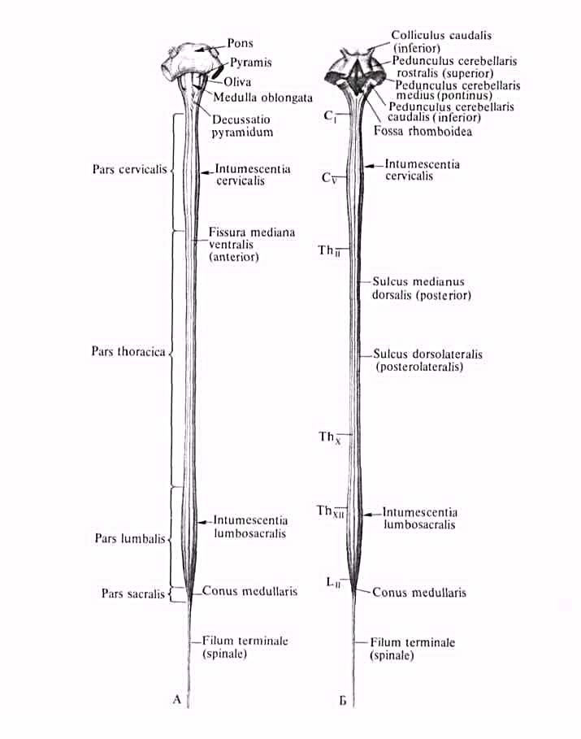
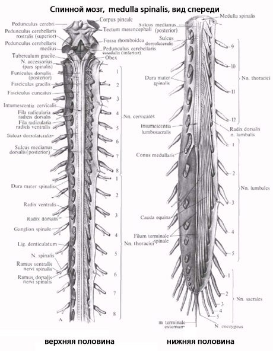
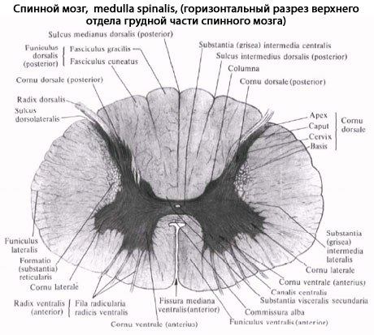
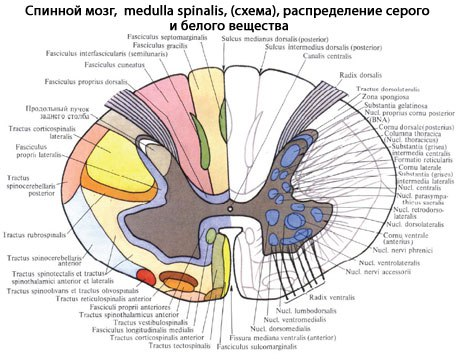
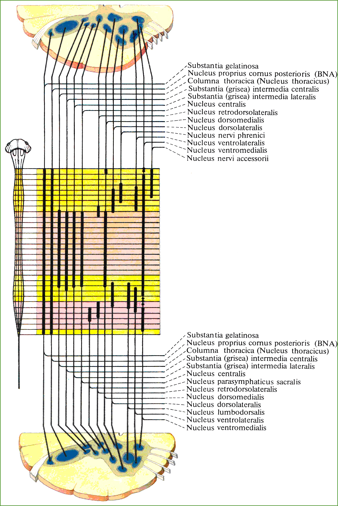

[Вернуться](./Анатомия нервной системы.md)

# Спинной мозг

Спинной мозг, medulla spinalis (греч. myelos), лежит в позвоночном канале и у взрослых представляет собой длинный (45 см у мужчин и 41-42 см у женщин), несколько сплюснутый спереди назад цилиндрический тяж, который вверху (краниально) непосредственно переходит в продолговатый мозг, а внизу (каудально) оканчивается коническим заострением, conus medullaris, на уровне II поясничного позвонка. Знание этого факта имеет практическое значение (чтобы не повредить спинной мозг при поясничном проколе с целью взятия спинномозговой жидкости или с целью спинномозговой анестезии, надо вводить иглу шприца между остистыми отростками III и IV поясничных позвонков). От conus medullaris отходит книзу так называемая концевая нить, filum terminale, представляющая атрофированную нижнюю часть спинного мозга, которая внизу состоит из продолжения оболочек спинного мозга и прикрепляется ко II копчиковому позвонку.

Спинной мозг на своем протяжении имеет два утолщения, соответствующих корешкам нервов верхней и нижней конечностей: верхнее из них называется шейным утолщением, intumescentia cervicalis, а нижнее - пояснично-крестцовым, intumescentia lumbosacralis. Из этих утолщений более обширно пояснично-крестцовое, но более дифференцировано шейное, что связано с более сложной иннервацией руки как органа труда.

Образовавшимися вследствие утолщения боковых стенок спинномозговой трубки и проходящими по средней линии передней и задней продольными бороздами: глубокой fissura mediana anterior, и поверхностной, sulcus medianus posterior, спинной мозг делится на две симметричные половины - правую и левую; каждая из них в свою очередь имеет слабо выраженную продольную борозду, идущую по линии входа задних корешков (sulcus posterolateralis) и по линии выхода передних корешков (sulcus anterolateralis). Эти борозды делят каждую половину белого вещества спинного мозга на три продольных канатика: передний - funiculus anterior, боковой - funiculus lateralis и задний - funiculus posterior. Задний канатик в шейном и верхнегрудном отделах делится еще промежуточной бороздкой, sulcus intermedius posterior, на два пучка: fasciculus gracilis и fasciculus cuneatus. Оба эти пучка под теми же названиями переходят вверху на заднюю сторону продолговатого мозга. 

На той и другой стороне из спинного мозга выходят двумя продольными рядами корешки спинномозговых нервов. Передний корешок, radix ventralis s. anterior, выходящий через sulcus anterolateralis, состоит из нейритов двигательных (центробежных, или эфферентных) нейронов, клеточные тела которых лежат в спинном мозге, тогда как задний корешок, radix dorsalis s. posterior, входящий в sulcus posterolateralis, содержит отростки чувствительных (центростремительных, или афферентных) нейронов, тела которых лежат в спинномозговых узлах. 

На некотором расстоянии от спинного мозга двигательный корешок прилегает к чувствительному и они вместе образуют ствол спинномозгового нерва, truncus n. spinalis, который невропатологи выделяют под именем канатика, funiculus. При воспалении канатика (фуникулит) возникают сегментарные расстройства одновременно двигательной и чувствительной сфер; при заболевании корешка (радикулит) наблюдаются сегментарные нарушения одной сферы - или чувствительной, или двигательной, а при воспалении ветвей нерва (неврит) расстройства соответствуют зоне распространения данного нерва. Ствол нерва обычно очень короткий, так как по выходе из межпозвоночного отверстия нерв распадается на свои основные ветви. 

В межпозвоночных отверстиях вблизи места соединения обоих корешков задний корешок имеет утолщение - спинномозговой узел, ganglion spinale, содержащий ложноуниполярные нервные клетки (афферентные нейроны) с одним отростком, который делится затем на две ветви: одна из них, центральная, идет в составе заднего корешка в спинной мозг, другая, периферическая, продолжается в спинномозговой нерв. 

Таким образом, в спинномозговых узлах отсутствуют синапсы, так как здесь лежат клеточные тела только афферентных нейронов. Этим названные узлы отличаются от вегетативных узлов периферической нервной системы, так как в последних вступают в контакты вставочные и эфферентные нейроны. Спинномозговые узлы крестцовых корешков лежат внутри крестцового канала, а узел копчикового корешка - внутри мешка твердой оболочки спинного мозга. Вследствие того что спинной мозг короче позвоночного канала, место выхода нервных корешков не соответствует уровню межпозвоночных отверстий. Чтобы попасть в последние, корешки направляются не только в стороны от мозга, но еще и вниз, при этом тем отвеснее, чем ниже они отходят от спинного мозга. В поясничной части последнего нервные корешки спускаются к соответствующим межпозвоночным отверстиям параллельно filum terminate, облекая ее и conus medullaris густым пучком, который носит название конского хвоста, cauda equina. 

## Внутреннее строение спинного мозга. 

Спинной мозг состоит из серого вещества, содержащего нервные клетки, и белого вещества, слагающегося из миелиновых нервных волокон

* Серое вещество, substantia grisea, заложено внутри спинного мозга и окружено со всех сторон белым веществом. Серое вещество образует две вертикальные колонны, помещенные в правой и левой половинах спинного мозга. В середине его заложен узкий центральный канал, canalis centralis, спинного мозга, проходящий во всю длину последнего и содержащий спинномозговую жидкость.
  * Центральный канал является остатком полости первичной нервной трубки. Поэтому вверху он сообщается с IV желудочком головного мозга, а в области conus medullaris заканчивается расширением - концевым желудочком, ventriculus terminalis. Серое вещество, окружающее центральный канал, носит название промежуточного, substantia intermedia centralis. В каждой колонне серого вещества два столба: передний, columna anterior, и задний, columna posterior. На поперечных разрезах спинного мозга эти столбы имеют вид рогов: переднего, расширенного, cornu anterius, и заднего, заостренного, cornu posterius. Поэтому общий вид серого вещества на фоне белого напоминает букву «Н».
  * Серое вещество состоит из нервных клеток, группирующихся в ядра, расположение которых в основном соответствует сегментарному строению спинного мозга и его первичной трехчленной рефлекторной дуге. Первый, чувствительный, нейрон этой дуги лежит в спинномозговых узлах, периферический отросток которого начинается рецепторами в органах и тканях, а центральный в составе задних чувствительных корешков проникает через sulcus posterolateralis в спинной мозг. Вокруг верхушки заднего рога образуется пограничная зона белого вещества, представляющая собой совокупность центральных отростков клеток спинномозговых узлов, заканчивающихся в спинном мозге.
  * Клетки задних рогов образуют отдельные группы или ядра, воспринимающие из сомы различные виды чувствительности, - соматически-чувствительные ядра. Среди них выделяются: грудное ядро, nucleus thoracicus (columna thoracica), наиболее выраженное в грудных сегментах мозга; находящееся на верхушке рога студенистое вещество, substantia gelatinosa, а также так называемые собственные ядра, nuclei proprii. Заложенные в заднем роге клетки образуют вторые, вставочные, нейроны. В сером веществе задних рогов разбросаны также рассеянные клетки, так называемые пучковые клетки, аксоны которых проходят в белом веществе обособленными пучками волокон. Эти волокна несут нервные импульсы от определенных ядер спинного мозга в его другие сегменты или служат для связи с третьими нейронами рефлекторной дуги, заложенными в передних рогах того же сегмента. Отростки этих клеток, идущие от задних рогов к передним, располагаются вблизи серого вещества, по его периферии, образуя узкую кайму белого вещества, окружающего серое со всех сторон. Это собственные пучки спинного мозга, fasciculi proprii. Вследствие этого раздражение, идущее из определенной области тела, может передаваться не только на соответствующий ей сегмент спинного мозга, но захватывать и другие. В результате простой рефлекс может вовлекать в ответную реакцию целую группу мышц, обеспечивая сложное координированное движение, остающееся, однако, безусловнорефлекторным.
  * Передние рога содержат третьи, двигательные, нейроны, аксоны которых, выходя из спинного мозга, составляют передние, двигательные, корешки. Эти клетки образуют ядра эфферентных соматических нервов, иннервирующих скелетную мускулатуру, - соматически-двигательные ядра. Последние имеют вид коротких колонок и лежат в виде двух групп - медиальной и латеральной. Нейроны медиальной группы иннервируют мышцы, развившиеся из дорсальной части миотомов (аутохтонная мускулатура спины), а латеральной - мышцы, происходящие из вентральной части миотомов (вентролатеральные мышцы туловища и мышцы конечностей); чем дистальнее иннервируемые мышцы, тем латеральнее лежат иннервирующие их клетки. Наибольшее число ядер содержится в передних рогах шейного утолщения спинного мозга, откуда иннервируются верхние конечности, что определяется участием последних в трудовой деятельности человека. У последнего в связи с усложнением движений руки как органа труда этих ядер значительно больше, чем у животных, включая антропоидов (Рис. 4).
    
  * Таким образом, задние и передние рога серого вещества имеют отношение к иннервации органов животной жизни, особенно аппарата движения, в связи с усовершенствованием которого в процессе эволюции и развивался спинной мозг. Передний и задний рога в каждой половине спинного мозга связаны между собой промежуточной зоной серого вещества, которая в грудном и поясничном отделах спинного мозга, на протяжении от I грудного до II-III поясничных сегментов особенно выражена и выступает в виде бокового рога, cornu laterale. Вследствие этого в названных отделах серое вещество на поперечном разрезе приобретает вид бабочки. В боковых рогах заложены клетки, иннервирующие вегетативные органы и группирующиеся в ядро, которое носит название columna intermediolateralis. Нейриты клеток этого ядра выходят из спинного мозга в составе передних корешков. 

* Белое вещество, substantia alba, спинного мозга состоит из нервных отростков, которые составляют три системы нервных волокон:
* Короткие пучки ассоциативных волокон, соединяющих участки спинного мозга на различных уровнях (афферентные и вставочные нейроны).
* Длинные центростремительные (чувствительные, афферентные).
* Длинные центробежные (двигательные, эфферентные).
  * Первая система (коротких волокон) относится к собственному аппарату спинного мозга, а остальные две (длинных волокон) составляют проводниковый аппарат двусторонних связей с головным мозгом. Собственный аппарат включает серое вещество спинного мозга с задними и передними корешками и собственными пучками белого вещества (fasciculi proprii), окаймляющими серое в виде узкой полосы. По развитию собственный аппарат является образованием филогенетически более старым и потому сохраняет примитивные черты строения - сегментарность, отчего его называют также сегментарным аппаратом спинного мозга в отличие от остального несегментированного аппарата двусторонних связей с головным мозгом. 

Таким образом, **нервный сегмент** - это поперечный отрезок спинного мозга и связанных с ним правого и левого спинномозговых нервов, развившихся из одного невротома (невромера). Он состоит из горизонтального слоя белого и серого вещества (задние, передние и боковые рога), содержащего нейроны, отростки которых проходят в одном парном (правом и левом) спинномозговом нерве и его корешках. 

В спинном мозге различают 31 сегмент, которые топографически делятся на 8 шейных, 12 грудных, 5 поясничных, 5 крестцовых и 1 копчиковый. В пределах нервного сегмента замыкается короткая рефлекторная дуга. Так как собственный сегментарный аппарат спинного мозга возник тогда, когда еще не было головного, то функция его - это осуществление тех реакций в ответ на внешнее и внутреннее раздражения, которые в процессе эволюции возникли раньше, т. е. врожденных реакций. Аппарат двусторонних связей с головным мозгом филогенетически более молодой, так как возник лишь тогда, когда появился головной мозг. По мере развития последнего разрастались кнаружи и проводящие пути, связывающие спинной мозг с головным. Этим объясняется тот факт, что белое вещество спинного мозга как бы окружило со всех сторон серое вещество. Благодаря проводниковому аппарату собственный аппарат спинного мозга связан с аппаратом головного мозга, который объединяет работу всей нервной системы. Нервные волокна группируются в пучки, а из пучков составляются видимые невооруженным глазом канатики: задний, боковой и передний. В заднем канатике, прилежащем к заднему (чувствительному) рогу, лежат пучки восходящих нервных волокон; в переднем канатике, прилежащем к переднему (двигательному) рогу, лежат пучки нисходящих нервных волокон; наконец, в боковом канатике находятся и те и другие. Кроме канатиков, белое вещество находится в белой спайке, comissura alba, образующейся вследствие перекреста волокон спереди от substantia intermedia centralis; сзади белая спайка отсутствует.

**Задние канатики** содержат волокна задних корешков спинномозговых нервов, слагающиеся в две системы:

* Медиально расположенный тонкий пучок, fasciculus gracilis.

* Латерально расположенный клиновидный пучок, fasciculus cuneatus. 

  Пучки тонкий и клиновидный проводят от соответствующих частей тела к коре головного мозга сознательную проприоцептивную (мышечно-суставное чувство) и кожную (чувство стереогноза - узнавание предметов на ощупь) чувствительность, имеющую отношение к определению положения тела в пространстве, а также тактильную чувствительность. 

**Боковые канатики** содержат следующие пучки:

* Восходящие.
  * К заднему мозгу:
    * tractus spinocerebellaris posterior, задний спинно-мозжечковый путь, располагается в задней части бокового канатика по его периферии;
    * tractus spinocerebellaris anterior, передний спинно-мозжечковый путь, лежит вентральнее предыдущего.
    
      Оба спинно-мозжечковых тракта проводят бессознательные проприоцептивные импульсы (бессознательная координация движений).
  * К среднему мозгу: 
    
    * tractus spinotectalis, спинно-покрыщечный путь, прилегает к медиальной стороне и передней части tractus spinocerebellaris anterior. 
  * К промежуточному мозгу: 
    * tractus spinothalamics lateralis прилегает с медиальной стороны к tractus spinocerebellaris anterior, тотчас позади tractus spinotectalis. Он проводит в дорсальной части тракта температурные раздражения, а в вентральной - болевые;
    * tractus spinothalamicus anteriror s. ventralis аналогичен предыдущему, но располагается кпереди от соименного латерального и является путем проведения импульсов осязания, прикосновения (тактильная чувствительность). По последним данным, этот тракт располагается в переднем канатике

* Нисходящие.

  * От коры большого мозга:
    * латеральный корково-спинномозговой (пирамидный) путь, tractus corticospinalis (pyramidalis) lateralis. Этот тракт является сознательным эфферентным двигательным путем.
  * От среднего мозга:
    * tractus rubrospinalis. Он является бессознательным эфферентным двигательным путем.
  * От заднего мозга:
    * tractus olivospinalis, лежит вентральнее tractus spinocerebellaris anterior, вблизи переднего канатика. Передние канатики содержат нисходящие пути.
  * От коры головного мозга:
    * передний корково-спинномозговой (пирамидный) путь, tractus corticospinalis (pyramidalis) anterior, составляет с латеральным пирамидным пучком общую пирамидную систему.
  * От среднего мозга:
    * ractus tectospinalis, лежит медиальнее пирамидного пучка, ограничивая fissura mediana anterior. Благодаря ему осуществляются рефлекторные защитные движения при зрительных и слуховых раздражениях - зрительно-слуховой рефлекторный тракт

Ряд пучков идет к **передним рогам** спинного мозга **от различных ядер продолговатого мозга**, имеющих отношение к равновесию и координации движений, а именно:

* от ядер вестибулярного нерва - tractus vestibulospinalis - лежит на границе переднего и бокового канатиков;
* от formatio reticularis - tractus reticulospinalis anterio

