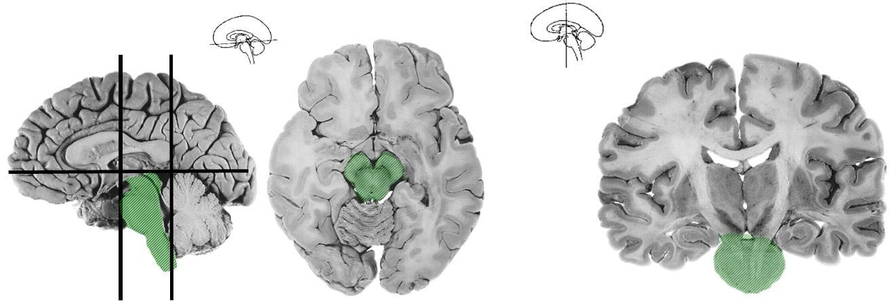

[Вернуться](./Анатомия нервной системы.md)

Ствол головного мозга

Ствол мозга включает три отдела головного мозга: продолговатый мозг, мост и средний мозг - это те отделы, в которых находятся ядра и отходящие от них черепные нервы (с III по XII пару), иннервирующих мускулатуру и кожу головы, части мышц шеи, внутренние органы, часть органов чувств. Через ствол мозга осуществляется связь головного мозга со спинным посредством восходящих и нисходящих проводящих путей. По эволюционному развитию это наиболее древняя часть головного мозга, поэтому большинство образований мозгового ствола по взаимному распределению серого и белого вещества сходны со спинным мозгом.
## Продолговатый мозг
**Продолговатый мозг** представляет собой непосредственное продолжение спинного мозга, поэтому в его строении наиболее проявляется сходством с последним. Он имеет форму усеченного конуса (старое название - луковица) и длину около 3 см. Продолговатый мозг находится полости черепа на скате, к которому прилежит своей вентральной поверхностью, а дорсальной поверхностью он обращен к мозжечку. Верхний расширенный конец продолговатого мозга граничит с нижним краем моста, а нижний соответствует месту выхода корешков I пары шейных спинномозговых нервов.

На вентральной поверхности продолговатого мозга имеется передняя срединная щель, на дорсальной поверхности - задняя срединная борозда, а по бокам с каждой стороны находятся передняя и задняя латеральные борозды. По бокам от передней срединной щели располагаются утолщения белого вещества - пирамиды. Нервные волокна пирамид на границе со спинным мозгом частично переходят на противоположную сторону и образуют перекрест пирамид. Кзади от каждой пирамиды имеется утолщение овальной формы - олива. Между пирамидой и оливой в передней боковой борозде выходят из продолговатого мозга корешки XII пары черепных нервов (подъязычного нерва), а дорсальнее оливы в задней боковой борозде - корешки IX, X и XI пар черепных нервов (языкоглоточного, блуждающего и добавочного соответственно). Между задней срединной и латеральной бороздами с каждой стороны продолговатого мозга расположены по два утолщения - тонкий и клиновидный бугорки, внутри которых находятся одноименные ядра. Верхняя часть задней поверхности продолговатого мозга имеет форму треугольника и является нижней половиной ромбовидной ямки (дно IV желудочка). С боков нижний отдел ромбовидной ямки ограничивают две нижние мозжечковые ножки. Внутри нижней трети продолговатого мозга находится центральный канал, который открывается в IV желудочек мозга.

## Внутреннее строение продолговатого мозга
Для внутреннего строения продолговатого мозга характерно особое распределение серого и белого вещества в крыше, покрышке и основании.

1. Крыша
	* Нижний мозговой парус – расположен между нижними ножками мозжечка, представляет собой нейроэпителиальную пластинку, в которой расположено сосудистое сплетение IV желудочка. Имеет три отверстия: снизу в середине - Мажанди; сверху латерально - 2 отверстия Люшке. Через них происходит сообщение полости четвертого желудочка с субарахноидальным пространством головного мозга.
2. Покрышка образует дно IV желудочка
	* Ядра черепномозговых нервов: 
		1. сенсорные (чувствительные) - блуждающего (X), языкоглоточного (IX), тройничного (V);
		2. двигательные - подъязычного (XII), добавочного (XI), блуждающего (X), языкоглоточного (IX);
		3. вегетативные - парасимпатические блуждающего (X) и языкоглоточного (IX).
	* Ядерный комплекс оливы относится к экстрапирамидной системе и является подкорковым центром вестибулярных функций.
	* Ядро тонкого пучка (Голля) - образовано телами ассоциативных нейронов.
	* Ядро клиновидного пучка (Бурдаха) - образовано телами ассоциативных нейронов.
	* Ядра ретикулярной формации являются вставочными нейронами ствола и формируют дыхательный и сосудодвигательный центры.
	* Вегетативные центры: пищеварительный, чихания, рвоты, кашля.
3. Основание - представлено пирамидами

## Варолиев мост
Варолиев мост (мост мозга, мост). Белый толстый валик длиной 25-27 см. Расположен между продолговатым мозгом и ножками мозга. На границе между мостом и продолговатым мозгом находятся места выходов отводящего (VI пара), лицевого (VII пара), и преддверно-улиткового (VIII пара) нерва. Различают: переднюю часть моста, которая прилегает к скату черепа, и заднюю, которая обращена к мозжечку. Между вентральной и дорсальной частями моста (между покрышкой и основанием) располагается полоска шириной 2-3 мм - трапециевидное тело. Оно имеет собственные ядра, кроме этого в ней проходят волокна вентрального и дорсального слуховых ядер. На передней части моста проходит базилярная борозда, в которой располагается базилярная артерия. По бокам мост переходит в правую и левую средние ножки мозжечка. В них проходят нервные волокна из моста в мозжечок. Задняя часть моста образует верхнюю половину ромбовидной ямки. Мост новорожденного лежит на 5 мм выше спинки турецкого седла. К 2-3 годам он опускается на скат черепа. Волокна моста миелинизируются к 8 годам.

## Внутреннее строение моста

1. Крыша образована верхним мозговым парусом, натянутым между верхними ножками мозжечка.
2. Покрышка является продолжением продолговатого мозга
	* Ядра черепных нервов: тройничного (V), отводящего (VI) и лицевого (VII).
Отростки вторых нейронов чувствительного ядра тройничного нерва образуют тройничную (тригеминальную) петлю.
	* Ядра преддверно-улиткового нерва (VIII). Волокна нейронов этих ядер образуют латеральную петлю, волокна которой идут к среднему и промежуточному мозгу.
	* Верхнее оливное ядро (парное).
	* Ядра ретикулярной формации.
	* Собственные ядра моста. Являются промежуточным звеном связи коры с мозжечком. Волокна, идущие от этих ядер, перекрещиваются и следуют в составе средних ножек мозжечка, в результате чего каждое полушарие коры влияет на работу контрлатеральной половины мозжечка.

## Средний мозг
Средний мозг является верхней частью мозгового ствола. Он представляет собой наименьшую часть головного мозга и состоит из верхней дорсальной и нижней вентральной части. Дорсальная часть представлена крышей среднего мозга - пластинкой четверохолмия. Вентральная часть образована ножками мозга. Полостью среднего мозга является сильвиев водопровод – узкий канал длиной 1,5-2 см, выстланный эпендимой - соединяет IV желудочек с III.

**Функции среднего мозга**
Средний мозг является первичным зрительным и слуховым центром, осуществляет быстрые рефлекторные реакции (оборонительные и ориентировочные). Кроме того, красные ядра и черная субстанция являются ядрами, которые контролируют тонус мускулатуры и движения.

## Внутреннее строение среднего мозга.

На поперечном разрезе среднего мозга выделяют три отдела:
1. Крыша - пластинка четверохолмия
	* первичный подкорковый центр зрения (верхние бугорки) - выполняют функцию рефлекторных центров, которые определяют положение головы и глаз в ответ на зрительные и слуховые раздражения;
	* основной подкорковый центр слуха (нижние бугорки) - состоит из трех ядер: два из которых передают информацию в медиальное коленчатое тело, и одно обеспечивает акустическо-двигательную реакцию.
2. Покрышка - верхний отдел ножек мозга
	* Красное ядро - располагается между черной субстанцией и центральным серым веществом - состоит из клеток, содержащих железо, относится к экстрапирамидной системе, к нему идут волокна от коры, таламуса и мозжечка, от него идет красноядерно-спинномозговой (Монаков) путь к клеткам передних рогов спинного мозга;
	* Центральное серое вещество, расположенное вокруг водопровода, в котором находятся ниже перечисленные ядра;
	* Ядра глазодвигательного нерва (III пара): двигательное соматическое, вегетативное парасимпатическое (Якубовича), центральное непарное (Перлиа);
	* Ядро блокового нерва (IV пара) - двигательное;
	* Ядра ретикулярной формации: промежуточное ядро (Кахаля) - участвует в осуществлении медленных вращательных и вертикальных движений глазных яблок, ядро задней спайки мозга (Даркшевича) - функции те же;
	* Ядро среднемозгового пути тройничного нерва (V пара);
3. Основание ножек мозга - лишено ядер и образовано нисходящими из коры больших полушарий пирамидными эфферентными проводящими путями.

