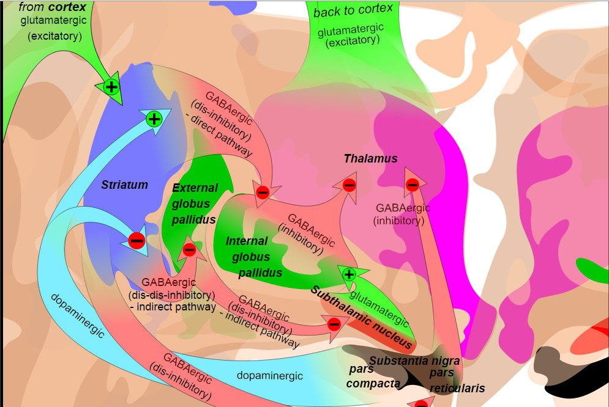
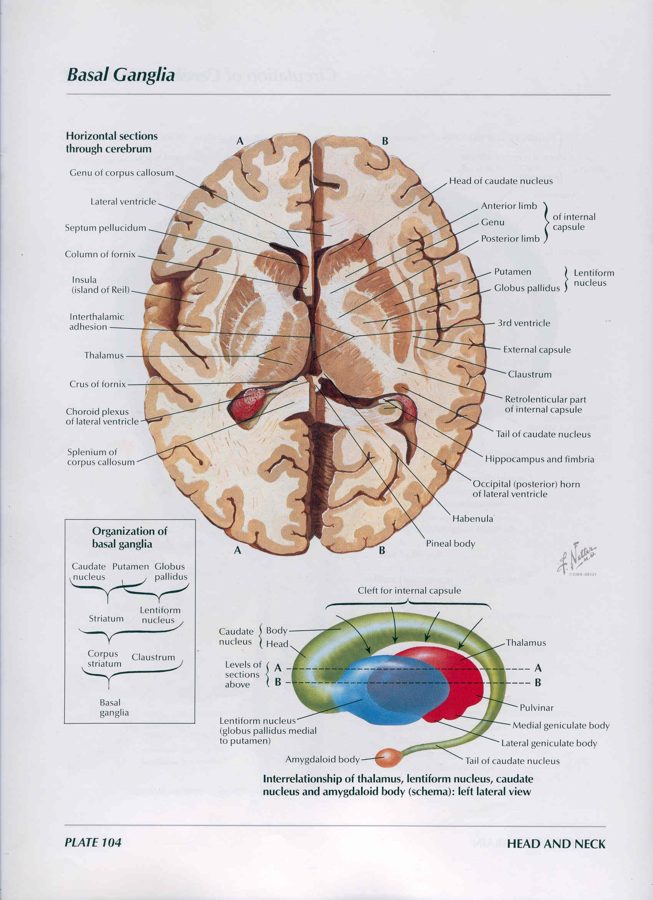

[Вернуться](./Анатомия нервной системы.md)

# Экстрапирамидная система

## Понятие об экстрапирамидной системе

Когда наличие пирамидной системы уже стало общепризнанным, исследователи обратили внимание на то, что в обеспечении двигательных функций принимают участие и многие другие клеточные структуры, расположенные на разных уровнях ЦНС, которые стали именовать экстрапирамидными.

Данный термин был введен в 1908 г. английским невропатологом С. Вильсоном, который в процессе изучения заболевания, известного теперь как гепато-лентикулярная дегенерация, или болезнь Вильсона-Коновалова, отметил, что на состояние двигательных функций влияют и подкорковые узлы, не входящие в понятие о пирамидной системе. С тех пор все структуры головного мозга, которые, как выяснялось позже, влияют на состояние поперечнополосатых мышц и, следовательно, участвующие в обеспечении движений, стали именовать экстрапирамидными. 

Однако на сегодня известно, что с точки зрения учения о филогенезе и онтогенезе нервной системы, экстрапирамидные структуры формируются раньше пирамидных. Экстрапирамидные структуры в двигательной системе могут рассматриваться как базисные, тогда как признаваемые классическими моносинаптические пирамидные волокна (аксоны клеток Беца) составляют в кортико-спинальных проводящих путях человека всего лишь 2-2,5%. Их можно рассматривать как своеобразную надстройку над экстрапирамидными путями, возникающую у приматов с необходимостью выполнения тонких и точных двигательных актов. У человека такая потребность достигла наиболее высокого уровня в связи с совершенствованием произвольных движений рук, главным образом кисти и пальцев, а также тонких движений, осуществляемых за счет мимических мышц и речедвигательного аппарата, или, по выражению В.М. Бехтерева, «особенных» движений.

В 1973 г. ведущий американский физиолог П. Милнер (Milner P.) высказался по этому поводу так: «Само подразделение моторной системы на пирамидную и экстрапирамидную является источником путаницы и ошибок. Возможно, оно явилось следствием исторического заблуждения, возникшего из начального представления о том, что пирамидная система является единственной двигательной системой. Поэтому те части мозга, участие которых в двигательных функциях было выявлено позднее, были объединены под названием экстрапирамидной системы. Трудно провести четкую функциональную грань между этими системами. Не обособлены они и анатомически, за исключением короткой части пути через продолговатый мозг». 

Высказанное П. Милнером мнение вполне логично, однако пока по традиции большинство нейрофизиологов и клиницистов признают целесообразность выделения пирамидной и экстрапирамидной системы. К экстрапирамидной системе обычно относят многочисленные клеточные образования, расположенные в больших полушариях мозга, в промежуточном мозге и в стволе мозга, а также афферентные и эфферентные связи между этими образованиями.

## Структура и основные функции экстрапирамидной системы

**Чечевицеобразное ядро** - самое крупное из расположенных в глубине большого полушария мозга ядерное образование, состоит из трех члеников, сформированных из серого вещества. Два из них (медиальные), более светлые, составляют так называемый **бледный шар** (globus pallidus). Бледный шар состоит из крупных клеток, расположенных в петлях, которые образованы миелиновыми волокнами, находящимися здесь в большом количестве и обусловливающими его «бледность». Латерально расположенный членик чечевицеобразного ядра называется **скорлупой** (putamen). Скорлупа и находящееся поблизости хвостатое ядро состоят из большого количества мелких клеток с короткими ветвящимися отростками и больших мультиполярных нейронов между ними, имеющих длинные аксоны. 

Сходство фило- и онтогенеза, гистологического строения и биохимического состава, а также определенная общность функций служат основанием для объединения скорлупы и хвостатого ядра в **полосатое тело** (corpus striatum seu neostriatum), или **стриарную систему**. Исчерченность полосатого тела обусловлена наличием чередования в нем участков серого и белого вещества. Стриарной системе противопоставляется **паллидарная система**, которая известна и как paleostriatum, так как является более древней в филогенетическом отношении и раньше формируется в процессе онтогенеза

**Стриарная и паллидарная системы** имеют различное происхождение, разную структуру и в какой-то степени противоположные функции. Скорлупа и хвостатое ядро происходят из паравентрикулярных структур, расположенных вблизи бокового желудочка, тогда как бледный шар, располагаясь вблизи III желудочка, имеет общее происхождение с субталамическим ядром. В паллидарной и стриарной системах предполагается наличие элементов соматотопического представительства. 

**Хвостатое ядро** повторяет очертания бокового желудочка и имеет форму эллипса, при этом хвост его почти достигает миндалевидного ядра. Скорлупа находится снаружи бледного шара и отделена от него слоем миелинизированных волокон - боковой медуллярной пластинкой бледного шара. Латеральная сторона скорлупы отграничена от ограды наружной капсулой (capsula externa). В ее состав входят ассоциативные волокна, связывающие слуховую область коры височной доли с моторной и премоторной корой.

Структуры стриопаллидарной системы имеют связи между собой, а также афферентные и эфферентные связи с другими отделами экстрапирамидной системы, в частности с черной субстанцией, красным ядром, ретикулярной формацией, мозжечком, а также с корой больших полушарий и периферическими мотонейронами ствола и спинного мозга. Через переднюю спайку мозга (комиссуру Мейнерта) осуществляется взаимодействие подкорковых узлов правого и левого полушарий. Тесная связь стриопаллидарной системы с ядрами гипоталамического отдела мозга определяет ее роль в механизмах эмоциональных реакций.

**Полосатое тело** получает импульсы от многих отделов мозговой коры, при этом особенно значительны ее **ипсилатеральные связи** с двигательными зонами (заднелобные отделы, предцентральная извилина, парацентральная долька). Нервные волокна, обеспечивающие эти связи, расположены в определенном порядке. Поступающая по ним импульсация оказывает в основном тормозное действие на клетки полосатого тела. Другая система афферентных волокон обеспечивает передачу импульсов в полосатое тело из центромедианного ядра таламуса. Эти импульсы оказывают на собственные клетки полосатого тела, скорее всего, активирующее действие. 

Афферентные пути из хвостатого ядра и из скорлупы, составляющие полосатое тело, направляются к латеральному и медиальному сегментам бледного шара, разделенным тонкой медуллярной пластинкой. Кроме того, полосатое тело имеет прямые и обратные связи с черной субстанцией, которая обеспечивается соответственно аксонами стрионигральных и нигростриарных нейронов. Нигростриарные нейроны являются допаминергическими, тормозящими функцию стриарных холинергических нейронов и уменьшающими таким образом их тормозное влияние на структуры паллидума. ГАМКергические стрионигральные нейроны тормозят активность клеток черной субстанции. Они оказывают тормозное действие как на дофаминергические нигростриарные нейроны, так и на нигроспинальные нейроны, аксоны которых направляются к гамма-мотонейронам спинного мозга, регулируя таким образом тонус поперечнополосатых мышц. Часть нервных волокон, идущих от полосатого тела, обеспечивает его влияние на многие ядерные образования, относящиеся к экстрапирамидной и к лимбико-ретикулярной системам.

От деятельности экстрапирамидных структур зависит способность человека принимать оптимальную для предстоящего действия позу, поддерживать необходимое реципрокное соотношение тонуса мышц-агонистов и антагонистов, двигательную активность, а также плавность и соразмерность двигательных актов во времени и пространстве. Экстрапирамидная система обеспечивает преодоление инерции покоя и инерции движений, координацию произвольных и непроизвольных (автоматизированных) и, в частности, локомоторных движений, спонтанную мимику, влияет на состояние вегетативного баланса.

